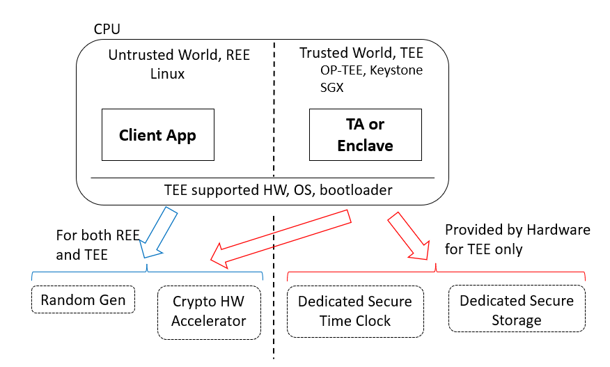
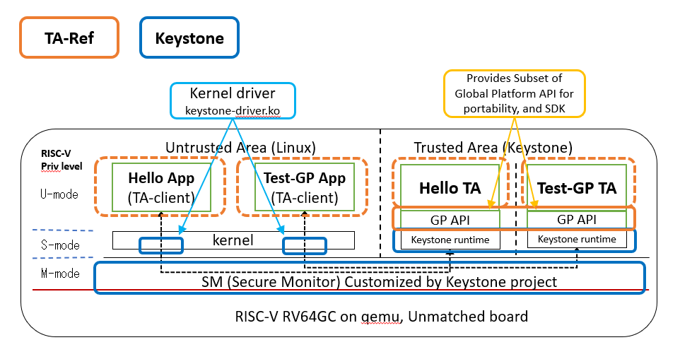
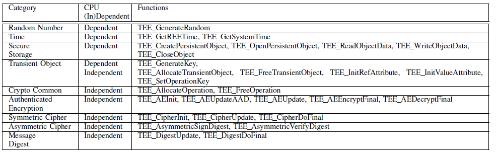
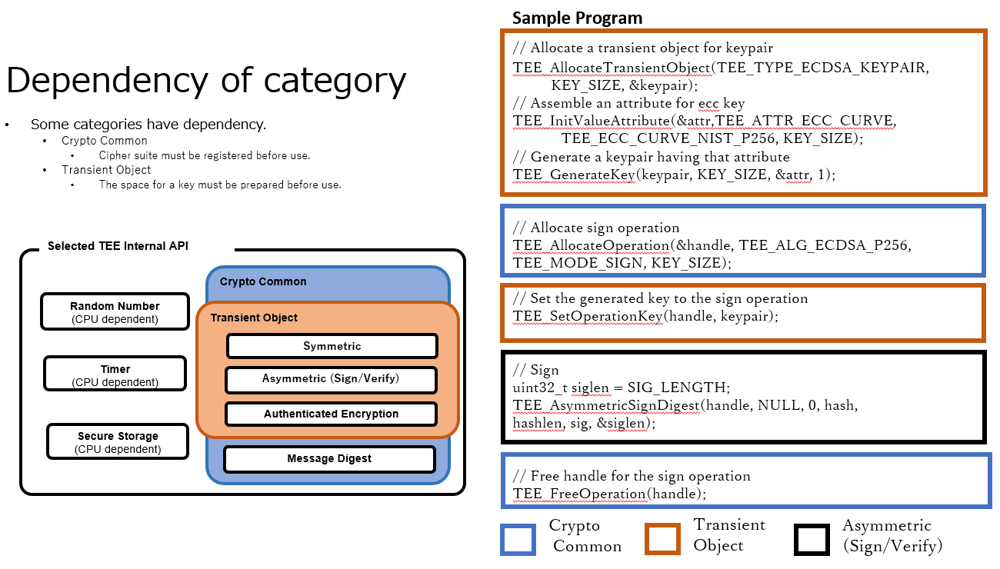

# Overview of Trusted Application Reference (TA-Ref)

The TEE is a feature of having capability of running software from an isolated area assisted by CPU hardware.

Many recent devices are able to be customized by installing softwares from end users, dealers and security service companies which are different entities from the device vendors, for example, smart phones, Android TVs, set top boxes. infotainment system on cars, surveillance cameras, home security gateways, edge routers, network equipment, and etc. In this situation, malicious software could be installed on a regular operating system, such as Linux.

The TEE provides a secure software runtime environment for the security sensitive software from preventing interference on customizable devices of softwares running on a normal operating system.

## Features of TA-Ref
  - Provides Portable API and SDK among Intel SGX, ARM TrustZone-A and RISC-V Keystone
  - Provides portability for source codes of Trusted Applications among SGX, TrustZone and Keystone
  - Provides subset of Global Platform API on TEE
  - Tutorial programs of common usage of hash functions, symmetric algorithm and asymmetric algorithm
  - Simple Makefiles to develop TAs on different CPUs which traditionally tend to have complex build systems

### Assumption of hardware features of TA-Ref on TEE



The Secure Time Clock is the date and time clock hardware peripheral which updates monotonically provided separately from regular clock peripheral so the user application and OS on REE could not change the date and/or time. Many certificates of CA, license keys of purchased serial code, hardware enablement keys such as increasing the battery size of the electric cars are bound to the date. The easiest way for end users or attackers phishing the CAs and web sites, using the software and enabling the optional hardware feature without the payment is to change the value of the clock. The concrete date and time is especially important for the telemetry data.

The Secure Storage will be saving the cryptographic keys, Trusted Application binaries, personalization data, telemetry data, and etc, which are security sensitive files must not be tampered by any applications on the REE side. The size of the storage is typically in the order of megabytes to fulfill the required files.

The Random Generator is another requirement of the hardware ensuring the security level of the system. Quality of the random value is very important for having a good security level on many cryptographic algorithms used inside TEE. It is recommended to have an equivalent level of SP 800-90B and FIPS 140-3.

The Cryptographic Hardware accelerators are not strictly mandatory hardware features, however, it is essential to have them to be usable devices to prevent or expose the very slow usability.

## Components of TA-Ref

### TA-Ref Components on Keystone



TA-Ref provides a portable TEE programming environment over the Keystone project on RISC-V RV64GC CPU. Each TA in the Trusted Aria is protected with Physical memory protection (PMP) which is enabled by RISC-V hardware.

- Keystone project
  * https://keystone-enclave.org/

### TA-Ref Components on OP-TEE


It is on OP-TEE and highly utilizing the programming environment provided by TA-Ref to simplify developing of Trusted Applications to be able to build and function on other CPUs with the single source code.

### TA-Ref Components on SGX


The diagram shows implementation of TA-Ref and Trusted Applications on SGX. Unlike ARM Cortex-A or RISC-V, the TEE security level is implemented vertically in the user space. The TA-Ref provides the same programming environment of ARM Cortex-A or RISC-V on Intel with the capability subset of Global Platform TEE Internal APIs.

## What we did on RISC-V
  - We designed the GP internal API library to be portable.
  - Keystone SDK is utilized because of runtime "Eyrie".
  - The library is ported to Intel SGX as well as RISC-V Keystone.

### Challenges faced during Implementation
  - The combination of GP internal API and cipher suite is big.
    - To reduce the size, We pick up some important GP internal APIs.
  - Some APIs depend on CPU architecture.
    - We separate APIs into CPU architecture dependent / independent.
  - Integrate GP TEE Internal API to Keystone SDK.
    - Keystone SDK includes EDL (Enclave Definition Language) named “keedger”.
    - Keedger creates the code for OCALL (request from TEE to REE) to check the pointer and boundary.

### Selected GP TEE Internal API's for testing

- CPU architecture dependent
  - Random Generator, Time, Secure Storage, Transient Object(TEE_GenerateKey)

- CPU architecture independent(Crypto)
  - Transient Object(exclude TEE_GenerateKey), Crypto Common, Authenticated Encryption, Symmetric/Asymmetric Cipher, Message Digest

Following shows the table of CPU Dependent and Independent API's with its functions.



## Dependency of category



# Preparation and building TA-Ref with docker


## Preparation

For building TA-Ref with docker, it is required to install docker on Ubuntu.

For the first time users of docker, please have a look on https://docs.docker.com/engine/

The following installation steps is for Ubuntu 20.04

### Installing Docker

```sh
$ sudo apt update

# Next, install a few prerequisite packages which let apt use packages over HTTPS:
$ sudo apt install apt-transport-https ca-certificates curl software-properties-common

# Then add the GPG key for the official Docker repository to your system:
$ curl -fsSL https://download.docker.com/linux/ubuntu/gpg | sudo apt-key add -

# Add the Docker repository to APT sources:
$ sudo add-apt-repository "deb [arch=amd64] https://download.docker.com/linux/ubuntu focal stable"

# This will also update our package database with the Docker packages from the newly added repo.
# Make sure you are about to install from the Docker repo instead of the default Ubuntu repo:
$ apt-cache policy docker-ce

#Finally, install Docker
$ sudo apt install docker-ce
```

### Executing Docker without sudo

By default, the docker command can only be run the root user or by a user in the docker group, which is automatically created during Docker’s installation process. If you attempt to run the docker command without prefixing it with sudo or without being in the docker group, you’ll get an output like this:

```console
docker: Cannot connect to the Docker daemon. Is the docker daemon running on this host?.
```

To avoid typing sudo whenever we run the docker command, add your username to the docker group.

```sh
$ sudo groupadd docker

$ sudo gpasswd -a $USER docker

# Logout and then log-in again to apply the changes to the group
 ```

After you logout and login, you can probably run the docker command without `sudo`

```sh
$ docker run hello-world
```

### Create a docker network tamproto

A docker network named tamproto is required when we run TA-Ref for Keystone.
The local network is required to connect with tamproto service running locally.

```sh
$ docker network create tamproto_default
```

## Docker images details

The docker images with all necessary packages for building TA-Ref for all three targets are already available.
Make sure you have account on docker-hub. If not please create one on `dockerhub.com`
The details are mentioned below

| Target | docker image |
| ------ | ------ |
| Keystone | aistcpsec/tee-dev:keystone-1.0.0 |
| OP-TEE | aistcpsec/tee-dev:optee-3.10.0 |
| Intel SGX | aistcpsec/tee-dev:sgx-2.10 |


## Building TA-Ref with Docker

### Building TA-Ref for Keystone with docker

Following commands are to be executed on Ubuntu 20.04.

```sh
# Clone the TA-Ref repo and checkout teep-master branch
$ git clone https://github.com/mcd500/ta-ref.git
$ cd ta-ref/
$ git checkout teep-master

# Sync and update the submodules
$ git submodule sync --recursive
$ git submodule update --init --recursive

# Start the docker
$ docker run --network tamproto_default -it --rm -v $(pwd):/home/user/ta-ref
 aistcpsec/tee-dev:keystone-1.0.0
```

After you start the docker command, you will be logged-in inside the docker container.
Following are the  commands to be executed inside the docker

```sh
# [Inside docker image]

$ cd ta-ref/
$ source env/keystone.sh

# Build test_hello directory
$ make build test-bin MACHINE=SIM TEST_DIR=test_hello

# Build test_gp directory
$ make build test-bin MACHINE=SIM TEST_DIR=test_gp
```

By the above steps, we have successfully built the TA-Ref.
Below we are going to push it into qemu and test its working


**Test the built test_hello, test_gp binaries in Qemu**


```sh
# Copy the test_hello inside qemu root
$ mkdir $KEYSTONE_DIR/build/overlay/root/test_hello
$ cp test_hello/keystone/App/App.client $KEYSTONE_DIR/build/overlay/root/test_hello/
$ cp test_hello/keystone/Enclave/Enclave.eapp_riscv $KEYSTONE_DIR/build/overlay/root/test_hello/
$ cp $KEYSTONE_SDK_DIR/runtime/eyrie-rt $KEYSTONE_DIR/build/overlay/root/test_hello/


# Copy the test_gp inside qemu root
$ mkdir $KEYSTONE_DIR/build/overlay/root/test_gp
$ cp test_gp/keystone/App/App.client $KEYSTONE_DIR/build/overlay/root/test_gp/
$ cp test_gp/keystone/Enclave/Enclave.eapp_riscv $KEYSTONE_DIR/build/overlay/root/test_gp/
$ cp $KEYSTONE_SDK_DIR/runtime/eyrie-rt $KEYSTONE_DIR/build/overlay/root/test_gp/

# Re-build the keystone again to copy test_hello and test_gp inside qemu
$ cd $KEYSTONE_DIR/build
$ make


# Start the Qemu console from $KEYSTONE_DIR/build dir
$ ./scripts/run-qemu.sh

# When asked for username and password use
# username : root
# password : sifive

# Inside Qemu run the steps to test test_hello and test_gp
# Load keystone driver
$ insmod keystone-driver.ko

# Test test_hello
$ cd test_hello/
$ ./App.client Enclave.eapp_riscv eyrie-rt

[debug] UTM : 0xffffffff80000000-0xffffffff80100000 (1024 KB) (boot.c:127)
[debug] DRAM: 0xb7c00000-0xb8000000 (4096 KB) (boot.c:128)
[debug] FREE: 0xb7dbb000-0xb8000000 (2324 KB), va 0xffffffff001bb000 (boot.c:133)
[debug] eyrie boot finished. drop to the user land ... (boot.c:172)
hello world!


# Test Test_gp
$ cd ../test_gp/
$ ./App.client Enclave.eapp_riscv eyrie-rt

[debug] UTM : 0xffffffff80000000-0xffffffff80100000 (1024 KB) (boot.c:127)
[debug] DRAM: 0xb8000000-0xb8400000 (4096 KB) (boot.c:128)
[debug] FREE: 0xb81dd000-0xb8400000 (2188 KB), va 0xffffffff001dd000 (boot.c:133)
[debug] eyrie boot finished. drop to the user land ... (boot.c:172)
main start
TEE_GenerateRandom(0x000000003FFFFEE0, 16): start
@random: 5c066e270ed690d9f1f0a3ba094def05
TEE_GetREETime(): start
@GP REE time 241 sec 936 millis
TEE_GetSystemTime(): start
@GP System time 1312074212 sec 5 millis
TEE_CreatePersistentObject(): start
TEE_WriteObjectData(): start
TEE_CloseObject(): start
TEE_OpenPersistentObject(): start
TEE_ReadObjectData(): start
TEE_CloseObject(): start
256 bytes read: 000102030405060708090a0b0c0d0e0f101112131415161718191a1b1c1d1e1f202122232
425262728292a2b2c2d2e2f303132333435363738393a3b3c3d3e3f404142434445464748494a4b4c4d4e4f50
5152535455565758595a5b5c5d5e5f606162636465666768696a6b6c6d6e6f707172737475767778797a7b7c7
d7e7f808182838485868788898a8b8c8d8e8f909192939495969798999a9b9c9d9e9fa0a1a2a3a4a5a6a7a8a9
aaabacadaeafb0b1b2b3b4b5b6b7b8b9babbbcbdbebfc0c1c2c3c4c5c6c7c8c9cacbcccdcecfd0d1d2d3d4d5d
6d7d8d9dadbdcdddedfe0e1e2e3e4e5e6e7e8e9eaebecedeeeff0f1f2f3f4f5f6f7f8f9fafbfcfdfeff
verify ok
TEE_AllocateOperation(): start
TEE_FreeOperation(): start
TEE_DigestDoFinal(): start
TEE_FreeOperation(): start
hash: 9b04c091da96b997afb8f2585d608aebe9c4a904f7d52c8f28c7e4d2dd9fba5f
TEE_AllocateTransientObject(): start
TEE_GenerateKey(): start
TEE_GenerateRandom(0x000000003FFFFD88, 32): start
TEE_AllocateOperation(): start
TEE_GenerateRandom(0x000000003FFFFED0, 16): start
TEE_CipherInit(): start
TEE_CipherUpdate(): start
TEE_FreeOperation(): start
@cipher: 50b5316159d5e023fec5006a079f11117cc82d59e3888ee815cae300b9d7def43fb05ec75912e6e0068
a5fad284797bc61412db0b6395eb1403fd8dd5d81241654811d0e0ed6a52471dcd4958395b669f72b2ee2ab55585
4cd4772c4e4c5b1224c345e1a2b161e048c82e28950220c757ce05cb5339b92d88dc3a8d8318ce0b0280c94c15b7
779bcc456515176a11df946a91c40c124035a475074108f8c819d571384cff43a70fcae958ab6438fbec47bf1585
7b6b1b1ca98edcd8bc88140a6956a62a164e4da1b76f1e36e62402ec6cb6214f1a9b1ed9fbf0505454de33efdde3
71952be81fee1ac47e07203d41ea10024aca056d3010c01d0b1c792851cd7
TEE_AllocateOperation(): start
TEE_CipherInit(): start
TEE_CipherUpdate(): start
TEE_FreeOperation(): start
TEE_FreeTransientObject(): start
decrypted to: 000102030405060708090a0b0c0d0e0f101112131415161718191a1b1c1d1e1f20212223242526
2728292a2b2c2d2e2f303132333435363738393a3b3c3d3e3f404142434445464748494a4b4c4d4e4f5051525354
55565758595a5b5c5d5e5f606162636465666768696a6b6c6d6e6f707172737475767778797a7b7c7d7e7f808182
838485868788898a8b8c8d8e8f909192939495969798999a9b9c9d9e9fa0a1a2a3a4a5a6a7a8a9aaabacadaeafb0
b1b2b3b4b5b6b7b8b9babbbcbdbebfc0c1c2c3c4c5c6c7c8c9cacbcccdcecfd0d1d2d3d4d5d6d7d8d9dadbdcddde
dfe0e1e2e3e4e5e6e7e8e9eaebecedeeeff0f1f2f3f4f5f6f7f8f9fafbfcfdfeff
verify ok
TEE_AllocateTransientObject(): start
TEE_GenerateKey(): start
TEE_GenerateRandom(0x000000003FFFFC68, 32): start
TEE_AllocateOperation(): start
TEE_GenerateRandom(0x000000003FFFFEC8, 16): start
TEE_AEInit(): start
TEE_AEEncryptFinal(): start
TEE_FreeOperation(): start
@cipher: 5fbd1a14a83504ef595f73c6af425023ec6e6aca5ffb47b2b88666ddb7f8cf17ce32486e1efa7d09a53
369024e936eb9312431ed341feaed8cead7e985fea9baa72092cfd8e1955cd9428dd13fb48431aeae6fef34d200b
7b3e7bd25352e9c2a705a9d1570caf6019ca157f05ce9adec42c313a54162194a691d015564d7199b2f7e3ebf9d5
98ce408a930cf83d50924dcde08a57e110820bbad531612d3730138ca025c209f5ac285625001faffd4344ea3a72
a85d46295de4ca573d1ff8f21754d1faa550ad12f32aa4885f5acaeed96cc795d99768c884402e3462041bd596dd
d676dc154a7ca0c7d654a8670aec8e23486ec9e1897543d754476472fd04e
@tag: 9b8bd6ab05b44879079b894835aaedf1
TEE_AllocateOperation(): start
TEE_AEInit(): start
TEE_AEDecryptFinal(): start
TEE_FreeOperation(): start
TEE_FreeTransientObject(): start
decrypted to: 000102030405060708090a0b0c0d0e0f101112131415161718191a1b1c1d1e1f202122232425262
728292a2b2c2d2e2f303132333435363738393a3b3c3d3e3f404142434445464748494a4b4c4d4e4f505152535455
565758595a5b5c5d5e5f606162636465666768696a6b6c6d6e6f707172737475767778797a7b7c7d7e7f808182838
485868788898a8b8c8d8e8f909192939495969798999a9b9c9d9e9fa0a1a2a3a4a5a6a7a8a9aaabacadaeafb0b1b2
b3b4b5b6b7b8b9babbbcbdbebfc0c1c2c3c4c5c6c7c8c9cacbcccdcecfd0d1d2d3d4d5d6d7d8d9dadbdcdddedfe0e
1e2e3e4e5e6e7e8e9eaebecedeeeff0f1f2f3f4f5f6f7f8f9fafbfcfdfeff
verify ok
TEE_AllocateOperation(): start
TEE_FreeOperation(): start
TEE_DigestDoFinal(): start
TEE_FreeOperation(): start
@digest: 9b04c091da96b997afb8f2585d608aebe9c4a904f7d52c8f28c7e4d2dd9fba5f
TEE_AllocateOperation(): start
TEE_AllocateTransientObject(): start
TEE_InitValueAttribute(): start
TEE_GenerateKey(): start
TEE_GenerateRandom(0x000000003FFFFE28, 32): start
TEE_AsymmetricSignDigest(): start
TEE_FreeOperation(): start
@signature: 3b018bbf24235c4c367c276beafbf4dcec071ab885b37f3096081e98e8cb03fb97bb637d21c98fc0d60
06fb082d2a8690d6fa8c0fb2ae666670883b83bd27107
TEE_AllocateOperation(): start
TEE_AsymmetricVerifyDigest(): start
TEE_FreeOperation(): start
@@TEE_FreeOperation:
TEE_FreeTransientObject(): start
verify ok
main end
```

Poweroff the console incase, if you want to exit.
```
$ poweroff
```
You can also press Ctrl a+x to exit the qemu console.

### Building TA-Ref for OP-TEE with docker

Following commands are to be executed on Ubuntu 20.04.

```sh
# Clone the ta-ref repo and checkout teep-master branch
$ git clone https://github.com/mcd500/ta-ref.git
$ cd ta-ref/
$ git checkout teep-master

# Sync and update the submodules
$ git submodule sync --recursive
$ git submodule update --init --recursive

# Start the docker
$ docker run -it --rm -v $(pwd):/home/user/ta-ref aistcpsec/tee-dev:optee-3.10.0
```

After you start the docker command, you will be logged-in inside the docker container.
Following are the  commands to be executed inside the docker

```sh
# [Inside docker image]

$ cd ta-ref/
$ source env/optee_qemu.sh

# Build test_hello directory
$ make build test-bin MACHINE=SIM TEST_DIR=test_hello

# Build test_gp directory
$ make build test-bin MACHINE=SIM TEST_DIR=test_gp
```

By the above steps, we have successfully built the TA-Ref.
Below we are going to push it into qemu and test its working

**Test the built test_hello, test_gp binaries in Qemu**

```sh
# Extract the rootfs.cpio.gz
# copy the binaries into qemu rootfs directory
# Re-pack the rootfs folder into a cpio archive
$ make install_optee_qemu

# Start the Qemu console from $OPTEE_DIR/build directory
$ ln -sf /home/user/optee/out-br/images/rootfs.cpio.gz /home/user/optee/out/bin
$ cd /home/user/optee/out/bin && \
    /home/user/optee/qemu/aarch64-softmmu/qemu-system-aarch64 \
        -nographic \
        -serial mon:stdio -serial file:serial1.log \
        -smp 2 \
        -machine virt,secure=on -cpu cortex-a57 \
        -d unimp -semihosting-config enable,target=native \
        -m 1057 \
        -bios bl1.bin \
        -initrd rootfs.cpio.gz \
        -kernel Image -no-acpi \
        -append "console=ttyAMA0,38400 keep_bootcon root=/dev/vda2"

# If you face any error like
# qemu-system-aarch64: keep_bootcon: Could not open 'keep_bootcon': No such file or directory
# Just replace the double quotes in the last line with single quotes.

# When asked for builroot login, please enter root
# buildroot login: root

# Inside Qemu run the steps to test test_hello and test_gp
# Test test_hello
$ cd test_hello/
$ cp a6f77c1e-96fe-4a0e-9e74-262582a4c8f1.ta /lib/optee_armtz/
$ ./optee_ref_ta

--- enclave log start---
ecall_ta_main() start
hello world!
ecall_ta_main() end

--- enclave log end---
#

# Test test_gp
$ cd ../test_gp/
$ cp a6f77c1e-96fe-4a0e-9e74-262582a4c8f1.ta /lib/optee_armtz/
$ ./optee_ref_ta

start TEEC_InvokeCommand
--- enclave log start---
ecall_ta_main() start
@random: 3efa2690dc1857e1a45ee256fac75917
@GP REE time 1643004179 sec 669 millis
@GP System time 71 sec 804 millis
256 bytes read: 000102030405060708090a0b0c0d0e0f101112131415161718191a1b1c1d1e1f2021222
32425262728292a2b2c2d2e2f303132333435363738393a3b3c3d3e3f404142434445464748494a4b4c4d4e
4f505152535455565758595a5b5c5d5e5f606162636465666768696a6b6c6d6e6f707172737475767778797
a7b7c7d7e7f808182838485868788898a8b8c8d8e8f909192939495969798999a9b9c9d9e9fa0a1a2a3a4a5
a6a7a8a9aaabacadaeafb0b1b2b3b4b5b6b7b8b9babbbcbdbebfc0c1c2c3c4c5c6c7c8c9cacbcccdcecfd0d
1d2d3d4d5d6d7d8d9dadbdcdddedfe0e1e2e3e4e5e6e7e8e9eaebecedeeeff0f1f2f3f4f5f6f7f8f9fafbfc
fdfeff
verify ok
hash: 40aff2e9d2d8922e47afd4648e6967497158785fbd1da870e7110266bf944880
@cipher: 1a5004415312bf2ae919686a94aeaed65bc44a84724c12871945636443f03236104e406a12d5dc1
78b20a797b00fc38e42338e748ea60add29bbfc9c4253db4768114e019ed632408009a05cf21191e74faba54
4510290fca5cccc16e1befdf456c73c4e564adbde6704b4a8d8ef9d910bb0cd38653ab04eba9aa332abd2274
b6e5ea01563ff604f2ce4e7b11495b264bf9b6fd2692c609186f3413f8b893ea0b1c826f6d74da8dcb92d6d2
367ec0dfd1874c5e9f226e6f08a3a81431d944a35c46023f72dc2538f71dcd831282111b716723b4a178fa92
5bd901474b7392c5f7a06c0ecb7ce975677369eebeffbcfed4aa8b08d4974241ba9df0008f061395d
decrypted to: 000102030405060708090a0b0c0d0e0f101112131415161718191a1b1c1d1e1f2021222324
25262728292a2b2c2d2e2f303132333435363738393a3b3c3d3e3f404142434445464748494a4b4c4d4e4f50
5152535455565758595a5b5c5d5e5f606162636465666768696a6b6c6d6e6f707172737475767778797a7b7c
7d7e7f808182838485868788898a8b8c8d8e8f909192939495969798999a9b9c9d9e9fa0a1a2a3a4a5a6a7a8
a9aaabacadaeafb0b1b2b3b4b5b6b7b8b9babbbcbdbebfc0c1c2c3c4c5c6c7c8c9cacbcccdcecfd0d1d2d3d4
d5d6d7d8d9dadbdcdddedfe0e1e2e3e4e5e6e7e8e9eaebecedeeeff0f1f2f3f4f5f6f7f8f9fafbfcfdfeff
verify ok
@cipher: 0d3296d0049822159014b5cf781415ac6c43a57cf7d1e61abbc54eca7a802cd47c4b9f470017eff
d2511b310b3e1bf5093a52a0a2370ac354cd97cd984bb5cf7fdeba3009b69fbded49ac8789a4ada774436807
fe8452888fbf26eee36332894be13e7ff1ea60e02dfcc9b43a39c0088be43a871a342c119963859936c8bbce
4ffc215c1d7115d28fa2fef08cdca0e38131e967824ffa30a072ba8f7d66d2795e19beb08e32ffaf2b2a92d8
2a0b3ef796cbb1c290512963617abb5ecc31f14747e204057e3a90ad3e561efba681d58e0b7bb69c5a6a5250
c892bceb3dfc9d8c79e644a7aa234c4f5e7d94fb4867bd97d6dc8f26443345995802a9a320a64c22b
@tag: a38fd49dc4c3f453f35db8af29d8e371
decrypted to: 000102030405060708090a0b0c0d0e0f101112131415161718191a1b1c1d1e1f2021222324
25262728292a2b2c2d2e2f303132333435363738393a3b3c3d3e3f404142434445464748494a4b4c4d4e4f50
5152535455565758595a5b5c5d5e5f606162636465666768696a6b6c6d6e6f707172737475767778797a7b7c
7d7e7f808182838485868788898a8b8c8d8e8f909192939495969798999a9b9c9d9e9fa0a1a2a3a4a5a6a7a8
a9aaabacadaeafb0b1b2b3b4b5b6b7b8b9babbbcbdbebfc0c1c2c3c4c5c6c7c8c9cacbcccdcecfd0d1d2d3d4
d5d6d7d8d9dadbdcdddedfe0e1e2e3e4e5e6e7e8e9eaebecedeeeff0f1f2f3f4f5f6f7f8f9fafbfcfdfeff
verify ok
@digest: 40aff2e9d2d8922e47afd4648e6967497158785fbd1da870e7110266bf944880
@signature: a43c693ccede4504bc921c41ad9c937cd5ed3bab2494a72079f51deffb4d32d3840f55e699aa3
ec092e033efd4662bb702c6de4cb338f65bd015647d5a10bc62
@@TEE_FreeOperation:
verify ok
ecall_ta_main() end

--- enclave log end---
res = TEEC_SUCCESS; TEEC_InvokeCommand succeeded!
#

```

### Building TA-Ref for Intel SGX with docker

Following commands are to be executed on Ubuntu 20.04.

```sh
# Clone the ta-ref repo and checkout teep-master branch
$ git clone https://github.com/mcd500/ta-ref.git
$ cd ta-ref/
$ git checkout teep-master

# Sync and update the submodules
$ git submodule sync --recursive
$ git submodule update --init --recursive

# Start the docker
$ docker run -it --rm -v $(pwd):/home/user/ta-ref aistcpsec/tee-dev:sgx-2.10
```

Commands to be executed inside docker:

```sh
$ cd ta-ref/

# Source SGX environment variables
$ source /opt/intel/sgxsdk/environment
$ source env/sgx_x64.sh

# Build test_hello directory
$ make build test-bin MACHINE=SIM TEST_DIR=test_hello

# Build test_gp directory
$ make build test-bin MACHINE=SIM TEST_DIR=test_gp
```

By the above steps, we have successfully built the TA-Ref.
Since we are building in SIM mode, We can execute in docker itself.

There are two files required to test_hello
1) ./sgx_app
2)enclave.signed.so
copy the files into a directory and then execute the ./sgx_app command

**Test the built test_hello, test_gp binaries in Docker SIM mode**

Make sure test_hello is already built in SIM mode.
[Inside /home/user directory]

Test_hello:

```sh
$ cd test_hello/

# Copy the sgx_app for test_hello
$ cp sgx/App/sgx_app .
# Copy the enclave
$ cp sgx/Enclave/enclave.signed.so .

# Run the program
$ ./sgx_app

# [trimmed output]
hello world!
Info: Enclave successfully returned.
```

Test_gp:

Make sure test_hello is already built in SIM mode.
[Inside /home/user directory]

```sh
$ cd test_gp/

# Copy the sgx_app for test_gp
$ cp sgx/App/sgx_app .
# Copy the enclave
$ cp sgx/Enclave/enclave.signed.so .

# Run the program
$ ./sgx_app

# [trimmed output]
main start
TEE_GenerateRandom(): start
@random: 59af0039e8013fd0cc698c4115b682a3
TEE_GetREETime(): start
request to get unix time 1642994685, 852
@GP REE time 1642994685 sec 852 millis
TEE_GetSystemTime(): start
@GP System time 2624667013 sec 537 millis
TEE_CreatePersistentObject(): start
request to open FileOne flags 241 -> 3
TEE_WriteObjectData(): start
request to write 256 bytes to descriptor 3
TEE_CloseObject(): start
request to close descriptor 3
TEE_OpenPersistentObject(): start
request to open FileOne flags 0 -> 3
TEE_ReadObjectData(): start
request to read 256 bytes from descriptor 3
TEE_CloseObject(): start
request to close descriptor 3
256 bytes read: 000102030405060708090a0b0c0d0e0f101112131415161718191a1b1c1d1e1f202122232425262728
292a2b2c2d2e2f303132333435363738393a3b3c3d3e3f404142434445464748494a4b4c4d4e4f50515253545556575859
5a5b5c5d5e5f606162636465666768696a6b6c6d6e6f707172737475767778797a7b7c7d7e7f808182838485868788898a
8b8c8d8e8f909192939495969798999a9b9c9d9e9fa0a1a2a3a4a5a6a7a8a9aaabacadaeafb0b1b2b3b4b5b6b7b8b9babb
bcbdbebfc0c1c2c3c4c5c6c7c8c9cacbcccdcecfd0d1d2d3d4d5d6d7d8d9dadbdcdddedfe0e1e2e3e4e5e6e7e8e9eaebec
edeeeff0f1f2f3f4f5f6f7f8f9fafbfcfdfeff
verify ok
TEE_AllocateOperation(): start
TEE_FreeOperation(): start
TEE_DigestDoFinal(): start
TEE_FreeOperation(): start
hash: 9b04c091da96b997afb8f2585d608aebe9c4a904f7d52c8f28c7e4d2dd9fba5f
TEE_AllocateTransientObject(): start
TEE_GenerateKey(): start
TEE_GenerateRandom(): start
TEE_AllocateOperation(): start
TEE_GenerateRandom(): start
TEE_CipherInit(): start
TEE_CipherUpdate(): start
TEE_FreeOperation(): start
@cipher: 8fc07ed506c8616090c591ada2836179ba21c2b2d79f87600f57d64b489846808f0d0609a808c1184f37c5766
a0d92bc3d0db2d2644b788ae4ba4d2b7073757f6c948611a1163b166a6491aceefbab9f1655a754a610e3ffea5d7e8eac1
936399eaa91e0b2a804788996ebbda7d98988dec8458038c23ab4b2ec7c51eff0f04da2b5c5023b63093aa6b4181b5d2b3
fe724aa3ac9eaeb557bfeef4bec0dbba9f000e877641b60cf450a15b9fda70526f1023e7889607d5d8b4a9e559f6e2779c
925fd997d9431820c3d30593eabd3fd1b80d6ece5cb54edacac0560363546e9d330add6cb2c0daeb843eddfb299eeca505
298ae1a5100e58a46bce4502745a5ed
TEE_AllocateOperation(): start
TEE_CipherInit(): start
TEE_CipherUpdate(): start
TEE_FreeOperation(): start
TEE_FreeTransientObject(): start
decrypted to: 000102030405060708090a0b0c0d0e0f101112131415161718191a1b1c1d1e1f202122232425262728292
a2b2c2d2e2f303132333435363738393a3b3c3d3e3f404142434445464748494a4b4c4d4e4f505152535455565758595a5b
5c5d5e5f606162636465666768696a6b6c6d6e6f707172737475767778797a7b7c7d7e7f808182838485868788898a8b8c8
d8e8f909192939495969798999a9b9c9d9e9fa0a1a2a3a4a5a6a7a8a9aaabacadaeafb0b1b2b3b4b5b6b7b8b9babbbcbdbe
bfc0c1c2c3c4c5c6c7c8c9cacbcccdcecfd0d1d2d3d4d5d6d7d8d9dadbdcdddedfe0e1e2e3e4e5e6e7e8e9eaebecedeeeff
0f1f2f3f4f5f6f7f8f9fafbfcfdfeff
verify ok
TEE_AllocateTransientObject(): start
TEE_GenerateKey(): start
TEE_GenerateRandom(): start
TEE_AllocateOperation(): start
TEE_GenerateRandom(): start
TEE_AEInit(): start
TEE_AEEncryptFinal(): start
TEE_FreeOperation(): start
@cipher: db9dbbc85217721dc3b7901f18bb90dff2f23044f34b932805ef4f36be6602122b61281074fb483f4710d7e1576
a67a2377c5ea13fb976ae041b0cec9d49e60cd6cfa869c0700ffff54a02c8b22f11add2824d5f7fb4898cb28a269db083cd8
d49c6183691202eafa5b81d0167b7f46df3c51a28ed4dc146321a909d624d34fe64ee38189617f9f2df636f7e77a79cc105b
ad81a64b3a756c092d4f8d4f78c302d8411952bdb3fee378f4c12c51b6158b6b633c9cffc3c0dab4cad0aa3a63036e420437
45bf04eb9c2e852bfcc3dc0ff1dfb516c62aa12f0bc2e01073ff1198f0d9d85c7e2d1c52f321cca5536fef8f7be661fd3ce2
466ba20c17214bba2eb62
@tag: b462f462e0b7eb0382cd2eba81d976d5
TEE_AllocateOperation(): start
TEE_AEInit(): start
TEE_AEDecryptFinal(): start
TEE_FreeOperation(): start
TEE_FreeTransientObject(): start
decrypted to: 000102030405060708090a0b0c0d0e0f101112131415161718191a1b1c1d1e1f202122232425262728292a2
b2c2d2e2f303132333435363738393a3b3c3d3e3f404142434445464748494a4b4c4d4e4f505152535455565758595a5b5c5d
5e5f606162636465666768696a6b6c6d6e6f707172737475767778797a7b7c7d7e7f808182838485868788898a8b8c8d8e8f9
09192939495969798999a9b9c9d9e9fa0a1a2a3a4a5a6a7a8a9aaabacadaeafb0b1b2b3b4b5b6b7b8b9babbbcbdbebfc0c1c2
c3c4c5c6c7c8c9cacbcccdcecfd0d1d2d3d4d5d6d7d8d9dadbdcdddedfe0e1e2e3e4e5e6e7e8e9eaebecedeeeff0f1f2f3f4f
5f6f7f8f9fafbfcfdfeff
verify ok
TEE_AllocateOperation(): start
TEE_FreeOperation(): start
TEE_DigestDoFinal(): start
TEE_FreeOperation(): start
@digest: 9b04c091da96b997afb8f2585d608aebe9c4a904f7d52c8f28c7e4d2dd9fba5f
TEE_AllocateOperation(): start
TEE_AllocateTransientObject(): start
TEE_InitValueAttribute(): start
TEE_GenerateKey(): start
TEE_GenerateRandom(): start
TEE_AsymmetricSignDigest(): start
TEE_FreeOperation(): start
@signature: 62077f18091b203c70318ad9830e41a947aa644208cfedd3dc3889b6321738dafd15f1f3dc531128672da50a5d
88f5dd82d09f026be004c8d6f41a8dbc80da04
TEE_AllocateOperation(): start
TEE_AsymmetricVerifyDigest(): start
TEE_FreeOperation(): start
@@TEE_FreeOperation:
TEE_FreeTransientObject(): start
verify ok
main end
Info: Enclave successfully returned.
```
