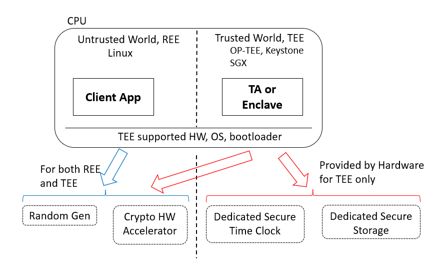
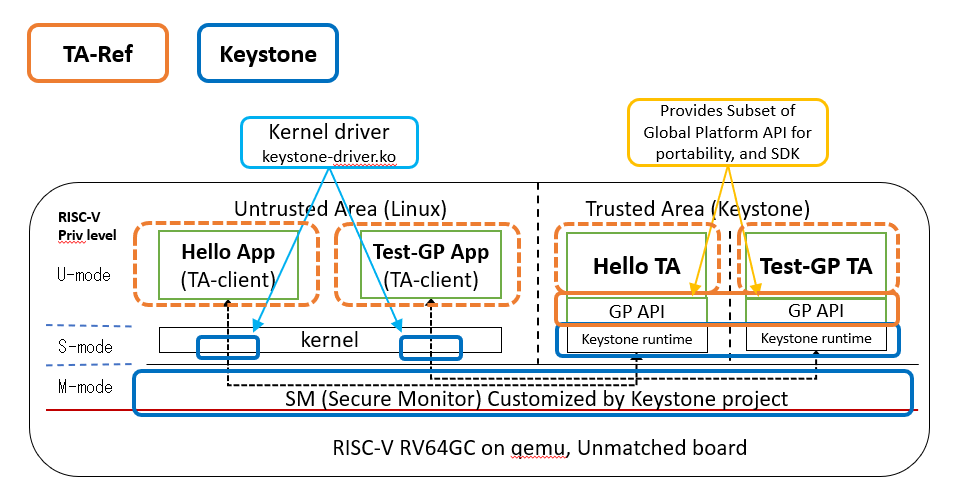
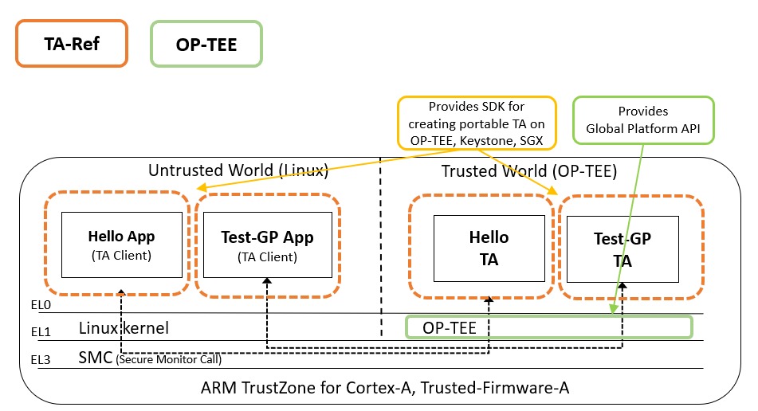
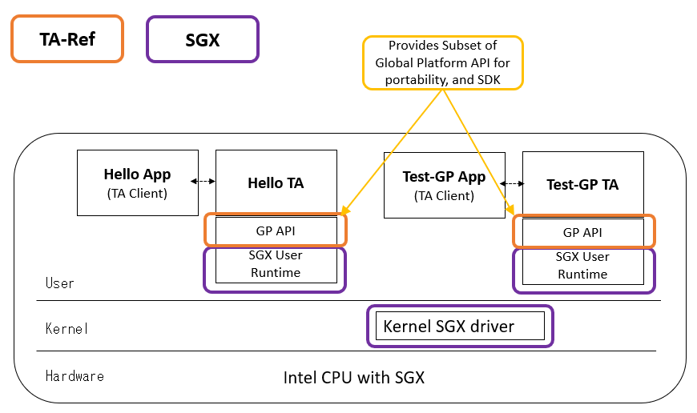
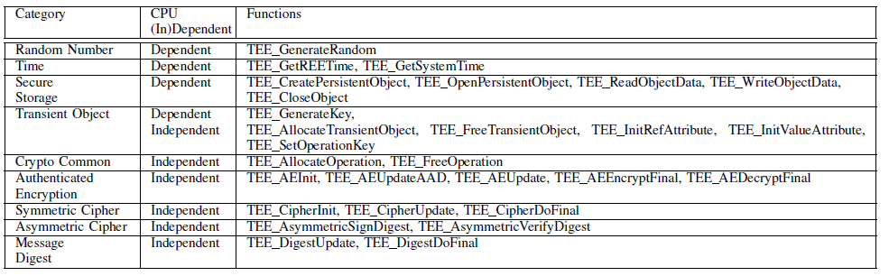
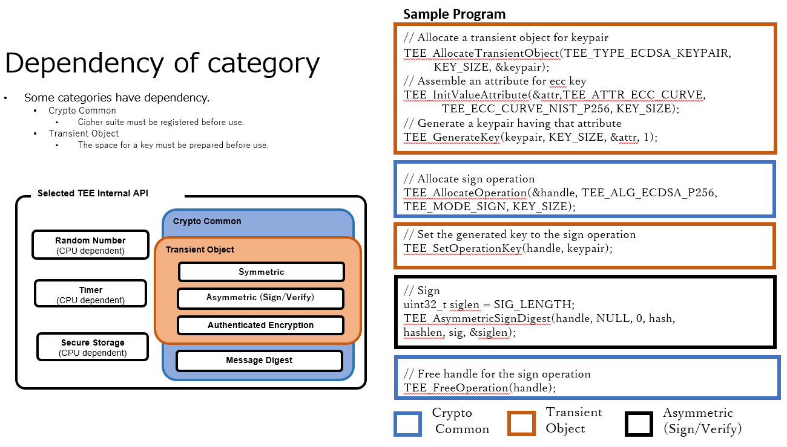
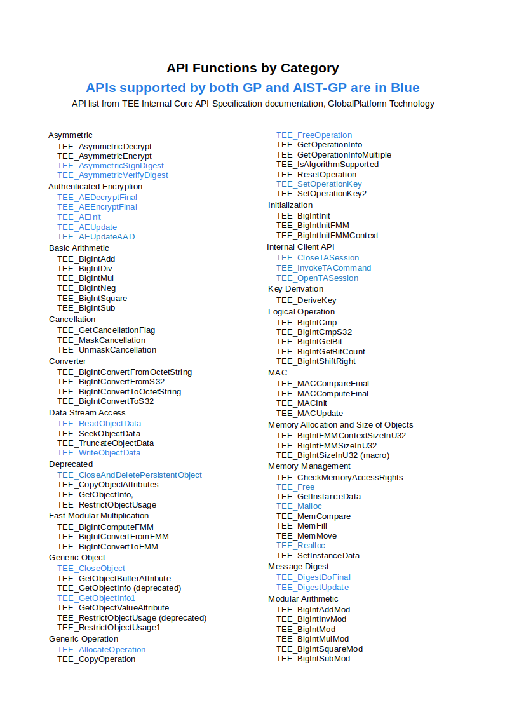
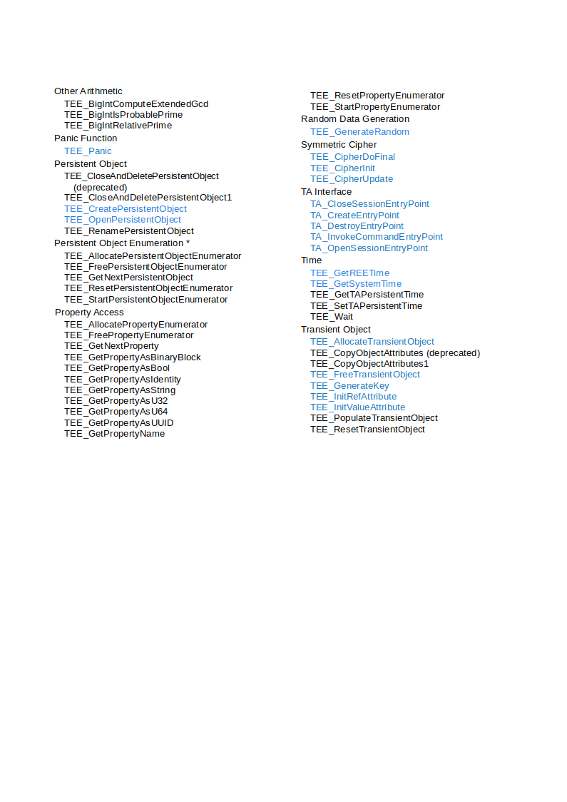

# Overview of Trusted Application Reference (TA-Ref)

The TEE is a feature of having capability of running software from an isolated area assisted by CPU hardware.

Many recent devices are able to be customized by installing softwares from end users, dealers and security service companies which are different entities from the device vendors, for example, smart phones, Android TVs, set top boxes. infotainment system on cars, surveillance cameras, home security gateways, edge routers, network equipment, and etc. In this situation, malicious software could be installed on a regular operating system, such as Linux.

The TEE provides a secure software runtime environment for the security sensitive software from preventing interference on customizable devices of softwares running on a normal operating system.

## Features of TA-Ref
  - Provides Portable API and SDK among Intel SGX, ARM TrustZone-A and RISC-V Keystone
  - Provides portability for source codes of Trusted Applications among SGX, TrustZone and Keystone
  - Provides subset of Global Platform API on TEE
  - Tutorial programs of common usage of hash functions, symmetric algorithm and asymmetric algorithm
  - Simple Makefiles to develop TAs on different CPUs which traditionally tend to have complex build systems

### Assumption of hardware features of TA-Ref on TEE



The Secure Time Clock is the date and time clock hardware peripheral which updates monotonically provided separately from regular clock peripheral so the user application and OS on REE could not change the date and/or time. Many certificates of CA, license keys of purchased serial code, hardware enablement keys such as increasing the battery size of the electric cars are bound to the date. The easiest way for end users or attackers phishing the CAs and web sites, using the software and enabling the optional hardware feature without the payment is to change the value of the clock. The concrete date and time is especially important for the telemetry data.

The Secure Storage will be saving the cryptographic keys, Trusted Application binaries, personalization data, telemetry data, and etc, which are security sensitive files must not be tampered by any applications on the REE side. The size of the storage is typically in the order of megabytes to fulfill the required files.

The Random Generator is another requirement of the hardware ensuring the security level of the system. Quality of the random value is very important for having a good security level on many cryptographic algorithms used inside TEE. It is recommended to have an equivalent level of SP 800-90B and FIPS 140-3.

The Cryptographic Hardware accelerators are not strictly mandatory hardware features, however, it is essential to have them to be usable devices to prevent or expose the very slow usability.

## Components of TA-Ref

### TA-Ref Components on Keystone



TA-Ref provides a portable TEE programming environment over the Keystone project on RISC-V RV64GC CPU. Each TA in the Trusted Aria is protected with Physical memory protection (PMP) which is enabled by RISC-V hardware.

- Keystone project
  * https://keystone-enclave.org/

### TA-Ref Components on OP-TEE



It is on OP-TEE and highly utilizing the programming environment provided by TA-Ref to simplify developing of Trusted Applications to be able to build and function on other CPUs with the single source code.

### TA-Ref Components on SGX



The diagram shows implementation of TA-Ref and Trusted Applications on SGX. Unlike ARM Cortex-A or RISC-V, the TEE security level is implemented vertically in the user space. The TA-Ref provides the same programming environment of ARM Cortex-A or RISC-V on Intel with the capability subset of Global Platform TEE Internal APIs.

## What we did on RISC-V
  - We designed the GP internal API library to be portable.
  - Keystone SDK is utilized because of runtime "Eyrie".
  - The library is ported to Intel SGX as well as RISC-V Keystone.

### Challenges faced during Implementation
  - The combination of GP internal API and cipher suite is big.
    - To reduce the size, We pick up some important GP internal APIs.
  - Some APIs depend on CPU architecture.
    - We separate APIs into CPU architecture dependent / independent.
  - Integrate GP TEE Internal API to Keystone SDK.
    - Keystone SDK includes EDL (Enclave Definition Language) named “keedger”.
    - Keedger creates the code for OCALL (request from TEE to REE) to check the pointer and boundary.

### Selected GP TEE Internal API's for testing

- CPU architecture dependent
  - Random Generator, Time, Secure Storage, Transient Object(TEE_GenerateKey)

- CPU architecture independent(Crypto)
  - Transient Object(exclude TEE_GenerateKey), Crypto Common, Authenticated Encryption, Symmetric/Asymmetric Cipher, Message Digest

Following shows the table of CPU Dependent and Independent API's with its functions.



## Dependency of category



# API comparison with full set of GP API

## GP API





# How to run sample TA programs on TA-Ref

Currently TA-Ref supports writing TA's for three targets namely
- Keystone
- OP-TEE
- Intel SGX

The pre-built TA-Ref Docker images for all three targets are already available.
The details are mentioned below

| Target | Docker image |
| ------ | ------ |
| Keystone | aistcpsec/taref-dev:keystone |
| OP-TEE | aistcpsec/taref-dev:optee |
| Intel SGX | aistcpsec/taref-dev:sgx |

## Run samples for Keystone

Sample to be executed : **message_digest**

Docker Image : **aistcpsec/taref-dev:keystone**

Following are the steps to be executed to run samples for Keystone.

```sh
# Pull the docker image
$ docker pull aistcpsec/taref-dev:keystone

#Run the docker image
$ docker run -it aistcpsec/taref-dev:keystone

# [Inside docker image]
# Initally you would be logged-in as build-user.
# If you are root user, change to build-user using # su build-user command.

# Changes to ta-ref folder
$ cd ${TAREF_DIR}

# Move to keystone build directory
$ cd samples/message_digest/build-keystone/

# Make the message-digest sample
$ make

# Run the qemu console
$ make run-qemu

# This opens us qemu console and login using
# buildroot login: root
# Password: sifive

# [Inside Qemu Console]
# Execute the sample and see the output
# Load the keystone driver
$ insmod keystone-driver.ko

# Run the message-digest program
$./App-keystone

# Exit the qemu console by clicking Ctrl-A X or $ poweroff command
### Ctrl-a x
```

Following is the output inside qemu when you execute the sample program.

```console
# insmod keystone-driver.ko
[   90.867089] keystone_driver: loading out-of-tree module taints kernel.
[   90.877175] keystone_enclave: keystone enclave v1.0.0
#
# ./App-keystone
[debug] UTM : 0xffffffff80000000-0xffffffff80100000 (1024 KB) (boot.c:127)
[debug] DRAM: 0x179800000-0x179c00000 (4096 KB) (boot.c:128)
[debug] FREE: 0x1799de000-0x179c00000 (2184 KB), va 0xffffffff001de000 (boot.c:133)
[debug] eyrie boot finished. drop to the user land ... (boot.c:172)
main start
TEE_AllocateOperation(): start
TEE_FreeOperation(): start
TEE_DigestDoFinal(): start
TEE_FreeOperation(): start
hash: 39 46 2d 2a 23 20 f8 da 57 2a 97 b0 b3 94 73 d4 31 2e 02 28 b2 3e 2c 2f e0 ae 9b 6c 67 f2 34 3c
TEE_CreatePersistentObject(): start
TEE_WriteObjectData(): start
TEE_CloseObject(): start
main end
[debug] UTM : 0xffffffff80000000-0xffffffff80100000 (1024 KB) (boot.c:127)
[debug] DRAM: 0x179800000-0x179c00000 (4096 KB) (boot.c:128)
[debug] FREE: 0x1799de000-0x179c00000 (2184 KB), va 0xffffffff001de000 (boot.c:133)
[debug] eyrie boot finished. drop to the user land ... (boot.c:172)
main start
TEE_AllocateOperation(): start
TEE_FreeOperation(): start
TEE_DigestDoFinal(): start
TEE_FreeOperation(): start
hash: 39 46 2d 2a 23 20 f8 da 57 2a 97 b0 b3 94 73 d4 31 2e 02 28 b2 3e 2c 2f e0 ae 9b 6c 67 f2 34 3c
TEE_OpenPersistentObject(): start
TEE_ReadObjectData(): start
TEE_CloseObject(): start
hash: matched!
main end
#
```

## Run samples for OP-TEE

Sample to be executed : **message_digest**

Docker Image : **aistcpsec/taref-dev:optee**

Following are the steps to be executed to run samples for OP-TEE.

```sh
# Pull the docker image
$ docker pull aistcpsec/taref-dev:optee

# Run the docker image
$ docker run -it aistcpsec/taref-dev:optee

# [Inside docker image]
# Initally you would be logged-in as build-user.
# If you are root user, change to build-user using # su build-user command.
$ cd ${TAREF_DIR}

# Move to Optee build directory
$ cd samples/message_digest/build-optee/

# Make the message-digest sample
$ make

# Make the qemu
make install_qemu

# Run the qemu console
$ make run-qemu

# This opens us qemu console and login using
# buildroot login: root

# [Inside Qemu Console]
# Execute the sample and see the output
# Run the message-digest program
./App-optee

# The output of the program is not displayed inside qemu.
# Inside the docker, it cannot open two console, one for Linux and one for optee,
# so saving the console output to file for optee. It is saved inside the serial.log

# Exit the qemu console by clicking Ctrl-A X or $ poweroff command
### Ctrl-a x
```

To view the output, open the serial log file by executing the following command outside qemu.

```console
$ cat /home/user/optee/out/bin/serial1.log

hash: be 45 cb 26 05 bf 36 be bd e6 84 84 1a 28 f0 fd 43 c6 98 50 a3 dc e5 fe db a6 99 28 ee 3a 89 91
hash: be 45 cb 26 05 bf 36 be bd e6 84 84 1a 28 f0 fd 43 c6 98 50 a3 dc e5 fe db a6 99 28 ee 3a 89 91
hash: matched!
D/TC:? 0 tee_ta_close_session:499 csess 0x6377e860 id 1
D/TC:? 0 tee_ta_close_session:518 Destroy session
#
```

## Run samples for Intel SGX

Sample to be executed : **message_digest**

Docker Image : **aistcpsec/taref-dev:sgx**

Following are the steps to be executed to run samples for SGX.

```sh
# Pull the docker image
$ docker pull aistcpsec/taref-dev:sgx

# Run the docker image
$ docker run -it aistcpsec/taref-dev:sgx

# [Inside docker image]
# Initally you would be logged-in as build-user.
# If you are root user, change to build-user using # su build-user command.
$ cd ${TAREF_DIR}

# Move to SGX build directory
$ cd samples/message_digest/build-sgx/

# Make the message-digest sample for Simulation mode
$ make

# This creates the App_sgx and enclave.signed.so
# You can copy this two files alone to any places and run the App_sgx
$ ./App_sgx
```

Trimmed the output in the App_sgx shown below

```console
.
.
[read_cpusvn_file ../cpusvn_util.cpp:96] Couldn't find/open the configuration file /home/user/.cpusvn.conf.
main start
TEE_AllocateOperation(): start
TEE_FreeOperation(): start
TEE_DigestDoFinal(): start
TEE_FreeOperation(): start
hash: 39 46 2d 2a 23 20 f8 da 57 2a 97 b0 b3 94 73 d4 31 2e 02 28 b2 3e 2c 2f e0 ae 9b 6c 67 f2 34 3c
TEE_CreatePersistentObject(): start
TEE_WriteObjectData(): start
TEE_CloseObject(): start
main end
main start
TEE_AllocateOperation(): start
TEE_FreeOperation(): start
TEE_DigestDoFinal(): start
TEE_FreeOperation(): start
hash: 39 46 2d 2a 23 20 f8 da 57 2a 97 b0 b3 94 73 d4 31 2e 02 28 b2 3e 2c 2f e0 ae 9b 6c 67 f2 34 3c
TEE_OpenPersistentObject(): start
TEE_ReadObjectData(): start
TEE_CloseObject(): start
hash: matched!
main end
Info: Enclave successfully returned.
build-user@b9755ab0abea:~/ta-ref/samples/message_digest/build-sgx$ ^C
build-user@b9755ab0abea:~/ta-ref/samples/message_digest/build-sgx$ exit
exit
```

# How to write your first 'Hello World' TA Program

To understand how to write TA,We are going to write a simple 'Hello World' TA program.
The objective of the program is to print the text 'Hello World'.

To do that, first we will copy the existing sample program from ta-ref `samples` directory

Have a look on the directory structure of sample program inside ta-ref directory.
```console
build-user@39ddcd17144c:~/ta-ref$ tree hello_world_ta/
hello_world_ta/
├── App-keystone.cpp
├── App-optee.c
├── App-sgx.cpp
├── build-keystone
│    └── Makefile
├── build-optee
│    ├── app.mk
│    ├── enclave.mk
│    ├── Makefile
│    ├── sub.mk
│    └── user_ta_header_defines.h
├── build-sgx
│    ├── app.mk
│    ├── config
│    │    └── Enclave.config.xml
│    ├── Enclave.lds
│    ├── enclave.mk
│    ├── Enclave_private.pem
│    └── Makefile
└── Enclave.c
```

Basically we need to modify two files

1) Enclave.c  (Common to all three targets)

2) App-<target>.c
    - App-keystone.cpp (incase of Keystone)
    - App-optee.c (Incase of OP-TEE)
    - App-sgx.cpp (Incase of SGX)


## Writing 'Hello World' TA for Keystone


**Step 1: Run the Docker image**

Run the TA-Ref pre-built Docker for keystone.

```sh
# Download / Refresh the docker image
$ docker pull trasioteam/taref-dev:keystone

# Run the docker image
$ docker run -it trasioteam/taref-dev:keystone
```

**Step 2: Copy sample directory and modify**

Copy the sample 'message_digest' and rename to the name you need.
Here, we are naming it to `hello_world_ta`

```sh
$ cd ${USER_DIR}
$ cp -r ${TAREF_DIR}/samples/message_digest/ hello_world_ta
$ cd hello_world_ta
```

**Step 3 : Modifications to Enclave.c (Common to all three targets)**

`Enclave.c` is the place where we write the business logic.
In our case, our business logic is to print the text 'Hello World'.

Look for the #define statement `TA_InvokeCommandEntryPoint()` function. This is the place we are going to modify

Before modification

```C
#define TA_REF_HASH_GEN    0x11111111
/** Command id for the second operation in TA */
#define TA_REF_HASH_CHECK  0x22222222


TEE_Result TA_InvokeCommandEntryPoint(void *sess_ctx,
                                      uint32_t cmd_id,
                                      uint32_t param_types, TEE_Param params[4])
{
    int ret = TEE_SUCCESS;

    switch (cmd_id) {
    case TA_REF_HASH_GEN:
        message_digest_gen();

        return TEE_SUCCESS;

    case TA_REF_HASH_CHECK:
        ret = message_digest_check();
        if (ret != TEE_SUCCESS)
            ret = TEE_ERROR_SIGNATURE_INVALID;

        return ret;

    default:
        return TEE_ERROR_BAD_PARAMETERS;
    }
}
```

After Modification

```C
#define TA_REF_PRINT_HELLO    0x11111111


TEE_Result TA_InvokeCommandEntryPoint(void *sess_ctx,
                                      uint32_t cmd_id,
                                      uint32_t param_types, TEE_Param params[4])
{
    int ret = TEE_SUCCESS;

    switch (cmd_id) {
    case TA_REF_PRINT_HELLO:

        tee_printf("Hello World \n");

        return TEE_SUCCESS;

    default:
        return TEE_ERROR_BAD_PARAMETERS;
    }
}
```

In the modification, we have removed the existing switch cases and added a new case
to print 'Hello World' text. Various functions available to be used here are
shown in Chapter 2 and few important functions are explained in detail
below.

Please save your changes and exit Enclave.c


**Step 4 : Modifications to App-keystone.c**

App-keystone.cpp is the main function which invokes Enclave.c.
The objective is to call the TA_InvokeCommandEntryPoint() which we modified in the previous step.

Before Modification

```C
    #define TA_REF_HASH_GEN    0x11111111
    /** Command id for the second operation in TA */
    #define TA_REF_HASH_CHECK  0x22222222

    // Inside main() function

  run_enclave(TA_REF_HASH_GEN);
  run_enclave(TA_REF_HASH_CHECK);
```

After modification
```C
    #define TA_REF_PRINT_HELLO    0x11111111

    // Inside main() function

    run_enclave(TA_REF_PRINT_HELLO);
```

**Step 5: Execute the 'Hello World' TA for Keystone**

Change directory to the `build-keystone` directory.

```sh
# Change to build-<target> directory
$ cd build-keystone

# Make the TA
$ make

# Run the qemu console
$ make run-qemu

# This opens us qemu console and login using
# buildroot login: root
# Password: sifive
#

# [Inside Qemu Console]
# Execute the sample and see the output
# Load the keystone driver
$ insmod keystone-driver.ko

# Run the message-digest program
$./App-keystone

# [Ouput log printing Hello world]
[debug] UTM : 0xffffffff80000000-0xffffffff80100000 (1024 KB) (boot.c:127)
[debug] DRAM: 0x179800000-0x179c00000 (4096 KB) (boot.c:128)
[debug] FREE: 0x1799dd000-0x179c00000 (2188 KB), va 0xffffffff001dd000 (boot.c:133)
[debug] eyrie boot finished. drop to the user land ... (boot.c:172)
main start
Hello World
main end

# Exit the qemu console by clicking Ctrl-A X or $ poweroff command
### Ctrl-a x
```

Here you can see the text 'Hello World' printed in the log.


## Writing 'Hello World' TA for OP-TEE

**Step 1: Run the Docker image**

Run the TA-Ref pre-built Docker for optee.

```sh
# Download / Refresh the docker image
$ docker pull trasioteam/taref-dev:optee

# Run the docker image
$ docker run -it trasioteam/taref-dev:optee
```

**Step 2: Copy sample directory and modify**

Copy the sample 'message_digest' and rename to the name you need.
Here, we are naming it to `hello_world_ta`

```sh
$ cd ${USER_DIR}
$ cp -r ${TAREF_DIR}/samples/message_digest/ hello_world_ta
$ cd hello_world_ta
```

**Step 3 : Modifications to Enclave.c**

The modification is same as Keystone. So please refer the Step 3 of Writing 'Hello World' TA for keystone.

**Step 4 : Modification to App-optee.cpp**

App-optee.c is the main function which invokes Enclave.c.
The objective is to call the TA_InvokeCommandEntryPoint() which we modified in the previous step.

Look for the #define statement and  `main(void)` function in the program

Before modification
```C
    #define TA_REF_HASH_GEN    0x11111111
    /** Command id for the second operation in TA */
    #define TA_REF_HASH_CHECK  0x22222222

    // Inside main(void) function


    /** Calling generating hash value function in TA  */
    res = TEEC_InvokeCommand(&sess, TA_REF_HASH_GEN, &op,
                             &err_origin);

    /** Calling comparing hash value function in TA  */
    res = TEEC_InvokeCommand(&sess, TA_REF_HASH_CHECK, &op,
                             &err_origin);

```

After modification
```C
    #define TA_REF_PRINT_HELLO    0x11111111

    // Inside main(void) function

    /** Calling Hello World function in TA  */
    res = TEEC_InvokeCommand(&sess, TA_REF_PRINT_HELLO, &op,
                             &err_origin);
```


**Step 5: Execute the 'Hello World' TA for OP-TEE**


Change directory to the `build-optee` directory.

```sh
# Change to build-<target> directory
$ cd build-optee

# Make the TA
$ make

# After successful make of TA, Make the qemu
$ make install_qemu

# Run the qemu console
$ make run-qemu

# This opens us qemu console and login using
# buildroot login: root

# [Inside Qemu Console]
# Execute the create TA program
# No ouput is shown inside qemu, its stored in serial.log
# ./App-optee

# Exit the qemu console by clicking Ctrl-A X or $ poweroff command
### Ctrl-a x
```

To view the output, open the serial log file by executing the following command outside qemu.
```console
$ cat /home/user/optee/out/bin/serial1.log

[Trimmed output]
D/TC:? 0 tee_ta_close_session:518 Destroy session
**Hello World**
D/TC:? 0 tee_ta_close_session:499 csess 0x3293e860 id 1
D/TC:? 0 tee_ta_close_session:518 Destroy session
```

Here you can see the text 'Hello World' printed in the log.


## Writing 'Hello World' TA for Intel SGX

**Step 1: Run the Docker image**

Run the TA-Ref pre-built Docker for sgx.

```sh
# Download / Refresh the docker image
$ docker pull trasioteam/taref-dev:sgx

# Run the docker image
$ docker run -it trasioteam/taref-dev:sgx
```

**Step 2: Copy sample directory and modify**

Copy the sample 'message_digest' and rename to the name you need.
Here, we are naming it to `hello_world_ta`

```sh
$ cd ${USER_DIR}
$ cp -r ${TAREF_DIR}/samples/message_digest/ hello_world_ta
$ cd hello_world_ta
```

**Step 3 : Modifications to Enclave.c**

The modification is same as Keystone. So please refer the Step 3 of Writing 'Hello World' TA for keystone.

**Step 4 : Modification to App-sgx.cpp**

App-sgx.c is the main function which invokes Enclave.c.
The objective is to call the TA_InvokeCommandEntryPoint() which we modified in the previous step.

Look for the #define statement and  `main(void)` function in the program

Before modification
```C
    #define TA_REF_HASH_GEN    0x11111111
    /** Command id for the second operation in TA */
    #define TA_REF_HASH_CHECK  0x22222222


    // Inside main(void) function

    /* Calling Trusted Application */
    ret = ecall_ta_main(global_eid, TA_REF_HASH_GEN);
    if (ret != SGX_SUCCESS)
        goto main_out;
    ret = ecall_ta_main(global_eid, TA_REF_HASH_CHECK);
    if (ret != SGX_SUCCESS)
        goto main_out;
```

After modification
```C
    #define TA_REF_PRINT_HELLO    0x11111111

    // Inside main(void) function

    /* Calling Trusted Application */
    ret = ecall_ta_main(global_eid, TA_REF_PRINT_HELLO);
    if (ret != SGX_SUCCESS)
        goto main_out;
```


**Step 5: Execute the 'Hello World' TA for Intel SGX**

Change directory to the `build-sgx` directory.

```sh
# Change to build-<target> directory
$ cd build-sgx

# Make the message-digest sample for Simulation mode
$ make

# This creates the App_sgx and enclave.signed.so
# You can copy this two files alone to any places and run the App_sgx
$ ./App_sgx

# [Trimmed Output]
main start
Hello World
main end
Info: Enclave successfully returned.
```

Here you can see the text 'Hello World' printed in the log.

# Tutorials of using GP API's in TEE

Following are the set of AIST supported GP API's that can be used when
writing your own TA is shown below.


## Time Functions


  ree_time_get() - Retrieves the current REE system time.
 
  Retrieves the current time as seen from the point of view of the REE which
  typically runs on Linux/Android or Windows with gettimeofday().
  It is not safe to use the value of TEE_GetREETime() in TEE for security
  sensitive purposes but it is a good way to check what the apps on REE 
  see the current time is.
 
  @return		returns time value from OS running on REE
 

```C
struct timeval ree_time_get(void)
{
    TEE_Time time;
    struct timeval tv;
   
    /* REE time */
    TEE_GetREETime(&time);
    tee_printf ("@GP REE time %u sec %u millis\n", time.seconds, time.millis);
   
    tv.tv_sec = time.seconds, tv.tv_usec = time.millis * 1000;
   
    return tv;
}
```


  tee_time_get() - Retrieves the current secure system time for the usage in TEE.
 
  The TEE_GetSystemTime() returns the time value which is not able to be
  changed by User Applications on the REE side, but returns a tamper safe
  time value which normally requires hardware implementation with a separate
  RTC chip in the area where OS on REE can not access it and backed up with
  shield battery. The secure system is for security sensitive operations,
  such as checking expiration date of certificates and keys.
 
  @return		returns time value for the usage in TEE
 

```C
struct timeval tee_time_get(void)
{
    TEE_Time time;
    struct timeval tv;
   
    /* System time */
    TEE_GetSystemTime(&time);
    tee_printf ("@GP Secure time %u sec %u millis\n", time.seconds, time.millis);
   
    tv.tv_sec = time.seconds, tv.tv_usec = time.millis * 1000;
   
    return tv;
}
```

## Random Functions


  tee_random_get() - Generates the random value for secure operation in TEE.
 
  It returns the closest value to the true random generator but the quality
  of the randomness depends on the hardware implementation.
  Quality of the random value is very important for having a good security
  level on many cryptographic algorithms used inside TEE. It is recommended
  to have equivalent level of SP 800-90B and FIPS 140-3.
 
  @return		returns random value
 

```C
void tee_random_get(void)
{
    unsigned char rbuf[16];
   
    TEE_GenerateRandom(rbuf, sizeof(rbuf));
   
    tee_printf("random: ");
    for (int i = 0; i < sizeof(rbuf); i++) {
        tee_printf ("%02x", rbuf[i]);
    }
    tee_printf("\n");
}
```

## Hash Functions

**Generate message digest**


  message_digest_gen() - Example program to show how to use hash functions
  with ta-ref API.
 
  Calculate hash value of a data in SHA256 and store it.
  Check the return value of each API call on real product development.
 

```C
void message_digest_gen(void)
{
    /* Data to take hash value as a example */
    uint8_t data[DATA_SIZE] = {
        0x00, 0x01, 0x02, 0x03, 0x04, 0x05, 0x06, 0x07,
        0x08, 0x09, 0x0a, 0x0b, 0x0c, 0x0d, 0x0e, 0x0f
    };
   
    size_t hashlen = SHA_LENGTH;
    uint8_t hash[SHA_LENGTH];
    uint8_t *pdata = data;
   
    TEE_OperationHandle handle;
    TEE_Result rv;
   
    /* Equivalant of sha3_init() in sha3.c or SHA256_Init() in openssl  */
    TEE_AllocateOperation(&handle, TEE_ALG_SHA256, TEE_MODE_DIGEST, SHA_LENGTH);
   
    /* Equivalant of sha3_update() in sha3.c or SHA256_Update() in openssl.
     *
     * It passes only a chunk of data each time.
     * Typically it is used with moving to the next pointer in a for loop to
     * handle large data until the last chunk. Calculating hash value in
     * iteration makes it possible to handle large data, such as 4GB which is
     * not able to have entire data inside TEE memory size and/or only
     * partial data arrives through the Internet in streaming fashion. */
    TEE_DigestUpdate(handle, pdata, CHUNK_SIZE);
   
    /* Used combined with the TEE_DigestUpdate.
     * When the data is larger, move to next pointer of chunk in the data 
     * for every iteration */
    pdata += CHUNK_SIZE;
   
    /* Equivalant of sha3_final() in sha3.c or SHA256_Final() in openssl.
     * This is the last chunk */
    TEE_DigestDoFinal(handle, pdata, DATA_SIZE - CHUNK_SIZE, hash, &hashlen);
   
    /* Closing TEE handle */
    TEE_FreeOperation(handle);
   
    /* The hash value is ready, dump hashed data */
    tee_printf("hash: ");
    for (int i = 0; i < hashlen; i++) {
        tee_printf ("%02x ", hash[i]);
    }
    tee_printf("\n");
   
    /* Save the hash value to secure storge */
    secure_storage_write(hash, hashlen, "hash_value");
}
```

**Verify the generated message disgest**


  message_digest_check() - Example program to show how to use hash
  functions with ta-ref API.
 
  Checking the hash value is the easiest way to confirm the integrity of
  the data. Calculate hash value of a data and compare it with the saved
  hash value to verify whether the data is the same as the previous data.
  Check the return value of each API call on real product development.
 
  @return		0 on data match, others if not
 

```C
int message_digest_check(void)
{
    /* Data to compare the hash value with previous data */
    uint8_t data[DATA_SIZE] = {
        0x00, 0x01, 0x02, 0x03, 0x04, 0x05, 0x06, 0x07,
        0x08, 0x09, 0x0a, 0x0b, 0x0c, 0x0d, 0x0e, 0x0f
    };
   
    size_t hashlen = SHA_LENGTH;
    uint8_t hash[SHA_LENGTH];
    uint8_t saved_hash[SHA_LENGTH];
    uint8_t *pdata = data;
   
    TEE_OperationHandle handle;
    TEE_Result rv;
    int ret;
   
    /* Repeating the same as in message_digest_gen() until have the hash value */
    TEE_AllocateOperation(&handle, TEE_ALG_SHA256, TEE_MODE_DIGEST, SHA_LENGTH);
    TEE_DigestUpdate(handle, data, CHUNK_SIZE);
    pdata += CHUNK_SIZE;
    TEE_DigestDoFinal(handle, pdata, DATA_SIZE - CHUNK_SIZE, hash, &hashlen);
   
    TEE_FreeOperation(handle);
   
    /* The hash value is ready, dump hashed data */
    tee_printf("hash: ");
    for (int i = 0; i < hashlen; i++) {
        tee_printf ("%02x ", hash[i]);
    }
    tee_printf("\n");
   
    /* Check if the data is the same with the data in message_digest_gen() 
     * to check the data integrity */
    secure_storage_read(saved_hash, &hashlen, "hash_value");
    ret = memcmp(saved_hash, hash, hashlen);
    if (ret == 0) {
        tee_printf("hash: matched!\n");
    }
   
    /* returns 0 on success */
    return ret;
}
```

## Symmetric Crypto AES-GCM Functions

**Symmetric Key Encryption**


  Example program to show how to use AES 256 GCM functions with ta-ref API.
 
  Generate a key and encypt a data and stores it.
  Check the return value of each API call on real product development.
 

```C
void symmetric_key_enc(void)
{
    /* Data to encrypt as a example */
    uint8_t data[DATA_SIZE] = {
        0x00, 0x01, 0x02, 0x03, 0x04, 0x05, 0x06, 0x07,
        0x08, 0x09, 0x0a, 0x0b, 0x0c, 0x0d, 0x0e, 0x0f,
        0x10, 0x11, 0x12, 0x13, 0x14, 0x15, 0x16, 0x17,
        0x18, 0x19, 0x1a, 0x1b, 0x1c, 0x1d, 0x1e, 0x1f
    };
   
    uint8_t out[ENCDATA_MAX];
    size_t  outlen = ENCDATA_MAX;
    uint8_t iv[TAG_LEN];
    uint8_t tag[TAG_LEN];
    size_t  taglen = TAG_LEN_BITS;
    uint8_t *pdata = data;
    size_t  keylen = 256;
   
    TEE_OperationHandle handle;
    TEE_Result rv;
   
    /* Generating Key with AES 256 GSM */
    TEE_AllocateTransientObject(TEE_TYPE_AES, 256, &key);
    TEE_GenerateKey(key, 256, NULL, 0);
    TEE_AllocateOperation(&handle, TEE_ALG_AES_GCM, TEE_MODE_ENCRYPT, 256);
    TEE_SetOperationKey(handle, key);
   
    // tee_printf("key: ");
    // for (int i = 0; i < 256 / 8; i++) {
    //   tee_printf ("%02x", key[i]);
    // }
    // tee_printf("\n");
   
    /* Prepare IV */
    TEE_GenerateRandom(iv, sizeof(iv));
   
    /* Start encrypting test data.
     * Equivalant of EVP_EncryptInit_ex() in openssl  */
    TEE_AEInit(handle, iv, sizeof(iv), TAG_LEN_BITS, 0, 0);
   
    /* Equivalant of EVP_EncryptUpdate() in openssl.
     *
     * It passes only a chunk of data each time.
     * Typically it is used with moving to the next pointer in a for loop to
     * handle large data until the last chunk. Encrypting in
     * iteration makes it possible to handle large data, such as 4GB which is
     * not able to have entire data inside TEE memory size and/or only
     * partial data arrives through the Internet in streaming fashion. */
    TEE_AEUpdateAAD(handle, pdata, CHUNK_SIZE);
   
    /* Used combined with the TEE_DigestUpdate.
     * When the data is larger, move to next pointer of chunk in the data 
     * for every iteration */
    pdata += CHUNK_SIZE;
   
    /* Equivalent in openssl is EVP_EncryptFinal() */ 
    TEE_AEEncryptFinal(handle, pdata, DATA_SIZE - CHUNK_SIZE, out, &outlen, tag, &taglen);
   
    /* Closing TEE handle */
    TEE_FreeOperation(handle);
   
    /* Dump encrypted data and tag */
    tee_printf("Encrypted Data: size:%d ", outlen);
    for (int i = 0; i < outlen; i++) {
      tee_printf ("%02x", out[i]);
    }
    tee_printf("\n");
    tee_printf("tag: size: %d ", taglen);
    for (int i = 0; i < taglen; i++) {
      tee_printf ("%02x", tag[i]);
    }
    tee_printf("\n");
   
    /* Save the symmetric key to secure storge */
    // secure_storage_write(key, keylen, "sym_key");
   
    /* Save the encrypted data to secure storge */
    secure_storage_write(out, outlen, "enc_data");
}
```

**Symmetric Key Decryption**


  TODO: Fails to match decrypted data.
  Example program to show how to use AES 256 GCM functions with ta-ref API.
 
  Retrive the key from secure store and decrypt the data.
 
  @return		0 on data match, others if not
 

```C
int symmetric_key_dec(void)
{
    /* Data to compare with encrypted data  */
    uint8_t data[DATA_SIZE] = {
        0x00, 0x01, 0x02, 0x03, 0x04, 0x05, 0x06, 0x07,
        0x08, 0x09, 0x0a, 0x0b, 0x0c, 0x0d, 0x0e, 0x0f,
        0x10, 0x11, 0x12, 0x13, 0x14, 0x15, 0x16, 0x17,
        0x18, 0x19, 0x1a, 0x1b, 0x1c, 0x1d, 0x1e, 0x1f
    };
   
    size_t  keylen = 256;
    uint8_t out[ENCDATA_MAX];
    size_t  outlen = ENCDATA_MAX;
    uint8_t iv[TAG_LEN];
    uint8_t tag[TAG_LEN];
    size_t  taglen = TAG_LEN_BITS;
    uint8_t *pdata = data;
    int ret;
   
    TEE_OperationHandle handle;
    TEE_Result rv;
   
    /* Read AES 256 KEY from secure storage */
    // secure_storage_read(key, &keylen, "sym_key");
   
    /* Read encypted data from secure storage */
    secure_storage_read(out, &outlen, "enc_data");
   
    tee_printf("Reading Stored Data: size:%d ", outlen);
    for (int i = 0; i < outlen; i++) {
      tee_printf ("%02x", out[i]);
    }
    tee_printf("\n");
   
    /* Start decrypting test data. */
   
    /* Specify for decrypting with AES 256 GCM */
    TEE_AllocateOperation(&handle, TEE_ALG_AES_GCM, TEE_MODE_DECRYPT, 256);
   
    /* Set the key read from secure storage */
    TEE_SetOperationKey(handle, key);
   
    /* Equivalant of EVP_DecryptInit_ex() in openssl  */
    TEE_AEInit(handle, iv, sizeof(iv), TAG_LEN_BITS, 0, 0);
   
    /* Equivalant of EVP_DecryptUpdate() in openssl.
     *
     * It passes only a chunk of data each time.
     * Typically it is used with moving to the next pointer in a for loop to
     * handle large data until the last chunk. Decrypting in
     * iteration makes it possible to handle large data, such as 4GB which is
     * not able to have entire data inside TEE memory size and/or only
     * partial data arrives through the Internet in streaming fashion. */
    TEE_AEUpdateAAD(handle, pdata, CHUNK_SIZE);
   
    /* Used combined with the TEE_AEUpdateAAD().
     * When the data is larger, move to next pointer of chunk in the data 
     * for every iteration */
    pdata += CHUNK_SIZE;
   
    /* Equivalent in openssl is EVP_DecryptFinal() */ 
    TEE_AEDecryptFinal(handle, pdata, DATA_SIZE - CHUNK_SIZE, out, &outlen, tag, &taglen);
   
    /* Closing TEE handle */
    TEE_FreeOperation(handle);
   
    TEE_FreeTransientObject(key);
   
    /* Dump encrypted data and tag */
    tee_printf("Decrypted Data: ");
    for (int i = 0; i < outlen; i++) {
      tee_printf ("%02x", out[i]);
    }
    tee_printf("\n");
   
    tee_printf("Actual Data: ");
    for (int i = 0; i < outlen; i++) {
      tee_printf ("%02x", data[i]);
    }
    tee_printf("\n");
   
    /* Check if the decrypted data is the same with the expected data  
     * to check the data integrity */
    ret = memcmp(data, out, outlen);
    if (ret == 0) {
        tee_printf("decrypt: Data matched!\n");
    } else {
        tee_printf("decrypt: Data does not match!\n");
    }
   
    /* returns 0 on success */
    return ret;
}
```

## Asymmetric Crypto Functions

**Asymmetric Key Encryption**


  Example program to show how to use asymmetric key encryption functions with ECDSA_P256
  on ta-ref API.
 
  Generate a keypair and creating signature of a data and stores them.
  Check the return value of each API call on real product development.
 

```C
void asymmetric_key_enc(void)
{
    tee_printf("Start of Aysmmetric Encryption\n");
   
    /* Data to encrypt as a example */
    uint8_t data[DATA_SIZE] = {
        0x00, 0x01, 0x02, 0x03, 0x04, 0x05, 0x06, 0x07,
        0x08, 0x09, 0x0a, 0x0b, 0x0c, 0x0d, 0x0e, 0x0f,
        0x10, 0x11, 0x12, 0x13, 0x14, 0x15, 0x16, 0x17,
        0x18, 0x19, 0x1a, 0x1b, 0x1c, 0x1d, 0x1e, 0x1f
    };
   
    uint8_t sig[SIG_LENGTH];
    size_t  siglen = SIG_LENGTH;
    uint8_t *pdata = data;
    unsigned char hash[DATA_SIZE];
    uint32_t hashlen = DATA_SIZE;
   
    TEE_ObjectHandle keypair;
    TEE_OperationHandle handle;
    TEE_Attribute attr;
    TEE_Result rv;
   
    /* Calculate hash of the test data first */
    TEE_AllocateOperation(&handle, TEE_ALG_SHA256, TEE_MODE_DIGEST, SHA_LENGTH);
    TEE_DigestUpdate(handle, pdata, CHUNK_SIZE);
    pdata += CHUNK_SIZE;
    TEE_DigestDoFinal(handle, pdata, DATA_SIZE - CHUNK_SIZE, hash, &hashlen);
    TEE_FreeOperation(handle);
   
    /* Dump hash data */
    tee_printf("hash: size %d", hashlen);
    for (int i = 0; i < hashlen; i++) {
      tee_printf ("%02x", hash[i]);
    }
    tee_printf("\n");
   
    /* Generating Keypair with ECDSA_P256 */
    TEE_AllocateTransientObject(TEE_TYPE_ECDSA_KEYPAIR, 256, &keypair);
    TEE_InitValueAttribute(&attr, TEE_ATTR_ECC_CURVE, TEE_ECC_CURVE_NIST_P256,
                           256);
    TEE_GenerateKey(keypair, 256, &attr, 1);
    TEE_AllocateOperation(&handle, TEE_ALG_ECDSA_P256, TEE_MODE_SIGN, 256);
    TEE_SetOperationKey(handle, keypair);
   
   
    /* Signing test data.
     * Keystone has ed25519_sign()
     * Equivalent in openssl is EVP_DigestSign() */
    TEE_AsymmetricSignDigest(handle, NULL, 0, hash, hashlen, sig, &siglen);
   
    /* Closing TEE handle */
    TEE_FreeOperation(handle);
   
    /* Dump encrypted data and tag */
    tee_printf("Signature: size:%d ", siglen);
    for (int i = 0; i < siglen; i++) {
      tee_printf ("%02x", sig[i]);
    }
   
    /* Save the asymmetric keypair to secure storge
     * TODO: would be better saving only pub key here */
    secure_storage_write(keypair, 256 / 8, "keypair");
   
    /* Save the signature to secure storge */
    secure_storage_write(sig, siglen, "sig_data");
   
    tee_printf("End of Aysmmetric Encryption\n");
}
```

**Asymmetric Key Decryption**


  TODO: Fails to match decrypted data.
  Example program to show how to use asymmetric key Decryption functions with ECDSA_P256
  on ta-ref API.
 
  @return		0 on successful decryption, others if not
 

```C
int asymmetric_key_dec(void)
{
    tee_printf("Start of Aysmmetric Decryption\n");
    
    /* Data to compare with encrypted data  */
    uint8_t data[DATA_SIZE] = {
        0x00, 0x01, 0x02, 0x03, 0x04, 0x05, 0x06, 0x07,
        0x08, 0x09, 0x0a, 0x0b, 0x0c, 0x0d, 0x0e, 0x0f,
        0x10, 0x11, 0x12, 0x13, 0x14, 0x15, 0x16, 0x17,
        0x18, 0x19, 0x1a, 0x1b, 0x1c, 0x1d, 0x1e, 0x1f
    };
   
    uint8_t sig[TAG_LEN];
    size_t  siglen = TAG_LEN_BITS;
    uint8_t *pdata = data;
    unsigned char hash[DATA_SIZE];
    uint32_t hashlen = DATA_SIZE;
    size_t  keypairlen = 256 / 8;
    int ret;
   
    TEE_OperationHandle handle;
    TEE_ObjectHandle key;
    TEE_Result verify_ok;
    TEE_ObjectHandle keypair;
   
    /* Read pub key from secure storage */
    // secure_storage_read(keypair, &keypairlen, "keypair");
   
    /* Read signature from secure storage */
    //secure_storage_read(sig, &siglen, "sig_data");
   
    /* Calculate hash of the test data first */
    TEE_AllocateOperation(&handle, TEE_ALG_SHA256, TEE_MODE_DIGEST, SHA_LENGTH);
    TEE_DigestUpdate(handle, pdata, CHUNK_SIZE);
    pdata += CHUNK_SIZE;
    TEE_DigestDoFinal(handle, pdata, DATA_SIZE - CHUNK_SIZE, hash, &hashlen);
    TEE_FreeOperation(handle);
   
    /* Dump hash data */
    tee_printf("hash: size %d", hashlen);
    for (int i = 0; i < hashlen; i++) {
      tee_printf ("%02x", hash[i]);
    }
    tee_printf("\n");
   
    /* Set pub key */
    TEE_AllocateOperation(&handle, TEE_ALG_ECDSA_P256, TEE_MODE_VERIFY, 256);
    TEE_SetOperationKey(handle, keypair);
   
    /* Check data with the signature    
     * Keystone has ed25519_verify()
     * Equivalent in openssl is EVP_DigestVerify() */
    verify_ok = TEE_AsymmetricVerifyDigest(handle, NULL, 0, hash, hashlen, sig, siglen);
   
//    TEE_FreeTransientObject(keypair);
    TEE_FreeOperation(handle);
   
    if (verify_ok == TEE_SUCCESS) {
      tee_printf("verify ok\n");
      ret = 0;
    } else {
      tee_printf("verify fails\n");
      ret = -1;
    }
   
    tee_printf("End of Aysmmetric Decryption\n");
   
    /* returns 0 on success */
    return ret;
}
```

## Open, Read, Write, Close On Secure Storage

**Secure Storage Write**


  secure_storage_write() - Example program to show how to use secure
  storage with ta-ref API. Write the data to secure storage.
 
  The secure storage is for storing cryptographic keys, certificates,
  security sensitive data such as personalization data. How the secure
  storage is secure is implementation dependent. Ideally the secure storage
  is provided separately from REE accessible areas and can not be tampered
  from User Application on REE, read, write, delete nore retrievable the
  file name. Typically requires hardware support, and if not then some easy
  implementation might be just saving the data on a filesystem on Linux
  residing in REE which does not provide the secure level as mentioned here.
  The data are saved with different encryption keys from other TAs, and
  not able to read the same data by other TAs.
 
  TODO: Relax the limitation of the size constraint.
        The size is limited to multiple of 16 bytes at the moment.
 

```C
void secure_storage_write(void)
{
   
    /* Data to write to secure storage */
    uint8_t data[DATA_SIZE] = {
        0xff, 0x01, 0x02, 0x03, 0x04, 0x05, 0x06, 0x07,
        0x08, 0x09, 0x0a, 0x0b, 0x0c, 0x0d, 0x0e, 0x0f
    };
   
    /* For opening secure storage */
    TEE_ObjectHandle object;
   
    /* Create a file in secure storage */
    TEE_CreatePersistentObject(TEE_STORAGE_PRIVATE,
                                    "filename", strlen("filename"),
                                    (TEE_DATA_FLAG_ACCESS_WRITE
                                     | TEE_DATA_FLAG_OVERWRITE),
                                    TEE_HANDLE_NULL,
                                    NULL, 0,
                                    &object);
   
    /* Write the data  */
    TEE_WriteObjectData(object, (const char *)data, DATA_SIZE);
   
    /* Close secure storage */
    TEE_CloseObject(object);
 
}
```

**Secure Storage Read**


  secure_storage_read() - Example program to show how to use secure
  storage with ta-ref API. Read the data from secure storage.
 
  Read the data from the secure storage and compare with expected data.
 
  @return		TEE_SUCCESS if the data mached, others if not.
 

```C
int secure_storage_read(void)
{
   
    /* Data to compare with written data in secure storage */
    uint8_t cmp_data[DATA_SIZE] = {
        0xff, 0x01, 0x02, 0x03, 0x04, 0x05, 0x06, 0x07,
        0x08, 0x09, 0x0a, 0x0b, 0x0c, 0x0d, 0x0e, 0x0f
    };
   
    /* Stores read data */
    uint8_t buf[DATA_SIZE * 2];
   
    /* For opening secure storage */
    TEE_ObjectHandle object;
   
    /* Open a file in secure storage */
    TEE_OpenPersistentObject(TEE_STORAGE_PRIVATE,
                                  "filename", strlen("filename"),
                                  TEE_DATA_FLAG_ACCESS_READ,
                                  &object);
   
    uint32_t count;
    /* Read */
    TEE_ReadObjectData(object, (char *)buf, DATA_SIZE, &count);
   
    /* Close secure storage */
    TEE_CloseObject(object);
   
    tee_printf("%d bytes read: ", count);
    for (uint32_t i = 0; i < count; i++) {
      tee_printf ("%02x", buf[i]);
    }
    tee_printf("\n");
   
    /* Compare read data with written data */
    int verify_ok;
    verify_ok = !memcmp(buf, cmp_data, count);
    if (verify_ok) {
        tee_printf("verify ok\n");
	return TEE_SUCCESS;
    } else {
        tee_printf("verify fails\n");
	return -1;
    }
   
    return TEE_SUCCESS;
}
```

## API Error Codes and its values

| API ERROR CODE | VALUE |
| ------ | ------ |
| TEE_SUCCESS                          | 0x00000000 |
| TEE_ERROR_CORRUPT_OBJECT             | 0xF0100001 |
| TEE_ERROR_CORRUPT_OBJECT_2           | 0xF0100002 |
| TEE_ERROR_STORAGE_NOT_AVAILABLE      | 0xF0100003 |
| TEE_ERROR_STORAGE_NOT_AVAILABLE_2    | 0xF0100004 |
| TEE_ERROR_GENERIC                    | 0xFFFF0000 |
| TEE_ERROR_ACCESS_DENIED              | 0xFFFF0001 |
| TEE_ERROR_CANCEL                     | 0xFFFF0002 |
| TEE_ERROR_ACCESS_CONFLICT            | 0xFFFF0003 |
| TEE_ERROR_EXCESS_DATA                | 0xFFFF0004 |
| TEE_ERROR_BAD_FORMAT                 | 0xFFFF0005 |
| TEE_ERROR_BAD_PARAMETERS             | 0xFFFF0006 |
| TEE_ERROR_BAD_STATE                  | 0xFFFF0007 |
| TEE_ERROR_ITEM_NOT_FOUND             | 0xFFFF0008 |
| TEE_ERROR_NOT_IMPLEMENTED            | 0xFFFF0009 |
| TEE_ERROR_NOT_SUPPORTED              | 0xFFFF000A |
| TEE_ERROR_NO_DATA                    | 0xFFFF000B |
| TEE_ERROR_OUT_OF_MEMORY              | 0xFFFF000C |
| TEE_ERROR_BUSY                       | 0xFFFF000D |
| TEE_ERROR_COMMUNICATION              | 0xFFFF000E |
| TEE_ERROR_SECURITY                   | 0xFFFF000F |
| TEE_ERROR_SHORT_BUFFER               | 0xFFFF0010 |
| TEE_ERROR_EXTERNAL_CANCEL            | 0xFFFF0011 |
| TEE_ERROR_OVERFLOW                   | 0xFFFF300F |
| TEE_ERROR_TARGET_DEAD                | 0xFFFF3024 |
| TEE_ERROR_STORAGE_NO_SPACE           | 0xFFFF3041 |
| TEE_ERROR_MAC_INVALID                | 0xFFFF3071 |
| TEE_ERROR_SIGNATURE_INVALID          | 0xFFFF3072 |
| TEE_ERROR_TIME_NOT_SET               | 0xFFFF5000 |
# Preparation and building TA-Ref with docker


## Preparation

For building TA-Ref with docker, it is required to install docker on Ubuntu.

For the first time users of docker, please have a look on https://docs.docker.com/engine/

The following installation steps is for Ubuntu 20.04

### Installing Docker

```sh
$ sudo apt update

# Next, install a few prerequisite packages which let apt use packages over HTTPS:
$ sudo apt install apt-transport-https ca-certificates curl software-properties-common

# Then add the GPG key for the official Docker repository to your system:
$ curl -fsSL https://download.docker.com/linux/ubuntu/gpg | sudo apt-key add -

# Add the Docker repository to APT sources:
$ sudo add-apt-repository "deb [arch=amd64] https://download.docker.com/linux/ubuntu focal stable"

# This will also update our package database with the Docker packages from the newly added repo.
# Make sure you are about to install from the Docker repo instead of the default Ubuntu repo:
$ apt-cache policy docker-ce

#Finally, install Docker
$ sudo apt install docker-ce
```

### Executing Docker without sudo

By default, the docker command can only be run the root user or by a user in the docker group, which is automatically created during Docker’s installation process. If you attempt to run the docker command without prefixing it with sudo or without being in the docker group, you’ll get an output like this:

```console
docker: Cannot connect to the Docker daemon. Is the docker daemon running on this host?.
```

To avoid typing sudo whenever we run the docker command, add your username to the docker group.

```sh
$ sudo groupadd docker

$ sudo gpasswd -a $USER docker

# Logout and then log-in again to apply the changes to the group
 ```

After you logout and login, you can probably run the docker command without `sudo`

```sh
$ docker run hello-world
```

### Create a docker network tamproto

A docker network named tamproto is required when we run TA-Ref for Keystone.
The local network is required to connect with tamproto service running locally.

```sh
$ docker network create tamproto_default
```

## Docker images details

The docker images with all necessary packages for building TA-Ref for all three targets are already available.
Make sure you have account on docker-hub. If not please create one on `dockerhub.com`
The details are mentioned below

| Target | docker image |
| ------ | ------ |
| Keystone | aistcpsec/tee-dev:keystone-1.0.0 |
| OP-TEE | aistcpsec/tee-dev:optee-3.10.0 |
| Intel SGX | aistcpsec/tee-dev:sgx-2.10 |


## Building TA-Ref with Docker

### Building TA-Ref for Keystone with docker

Following commands are to be executed on Ubuntu 20.04.

```sh
# Clone the TA-Ref repo and checkout teep-master branch
$ git clone https://github.com/mcd500/ta-ref.git
$ cd ta-ref/
$ git checkout teep-master

# Sync and update the submodules
$ git submodule sync --recursive
$ git submodule update --init --recursive

# Start the docker
$ docker run --network tamproto_default -it --rm -v $(pwd):/home/user/ta-ref
 aistcpsec/tee-dev:keystone-1.0.0
```

After you start the docker command, you will be logged-in inside the docker container.
Following are the  commands to be executed inside the docker

```sh
# [Inside docker image]

$ cd ta-ref/
$ source env/keystone.sh

# Build test_hello directory
$ make build test-bin MACHINE=SIM TEST_DIR=test_hello

# Build test_gp directory
$ make build test-bin MACHINE=SIM TEST_DIR=test_gp
```

By the above steps, we have successfully built the TA-Ref.
Below we are going to push it into qemu and test its working


**Test the built test_hello, test_gp binaries in Qemu**


```sh
# Copy the test_hello inside qemu root
$ mkdir $KEYSTONE_DIR/build/overlay/root/test_hello
$ cp test_hello/keystone/App/App.client $KEYSTONE_DIR/build/overlay/root/test_hello/
$ cp test_hello/keystone/Enclave/Enclave.eapp_riscv $KEYSTONE_DIR/build/overlay/root/test_hello/
$ cp $KEYSTONE_SDK_DIR/runtime/eyrie-rt $KEYSTONE_DIR/build/overlay/root/test_hello/


# Copy the test_gp inside qemu root
$ mkdir $KEYSTONE_DIR/build/overlay/root/test_gp
$ cp test_gp/keystone/App/App.client $KEYSTONE_DIR/build/overlay/root/test_gp/
$ cp test_gp/keystone/Enclave/Enclave.eapp_riscv $KEYSTONE_DIR/build/overlay/root/test_gp/
$ cp $KEYSTONE_SDK_DIR/runtime/eyrie-rt $KEYSTONE_DIR/build/overlay/root/test_gp/

# Re-build the keystone again to copy test_hello and test_gp inside qemu
$ cd $KEYSTONE_DIR/build
$ make


# Start the Qemu console from $KEYSTONE_DIR/build dir
$ ./scripts/run-qemu.sh

# When asked for username and password use
# username : root
# password : sifive

# Inside Qemu run the steps to test test_hello and test_gp
# Load keystone driver
$ insmod keystone-driver.ko

# Test test_hello
$ cd test_hello/
$ ./App.client Enclave.eapp_riscv eyrie-rt

[debug] UTM : 0xffffffff80000000-0xffffffff80100000 (1024 KB) (boot.c:127)
[debug] DRAM: 0xb7c00000-0xb8000000 (4096 KB) (boot.c:128)
[debug] FREE: 0xb7dbb000-0xb8000000 (2324 KB), va 0xffffffff001bb000 (boot.c:133)
[debug] eyrie boot finished. drop to the user land ... (boot.c:172)
hello world!


# Test Test_gp
$ cd ../test_gp/
$ ./App.client Enclave.eapp_riscv eyrie-rt

[debug] UTM : 0xffffffff80000000-0xffffffff80100000 (1024 KB) (boot.c:127)
[debug] DRAM: 0xb8000000-0xb8400000 (4096 KB) (boot.c:128)
[debug] FREE: 0xb81dd000-0xb8400000 (2188 KB), va 0xffffffff001dd000 (boot.c:133)
[debug] eyrie boot finished. drop to the user land ... (boot.c:172)
main start
TEE_GenerateRandom(0x000000003FFFFEE0, 16): start
@random: 5c066e270ed690d9f1f0a3ba094def05
TEE_GetREETime(): start
@GP REE time 241 sec 936 millis
TEE_GetSystemTime(): start
@GP System time 1312074212 sec 5 millis
TEE_CreatePersistentObject(): start
TEE_WriteObjectData(): start
TEE_CloseObject(): start
TEE_OpenPersistentObject(): start
TEE_ReadObjectData(): start
TEE_CloseObject(): start
256 bytes read: 000102030405060708090a0b0c0d0e0f101112131415161718191a1b1c1d1e1f202122232
425262728292a2b2c2d2e2f303132333435363738393a3b3c3d3e3f404142434445464748494a4b4c4d4e4f50
5152535455565758595a5b5c5d5e5f606162636465666768696a6b6c6d6e6f707172737475767778797a7b7c7
d7e7f808182838485868788898a8b8c8d8e8f909192939495969798999a9b9c9d9e9fa0a1a2a3a4a5a6a7a8a9
aaabacadaeafb0b1b2b3b4b5b6b7b8b9babbbcbdbebfc0c1c2c3c4c5c6c7c8c9cacbcccdcecfd0d1d2d3d4d5d
6d7d8d9dadbdcdddedfe0e1e2e3e4e5e6e7e8e9eaebecedeeeff0f1f2f3f4f5f6f7f8f9fafbfcfdfeff
verify ok
TEE_AllocateOperation(): start
TEE_FreeOperation(): start
TEE_DigestDoFinal(): start
TEE_FreeOperation(): start
hash: 9b04c091da96b997afb8f2585d608aebe9c4a904f7d52c8f28c7e4d2dd9fba5f
TEE_AllocateTransientObject(): start
TEE_GenerateKey(): start
TEE_GenerateRandom(0x000000003FFFFD88, 32): start
TEE_AllocateOperation(): start
TEE_GenerateRandom(0x000000003FFFFED0, 16): start
TEE_CipherInit(): start
TEE_CipherUpdate(): start
TEE_FreeOperation(): start
@cipher: 50b5316159d5e023fec5006a079f11117cc82d59e3888ee815cae300b9d7def43fb05ec75912e6e0068
a5fad284797bc61412db0b6395eb1403fd8dd5d81241654811d0e0ed6a52471dcd4958395b669f72b2ee2ab55585
4cd4772c4e4c5b1224c345e1a2b161e048c82e28950220c757ce05cb5339b92d88dc3a8d8318ce0b0280c94c15b7
779bcc456515176a11df946a91c40c124035a475074108f8c819d571384cff43a70fcae958ab6438fbec47bf1585
7b6b1b1ca98edcd8bc88140a6956a62a164e4da1b76f1e36e62402ec6cb6214f1a9b1ed9fbf0505454de33efdde3
71952be81fee1ac47e07203d41ea10024aca056d3010c01d0b1c792851cd7
TEE_AllocateOperation(): start
TEE_CipherInit(): start
TEE_CipherUpdate(): start
TEE_FreeOperation(): start
TEE_FreeTransientObject(): start
decrypted to: 000102030405060708090a0b0c0d0e0f101112131415161718191a1b1c1d1e1f20212223242526
2728292a2b2c2d2e2f303132333435363738393a3b3c3d3e3f404142434445464748494a4b4c4d4e4f5051525354
55565758595a5b5c5d5e5f606162636465666768696a6b6c6d6e6f707172737475767778797a7b7c7d7e7f808182
838485868788898a8b8c8d8e8f909192939495969798999a9b9c9d9e9fa0a1a2a3a4a5a6a7a8a9aaabacadaeafb0
b1b2b3b4b5b6b7b8b9babbbcbdbebfc0c1c2c3c4c5c6c7c8c9cacbcccdcecfd0d1d2d3d4d5d6d7d8d9dadbdcddde
dfe0e1e2e3e4e5e6e7e8e9eaebecedeeeff0f1f2f3f4f5f6f7f8f9fafbfcfdfeff
verify ok
TEE_AllocateTransientObject(): start
TEE_GenerateKey(): start
TEE_GenerateRandom(0x000000003FFFFC68, 32): start
TEE_AllocateOperation(): start
TEE_GenerateRandom(0x000000003FFFFEC8, 16): start
TEE_AEInit(): start
TEE_AEEncryptFinal(): start
TEE_FreeOperation(): start
@cipher: 5fbd1a14a83504ef595f73c6af425023ec6e6aca5ffb47b2b88666ddb7f8cf17ce32486e1efa7d09a53
369024e936eb9312431ed341feaed8cead7e985fea9baa72092cfd8e1955cd9428dd13fb48431aeae6fef34d200b
7b3e7bd25352e9c2a705a9d1570caf6019ca157f05ce9adec42c313a54162194a691d015564d7199b2f7e3ebf9d5
98ce408a930cf83d50924dcde08a57e110820bbad531612d3730138ca025c209f5ac285625001faffd4344ea3a72
a85d46295de4ca573d1ff8f21754d1faa550ad12f32aa4885f5acaeed96cc795d99768c884402e3462041bd596dd
d676dc154a7ca0c7d654a8670aec8e23486ec9e1897543d754476472fd04e
@tag: 9b8bd6ab05b44879079b894835aaedf1
TEE_AllocateOperation(): start
TEE_AEInit(): start
TEE_AEDecryptFinal(): start
TEE_FreeOperation(): start
TEE_FreeTransientObject(): start
decrypted to: 000102030405060708090a0b0c0d0e0f101112131415161718191a1b1c1d1e1f202122232425262
728292a2b2c2d2e2f303132333435363738393a3b3c3d3e3f404142434445464748494a4b4c4d4e4f505152535455
565758595a5b5c5d5e5f606162636465666768696a6b6c6d6e6f707172737475767778797a7b7c7d7e7f808182838
485868788898a8b8c8d8e8f909192939495969798999a9b9c9d9e9fa0a1a2a3a4a5a6a7a8a9aaabacadaeafb0b1b2
b3b4b5b6b7b8b9babbbcbdbebfc0c1c2c3c4c5c6c7c8c9cacbcccdcecfd0d1d2d3d4d5d6d7d8d9dadbdcdddedfe0e
1e2e3e4e5e6e7e8e9eaebecedeeeff0f1f2f3f4f5f6f7f8f9fafbfcfdfeff
verify ok
TEE_AllocateOperation(): start
TEE_FreeOperation(): start
TEE_DigestDoFinal(): start
TEE_FreeOperation(): start
@digest: 9b04c091da96b997afb8f2585d608aebe9c4a904f7d52c8f28c7e4d2dd9fba5f
TEE_AllocateOperation(): start
TEE_AllocateTransientObject(): start
TEE_InitValueAttribute(): start
TEE_GenerateKey(): start
TEE_GenerateRandom(0x000000003FFFFE28, 32): start
TEE_AsymmetricSignDigest(): start
TEE_FreeOperation(): start
@signature: 3b018bbf24235c4c367c276beafbf4dcec071ab885b37f3096081e98e8cb03fb97bb637d21c98fc0d60
06fb082d2a8690d6fa8c0fb2ae666670883b83bd27107
TEE_AllocateOperation(): start
TEE_AsymmetricVerifyDigest(): start
TEE_FreeOperation(): start
@@TEE_FreeOperation:
TEE_FreeTransientObject(): start
verify ok
main end
```

Poweroff the console incase, if you want to exit.
```
$ poweroff
```
You can also press Ctrl a+x to exit the qemu console.

### Building TA-Ref for OP-TEE with docker

Following commands are to be executed on Ubuntu 20.04.

```sh
# Clone the ta-ref repo and checkout teep-master branch
$ git clone https://github.com/mcd500/ta-ref.git
$ cd ta-ref/
$ git checkout teep-master

# Sync and update the submodules
$ git submodule sync --recursive
$ git submodule update --init --recursive

# Start the docker
$ docker run -it --rm -v $(pwd):/home/user/ta-ref aistcpsec/tee-dev:optee-3.10.0
```

After you start the docker command, you will be logged-in inside the docker container.
Following are the  commands to be executed inside the docker

```sh
# [Inside docker image]

$ cd ta-ref/
$ source env/optee_qemu.sh

# Build test_hello directory
$ make build test-bin MACHINE=SIM TEST_DIR=test_hello

# Build test_gp directory
$ make build test-bin MACHINE=SIM TEST_DIR=test_gp
```

By the above steps, we have successfully built the TA-Ref.
Below we are going to push it into qemu and test its working

**Test the built test_hello, test_gp binaries in Qemu**

```sh
# Extract the rootfs.cpio.gz
# copy the binaries into qemu rootfs directory
# Re-pack the rootfs folder into a cpio archive
$ make install_optee_qemu

# Start the Qemu console from $OPTEE_DIR/build directory
$ ln -sf /home/user/optee/out-br/images/rootfs.cpio.gz /home/user/optee/out/bin
$ cd /home/user/optee/out/bin && \
    /home/user/optee/qemu/aarch64-softmmu/qemu-system-aarch64 \
        -nographic \
        -serial mon:stdio -serial file:serial1.log \
        -smp 2 \
        -machine virt,secure=on -cpu cortex-a57 \
        -d unimp -semihosting-config enable,target=native \
        -m 1057 \
        -bios bl1.bin \
        -initrd rootfs.cpio.gz \
        -kernel Image -no-acpi \
        -append "console=ttyAMA0,38400 keep_bootcon root=/dev/vda2"

# If you face any error like
# qemu-system-aarch64: keep_bootcon: Could not open 'keep_bootcon': No such file or directory
# Just replace the double quotes in the last line with single quotes.

# When asked for builroot login, please enter root
# buildroot login: root

# Inside Qemu run the steps to test test_hello and test_gp
# Test test_hello
$ cd test_hello/
$ cp a6f77c1e-96fe-4a0e-9e74-262582a4c8f1.ta /lib/optee_armtz/
$ ./optee_ref_ta

--- enclave log start---
ecall_ta_main() start
hello world!
ecall_ta_main() end

--- enclave log end---
#

# Test test_gp
$ cd ../test_gp/
$ cp a6f77c1e-96fe-4a0e-9e74-262582a4c8f1.ta /lib/optee_armtz/
$ ./optee_ref_ta

start TEEC_InvokeCommand
--- enclave log start---
ecall_ta_main() start
@random: 3efa2690dc1857e1a45ee256fac75917
@GP REE time 1643004179 sec 669 millis
@GP System time 71 sec 804 millis
256 bytes read: 000102030405060708090a0b0c0d0e0f101112131415161718191a1b1c1d1e1f2021222
32425262728292a2b2c2d2e2f303132333435363738393a3b3c3d3e3f404142434445464748494a4b4c4d4e
4f505152535455565758595a5b5c5d5e5f606162636465666768696a6b6c6d6e6f707172737475767778797
a7b7c7d7e7f808182838485868788898a8b8c8d8e8f909192939495969798999a9b9c9d9e9fa0a1a2a3a4a5
a6a7a8a9aaabacadaeafb0b1b2b3b4b5b6b7b8b9babbbcbdbebfc0c1c2c3c4c5c6c7c8c9cacbcccdcecfd0d
1d2d3d4d5d6d7d8d9dadbdcdddedfe0e1e2e3e4e5e6e7e8e9eaebecedeeeff0f1f2f3f4f5f6f7f8f9fafbfc
fdfeff
verify ok
hash: 40aff2e9d2d8922e47afd4648e6967497158785fbd1da870e7110266bf944880
@cipher: 1a5004415312bf2ae919686a94aeaed65bc44a84724c12871945636443f03236104e406a12d5dc1
78b20a797b00fc38e42338e748ea60add29bbfc9c4253db4768114e019ed632408009a05cf21191e74faba54
4510290fca5cccc16e1befdf456c73c4e564adbde6704b4a8d8ef9d910bb0cd38653ab04eba9aa332abd2274
b6e5ea01563ff604f2ce4e7b11495b264bf9b6fd2692c609186f3413f8b893ea0b1c826f6d74da8dcb92d6d2
367ec0dfd1874c5e9f226e6f08a3a81431d944a35c46023f72dc2538f71dcd831282111b716723b4a178fa92
5bd901474b7392c5f7a06c0ecb7ce975677369eebeffbcfed4aa8b08d4974241ba9df0008f061395d
decrypted to: 000102030405060708090a0b0c0d0e0f101112131415161718191a1b1c1d1e1f2021222324
25262728292a2b2c2d2e2f303132333435363738393a3b3c3d3e3f404142434445464748494a4b4c4d4e4f50
5152535455565758595a5b5c5d5e5f606162636465666768696a6b6c6d6e6f707172737475767778797a7b7c
7d7e7f808182838485868788898a8b8c8d8e8f909192939495969798999a9b9c9d9e9fa0a1a2a3a4a5a6a7a8
a9aaabacadaeafb0b1b2b3b4b5b6b7b8b9babbbcbdbebfc0c1c2c3c4c5c6c7c8c9cacbcccdcecfd0d1d2d3d4
d5d6d7d8d9dadbdcdddedfe0e1e2e3e4e5e6e7e8e9eaebecedeeeff0f1f2f3f4f5f6f7f8f9fafbfcfdfeff
verify ok
@cipher: 0d3296d0049822159014b5cf781415ac6c43a57cf7d1e61abbc54eca7a802cd47c4b9f470017eff
d2511b310b3e1bf5093a52a0a2370ac354cd97cd984bb5cf7fdeba3009b69fbded49ac8789a4ada774436807
fe8452888fbf26eee36332894be13e7ff1ea60e02dfcc9b43a39c0088be43a871a342c119963859936c8bbce
4ffc215c1d7115d28fa2fef08cdca0e38131e967824ffa30a072ba8f7d66d2795e19beb08e32ffaf2b2a92d8
2a0b3ef796cbb1c290512963617abb5ecc31f14747e204057e3a90ad3e561efba681d58e0b7bb69c5a6a5250
c892bceb3dfc9d8c79e644a7aa234c4f5e7d94fb4867bd97d6dc8f26443345995802a9a320a64c22b
@tag: a38fd49dc4c3f453f35db8af29d8e371
decrypted to: 000102030405060708090a0b0c0d0e0f101112131415161718191a1b1c1d1e1f2021222324
25262728292a2b2c2d2e2f303132333435363738393a3b3c3d3e3f404142434445464748494a4b4c4d4e4f50
5152535455565758595a5b5c5d5e5f606162636465666768696a6b6c6d6e6f707172737475767778797a7b7c
7d7e7f808182838485868788898a8b8c8d8e8f909192939495969798999a9b9c9d9e9fa0a1a2a3a4a5a6a7a8
a9aaabacadaeafb0b1b2b3b4b5b6b7b8b9babbbcbdbebfc0c1c2c3c4c5c6c7c8c9cacbcccdcecfd0d1d2d3d4
d5d6d7d8d9dadbdcdddedfe0e1e2e3e4e5e6e7e8e9eaebecedeeeff0f1f2f3f4f5f6f7f8f9fafbfcfdfeff
verify ok
@digest: 40aff2e9d2d8922e47afd4648e6967497158785fbd1da870e7110266bf944880
@signature: a43c693ccede4504bc921c41ad9c937cd5ed3bab2494a72079f51deffb4d32d3840f55e699aa3
ec092e033efd4662bb702c6de4cb338f65bd015647d5a10bc62
@@TEE_FreeOperation:
verify ok
ecall_ta_main() end

--- enclave log end---
res = TEEC_SUCCESS; TEEC_InvokeCommand succeeded!
#

```

### Building TA-Ref for Intel SGX with docker

Following commands are to be executed on Ubuntu 20.04.

```sh
# Clone the ta-ref repo and checkout teep-master branch
$ git clone https://github.com/mcd500/ta-ref.git
$ cd ta-ref/
$ git checkout teep-master

# Sync and update the submodules
$ git submodule sync --recursive
$ git submodule update --init --recursive

# Start the docker
$ docker run -it --rm -v $(pwd):/home/user/ta-ref aistcpsec/tee-dev:sgx-2.10
```

Commands to be executed inside docker:

```sh
$ cd ta-ref/

# Source SGX environment variables
$ source /opt/intel/sgxsdk/environment
$ source env/sgx_x64.sh

# Build test_hello directory
$ make build test-bin MACHINE=SIM TEST_DIR=test_hello

# Build test_gp directory
$ make build test-bin MACHINE=SIM TEST_DIR=test_gp
```

By the above steps, we have successfully built the TA-Ref.
Since we are building in SIM mode, We can execute in docker itself.

There are two files required to test_hello
1) ./sgx_app
2)enclave.signed.so
copy the files into a directory and then execute the ./sgx_app command

**Test the built test_hello, test_gp binaries in Docker SIM mode**

Make sure test_hello is already built in SIM mode.
[Inside /home/user directory]

Test_hello:

```sh
$ cd test_hello/

# Copy the sgx_app for test_hello
$ cp sgx/App/sgx_app .
# Copy the enclave
$ cp sgx/Enclave/enclave.signed.so .

# Run the program
$ ./sgx_app

# [trimmed output]
hello world!
Info: Enclave successfully returned.
```

Test_gp:

Make sure test_hello is already built in SIM mode.
[Inside /home/user directory]

```sh
$ cd test_gp/

# Copy the sgx_app for test_gp
$ cp sgx/App/sgx_app .
# Copy the enclave
$ cp sgx/Enclave/enclave.signed.so .

# Run the program
$ ./sgx_app

# [trimmed output]
main start
TEE_GenerateRandom(): start
@random: 59af0039e8013fd0cc698c4115b682a3
TEE_GetREETime(): start
request to get unix time 1642994685, 852
@GP REE time 1642994685 sec 852 millis
TEE_GetSystemTime(): start
@GP System time 2624667013 sec 537 millis
TEE_CreatePersistentObject(): start
request to open FileOne flags 241 -> 3
TEE_WriteObjectData(): start
request to write 256 bytes to descriptor 3
TEE_CloseObject(): start
request to close descriptor 3
TEE_OpenPersistentObject(): start
request to open FileOne flags 0 -> 3
TEE_ReadObjectData(): start
request to read 256 bytes from descriptor 3
TEE_CloseObject(): start
request to close descriptor 3
256 bytes read: 000102030405060708090a0b0c0d0e0f101112131415161718191a1b1c1d1e1f202122232425262728
292a2b2c2d2e2f303132333435363738393a3b3c3d3e3f404142434445464748494a4b4c4d4e4f50515253545556575859
5a5b5c5d5e5f606162636465666768696a6b6c6d6e6f707172737475767778797a7b7c7d7e7f808182838485868788898a
8b8c8d8e8f909192939495969798999a9b9c9d9e9fa0a1a2a3a4a5a6a7a8a9aaabacadaeafb0b1b2b3b4b5b6b7b8b9babb
bcbdbebfc0c1c2c3c4c5c6c7c8c9cacbcccdcecfd0d1d2d3d4d5d6d7d8d9dadbdcdddedfe0e1e2e3e4e5e6e7e8e9eaebec
edeeeff0f1f2f3f4f5f6f7f8f9fafbfcfdfeff
verify ok
TEE_AllocateOperation(): start
TEE_FreeOperation(): start
TEE_DigestDoFinal(): start
TEE_FreeOperation(): start
hash: 9b04c091da96b997afb8f2585d608aebe9c4a904f7d52c8f28c7e4d2dd9fba5f
TEE_AllocateTransientObject(): start
TEE_GenerateKey(): start
TEE_GenerateRandom(): start
TEE_AllocateOperation(): start
TEE_GenerateRandom(): start
TEE_CipherInit(): start
TEE_CipherUpdate(): start
TEE_FreeOperation(): start
@cipher: 8fc07ed506c8616090c591ada2836179ba21c2b2d79f87600f57d64b489846808f0d0609a808c1184f37c5766
a0d92bc3d0db2d2644b788ae4ba4d2b7073757f6c948611a1163b166a6491aceefbab9f1655a754a610e3ffea5d7e8eac1
936399eaa91e0b2a804788996ebbda7d98988dec8458038c23ab4b2ec7c51eff0f04da2b5c5023b63093aa6b4181b5d2b3
fe724aa3ac9eaeb557bfeef4bec0dbba9f000e877641b60cf450a15b9fda70526f1023e7889607d5d8b4a9e559f6e2779c
925fd997d9431820c3d30593eabd3fd1b80d6ece5cb54edacac0560363546e9d330add6cb2c0daeb843eddfb299eeca505
298ae1a5100e58a46bce4502745a5ed
TEE_AllocateOperation(): start
TEE_CipherInit(): start
TEE_CipherUpdate(): start
TEE_FreeOperation(): start
TEE_FreeTransientObject(): start
decrypted to: 000102030405060708090a0b0c0d0e0f101112131415161718191a1b1c1d1e1f202122232425262728292
a2b2c2d2e2f303132333435363738393a3b3c3d3e3f404142434445464748494a4b4c4d4e4f505152535455565758595a5b
5c5d5e5f606162636465666768696a6b6c6d6e6f707172737475767778797a7b7c7d7e7f808182838485868788898a8b8c8
d8e8f909192939495969798999a9b9c9d9e9fa0a1a2a3a4a5a6a7a8a9aaabacadaeafb0b1b2b3b4b5b6b7b8b9babbbcbdbe
bfc0c1c2c3c4c5c6c7c8c9cacbcccdcecfd0d1d2d3d4d5d6d7d8d9dadbdcdddedfe0e1e2e3e4e5e6e7e8e9eaebecedeeeff
0f1f2f3f4f5f6f7f8f9fafbfcfdfeff
verify ok
TEE_AllocateTransientObject(): start
TEE_GenerateKey(): start
TEE_GenerateRandom(): start
TEE_AllocateOperation(): start
TEE_GenerateRandom(): start
TEE_AEInit(): start
TEE_AEEncryptFinal(): start
TEE_FreeOperation(): start
@cipher: db9dbbc85217721dc3b7901f18bb90dff2f23044f34b932805ef4f36be6602122b61281074fb483f4710d7e1576
a67a2377c5ea13fb976ae041b0cec9d49e60cd6cfa869c0700ffff54a02c8b22f11add2824d5f7fb4898cb28a269db083cd8
d49c6183691202eafa5b81d0167b7f46df3c51a28ed4dc146321a909d624d34fe64ee38189617f9f2df636f7e77a79cc105b
ad81a64b3a756c092d4f8d4f78c302d8411952bdb3fee378f4c12c51b6158b6b633c9cffc3c0dab4cad0aa3a63036e420437
45bf04eb9c2e852bfcc3dc0ff1dfb516c62aa12f0bc2e01073ff1198f0d9d85c7e2d1c52f321cca5536fef8f7be661fd3ce2
466ba20c17214bba2eb62
@tag: b462f462e0b7eb0382cd2eba81d976d5
TEE_AllocateOperation(): start
TEE_AEInit(): start
TEE_AEDecryptFinal(): start
TEE_FreeOperation(): start
TEE_FreeTransientObject(): start
decrypted to: 000102030405060708090a0b0c0d0e0f101112131415161718191a1b1c1d1e1f202122232425262728292a2
b2c2d2e2f303132333435363738393a3b3c3d3e3f404142434445464748494a4b4c4d4e4f505152535455565758595a5b5c5d
5e5f606162636465666768696a6b6c6d6e6f707172737475767778797a7b7c7d7e7f808182838485868788898a8b8c8d8e8f9
09192939495969798999a9b9c9d9e9fa0a1a2a3a4a5a6a7a8a9aaabacadaeafb0b1b2b3b4b5b6b7b8b9babbbcbdbebfc0c1c2
c3c4c5c6c7c8c9cacbcccdcecfd0d1d2d3d4d5d6d7d8d9dadbdcdddedfe0e1e2e3e4e5e6e7e8e9eaebecedeeeff0f1f2f3f4f
5f6f7f8f9fafbfcfdfeff
verify ok
TEE_AllocateOperation(): start
TEE_FreeOperation(): start
TEE_DigestDoFinal(): start
TEE_FreeOperation(): start
@digest: 9b04c091da96b997afb8f2585d608aebe9c4a904f7d52c8f28c7e4d2dd9fba5f
TEE_AllocateOperation(): start
TEE_AllocateTransientObject(): start
TEE_InitValueAttribute(): start
TEE_GenerateKey(): start
TEE_GenerateRandom(): start
TEE_AsymmetricSignDigest(): start
TEE_FreeOperation(): start
@signature: 62077f18091b203c70318ad9830e41a947aa644208cfedd3dc3889b6321738dafd15f1f3dc531128672da50a5d
88f5dd82d09f026be004c8d6f41a8dbc80da04
TEE_AllocateOperation(): start
TEE_AsymmetricVerifyDigest(): start
TEE_FreeOperation(): start
@@TEE_FreeOperation:
TEE_FreeTransientObject(): start
verify ok
main end
Info: Enclave successfully returned.
```
# Preparation before building TA-Ref without Docker

All the preparation steps below are based on Ubuntu 20.04 and 22.04.


# Keystone(RISC-V Unleased)
Keystone is an open-source TEE framework for RISC-V processors. For more details check,
- http://docs.keystone-enclave.org/en/latest


## Required Packages

Install the following packages for building TA-Ref on Keystone

For ubuntu 20.04
```sh
$ sudo apt-get update

# Following packages are required for Keystone
$ sudo apt-get install -y autoconf automake autotools-dev bc bison \
  build-essential curl expat libexpat1-dev flex gawk gcc git gperf libgmp-dev \
  libmpc-dev libmpfr-dev libtool texinfo tmux patchutils zlib1g-dev wget \
  bzip2 patch vim-common lbzip2 python pkg-config libglib2.0-dev libpixman-1-dev \
  libssl-dev screen device-tree-compiler expect makeself unzip cpio rsync cmake \
  p7zip-full python3-pip

# Following packages are required for clang, keyedge and make run commands in TA-Ref.
$ sudo apt-get install -y clang-tools-6.0 libclang-6.0-dev cmake \
	ocaml expect screen sshpass
```

For ubuntu 22.04
```sh
# Required tools to build the keystone
$ sudo apt-get update
$ sudo apt-get install -y autoconf automake autotools-dev bc bison \
  build-essential curl expat libexpat1-dev flex gawk gcc git gperf libgmp-dev \
  libmpc-dev libmpfr-dev libtool texinfo tmux patchutils zlib1g-dev wget \
  bzip2 patch vim-common lbzip2 pkg-config libglib2.0-dev libpixman-1-dev \
  libssl-dev screen device-tree-compiler expect makeself unzip cpio rsync cmake \
  p7zip-full python3-pip e2tools

```

## Download RISC-V toolchain and Keystone SDK

Download the keystone sources

```sh
$ git clone https://github.com/keystone-enclave/keystone.git -b v1.0.0
$ cd keystone
$ ./fast-setup.sh
$ source ./source.sh
```

After executing the `./fast-setup.sh`, the toolchain for RISC-V has been installed at `keystone/riscv/bin` and it adds to your PATH.

Make the following changes to increase the max edge calls
```sh
sed -i 's/MAX_EDGE_CALL 10$/MAX_EDGE_CALL 1000/' <keystone_dir>/sdk/include/edge/edge_common.h
```

Build the Keystone SDK

Make sure you are in keystone directory.

```sh
$ cd sdk/
$ mkdir -p build
$ cd build
$ cmake .. $SDK_FLAGS
$ make
$ make install
```

Build the Qemu Image

Make sure you are in `keystone` directory.

```sh
$ mkdir -p build
$ cd build
$ cmake ..
$ make
$ make image
```

Launch the QEMU image

Make sure you are in `keystone\build` directory.

```sh
$ ./scripts/run-qemu.sh
Welcome to Buildroot
```

Login to console with the following credentials

buildroot login = root,
Password = sifive

```console
buildroot login: root
Password:
$
```

Poweroff the console incase, if you want to exit.

```sh
$ poweroff
```

You can also use `CTRL^A + X` to exit Qemu Console.

## Run Keystone examples

Run the following commands to generate hello world example
programs to be executed on qemu.


Make sure you are in `keystone\build` directory.


```sh
$ make hello-package
$ cp -r examples/hello ./overlay/root/
# Update the image
$ make image
```

Launch QEMU console
<br />
```sh
$ ./scripts/run-qemu.sh
Welcome to Buildroot
```

Login to console with user=root, passwd=sifive
```console
buildroot login: root
Password:
$
```

Run hello example
```console
$ insmod keystone-driver.ko
[  365.354299] keystone_driver: loading out-of-tree module taints kernel.
[  365.364279] keystone_enclave: keystone enclave v0.2
$ ./hello/hello.ke
Verifying archive integrity...  100%   All good.
Uncompressing Keystone vault archive  100%
hello, world!
```
You can also run the tests by executing `./tests.ke`

Poweroff the console incase, if you want to exit.
```
$ poweroff
```

# OP-TEE (ARM64 Raspberry Pi 3 Model B)

OP-TEE is a Trusted Execution Environment (TEE) designed as companion to a non-secure Linux kernel running on Arm. Lets build OP-TEE for QEMU and Raspberry Pi3 Model B development board. For more details check,
- https://optee.readthedocs.io/en/latest/

## Required Packages

Install the following packages

For ubuntu 20.04
```sh
$ sudo dpkg --add-architecture i386

$ sudo apt-get update

$ sudo apt-get install -y android-tools-adb android-tools-fastboot autoconf \
  automake bc bison build-essential ccache cscope curl device-tree-compiler \
  expect flex ftp-upload gdisk iasl libattr1-dev libc6:i386 libcap-dev \
  libfdt-dev libftdi-dev libglib2.0-dev libhidapi-dev libncurses5-dev \
  libpixman-1-dev libssl-dev libstdc++6:i386 libtool libz1:i386 make \
  mtools netcat python python-crypto python3-crypto python-pyelftools \
  python3-pycryptodome python3-pyelftools python3-serial vim-common \
  rsync unzip uuid-dev xdg-utils xterm xz-utils zlib1g-dev \
  git python3-pip wget cpio texlive texinfo locales

```

For ubuntu 22.04
```sh
$ sudo dpkg --add-architecture i386
$ sudo apt-get update
$ sudo apt-get install -y \
  android-tools-adb android-tools-fastboot autoconf \
  automake bc bison build-essential ccache cscope curl device-tree-compiler \
  expect flex ftp-upload gdisk iasl libattr1-dev libc6:i386 libcap-dev \
  libfdt-dev libftdi-dev libglib2.0-dev libhidapi-dev libncurses5-dev \
  libpixman-1-dev libssl-dev libstdc++6:i386 libtool libz1:i386 make \
  mtools netcat python2 \
  python3-pycryptodome python3-pyelftools python3-serial vim-common \
  rsync unzip uuid-dev xdg-utils xterm xz-utils zlib1g-dev \
  git python3-pip wget cpio texlive texinfo cmake \
  locales

```

Set the locale to English, to cope with the problem, https://github.com/OP-TEE/build/issues/424#issuecomment-631302208.

```sh
$ sudo locale-gen en_US.UTF-8
$ export LANG=en_US.UTF-8
$ export LANGUAGE=en_US:en
$ export LC_ALL=en_US.UTF-8
```

## Download and build OP-TEE Toolchains 3.10.0

Create the directory to build the OP-TEE toolchains and export the toolchain directory

```sh
$ sudo mkdir -p /opt/arm-tc
$ export TOOLCHAIN_DIR=/opt/arm-tc
```

Clone and build the OP-TEE toolchain

```sh
$ git clone https://github.com/OP-TEE/build.git -b 3.10.0
$ cd build
$ sudo make TOOLCHAIN_ROOT=${TOOLCHAIN_DIR} -f toolchain.mk -j2
$ export PATH=${TOOLCHAIN_DIR}/aarch64/bin:${TOOLCHAIN_DIR}/aarch32/bin:${PATH}
```

## Download OP-TEE 3.10.0

Install Android repo to sync the OP-TEE repo

```sh
$ sudo git config --global user.name "dummy" && \
  sudo git config --global user.email "dummy@gmail.com" && \
  sudo git config --global color.ui false && \
  mkdir ~/bin && \
  curl https://storage.googleapis.com/git-repo-downloads/repo > ~/bin/repo && \
  chmod a+x ~/bin/repo

$ export PATH=$~/bin:${PATH}
```

Get the source code for optee

```sh
$ mkdir optee && cd optee
$ export OPTEE_DIR=$(pwd)
$ repo init -u https://github.com/OP-TEE/manifest.git -m qemu_v8.xml -b 3.10.0
$ repo sync -j4 --no-clone-bundle
```

## Build OP-TEE 3.10.0

```sh
$ cd ${OPTEE_DIR}/build
$ ln -s ${TOOLCHAIN_DIR} ${OPTEE_DIR}/toolchains
$ make TOOLCHAIN_ROOT=${TOOLCHAIN_DIR} -j`nproc`
```

If build is successfull, the rootfs can be found as follows
```sh
$ ls -l ${OPTEE_DIR}/out-br/images/rootfs.cpio.gz
```

## Run OP-TEE Examples

### Launching QEMU Console

<br />
Run following commands from OP-TEE build directory
<br />

```sh
$ cd $OPTEE_DIR/build
$ make run
```
Once above command is success, QEMU is ready
```console
* QEMU is now waiting to start the execution
* Start execution with either a 'c' followed by <enter> in the QEMU console or
* attach a debugger and continue from there.
*
* To run OP-TEE tests, use the xtest command in the 'Normal World' terminal
* Enter 'xtest -h' for help.

cd /TEE/demo/rpi3/optee_3.9.0_qemu/build/../out/bin
	 && /TEE/demo/rpi3/optee_3.9.0_qemu/build/../qemu/aarch64-softmmu/qemu-system-aarch64 \
	-nographic \
	-serial tcp:localhost:54320 -serial tcp:localhost:54321 \
	-smp 2 \
	-s -S -machine virt,secure=on -cpu cortex-a57 \
	-d unimp -semihosting-config enable,target=native \
	-m 1057 \
	-bios bl1.bin \
	-initrd rootfs.cpio.gz \
	-kernel Image -no-acpi \
	-append 'console=ttyAMA0,38400 keep_bootcon root=/dev/vda2' \
	-object rng-random,filename=/dev/urandom,id=rng0 -device virtio-rng-pci,rng=rng0,max-bytes=1024,
		period=1000 -netdev user,id=vmnic -device virtio-net-device,netdev=vmnic
QEMU 3.0.93 monitor - type 'help' for more information
(qemu) c
Now Optee started to boot from another tab on the Terminal
```

### Run hello world example
<br />
Once boot completed it displays following message, then enter "root" to login to the shell
<br />

```console
Welcome to Buildroot, type root or test to login
buildroot login: root
$
$ optee_example_hello_world
Invoking TA to increment 42
TA incremented value to 43
```

Poweroff the console in case, if you want to exit.

```sh
$ poweroff
```

# SGX (Intel NUC)

Intel(R) Software Guard Extensions (Intel(R) SGX) is an Intel technology for application developers
who is seeking to protect selected code and data from disclosure or modification. For more details check,
- https://github.com/intel/linux-sgx/blob/master/README.md

## System Requirements

### List of machines which are confirmed to work
Following are the the Intel NUC device which has been tested to make sure the TA-Ref sdk worked fine.

1. Intel NUC7PJYH	- 	Intel(R) Celeron(R) J4005 CPU @ 2.00GHz
2. Intel NUC7PJYH	- 	Intel(R) Pentium(R) Silver J5005 CPU @ 1.50GHz
3. Intel NUC9VXQNX	-	Intel(R) Xeon(R) E-2286M CPU @ 2.40GHz (Partially working)

### BIOS Versions which are failed or scucceeded in IAS Test
1. BIOS Version JYGLKCPX.86A.0050.2019.0418.1441 - IAS Test was Failed
2. BIOS Version JYGLKCPX.86A.0053.2019.1015.1510 - IAS Test was Failed
3. BIOS Version JYGLKCPX.86A.0057.2020.1020.1637 - IAS Test was Success
4. BIOS Version QNCFLX70.0034.2019.1125.1424 - IAS Test was Failed
5. BIOS Version QNCFLX70.0059.2020.1130.2122 - IAS Test was Success

Update BIOS from:
- https://downloadcenter.intel.com/download/29987/BIOS-Update-JYGLKCPX-
- https://downloadcenter.intel.com/download/30069/BIOS-Update-QNCFLX70-

### BIOS Settings
1. Make sure you are running with latest version BIOS
2. Make sure you enabled SGX support in BIOS
3. Make sure `Secure Boot` disabled in BIOS

Refer: https://github.com/intel/sgx-software-enable/blob/master/README.md

## Required Packages

Install following packages.

For ubuntu 20.04
```sh
$ sudo apt-get update
$ sudo apt-get install -y build-essential ocaml ocamlbuild automake autoconf \
  libtool wget python libssl-dev git cmake perl libssl-dev \
  libcurl4-openssl-dev protobuf-compiler libprotobuf-dev debhelper cmake \
  reprepro expect unzip libcurl4 libprotobuf17 python3-pipcurl libcap-dev
```

For ubuntu 22.04
```sh
$ sudo apt-get update
$ sudo apt-get install -y \
  build-essential ocaml ocamlbuild automake autoconf \
  libtool wget libssl-dev git cmake perl libssl-dev \
  libcurl4-openssl-dev protobuf-compiler libprotobuf-dev debhelper cmake \
  reprepro expect unzip libcurl4 libprotobuf23 python3-pip curl libcap-dev
```

## Build SGX

There are 3 components which need to be build for SGX
1. linux-sgx
2. linux-sgx-driver
3. sgx-ra-sample


### Build and install linux-sgx

Setup the environment variables

```sh
$ export OPT_INTEL=/opt/intel
$ export SDK_INSTALL_DIR=${OPT_INTEL}/sgxsdk
$ export PATH=${PATH}:${SDK_INSTALL_DIR}/bin:${SDK_INSTALL_DIR}/bin/x64
$ export PKG_CONFIG_PATH=${SDK_INSTALL_DIR}/pkgconfig
$ export LD_LIBRARY_PATH=${SDK_INSTALL_DIR}/sdk_libs
```

**Build and install Intel SGX SDK**

```sh
$ git clone https://github.com/intel/linux-sgx.git -b sgx_2.10
$ cd linux-sgx

# Download the prebuilt binaries for intel sgx
$ ./download_prebuilt.sh
$ cd external/toolset/ubuntu20.04/ && sudo cp as ld ld.gold objdump /usr/local/bin

# Make the intel sdk package
$ make sdk_install_pkg DEBUG=1
```

Make a script to install the intel sgx in OPT_INTEL

```sh
$ echo '#!/usr/bin/expect -f \n\
set install_bin [lindex $argv 0]; \n\
set output_dir [lindex $argv 1]; \n\
spawn $install_bin \n\
expect "Do you want to install in current directory?" \n\
send "no\r" \n\
expect "Please input the directory which you want to install in" \n\
send "$output_dir\r" \n\
expect eof' > exp.sh
```

Set the executable permissions for the script and execute the script

```sh
$ chmod u+x exp.sh
$ sudo mkdir -p ${OPT_INTEL}
$ sudo ./exp.sh <linux-sgx dir>/linux/installer/bin/sgx_linux_x64_sdk_2.10.100.2.bin ${OPT_INTEL}
```

**Build the Intel(R) SGX PSW and its installer**

```sh
# deb_psw_pkg includes `make psw`
# see Note) in https://github.com/intel/linux-sgx/tree/sgx_2.8#build-the-intelr-sgx-psw-and-intelr-sgx-psw-installer
$ export DEB_BUILD_OPTIONS="nostrip"
$ SGX_PSW_INSTALLER_DIR=${CLONE_DIR}/linux/installer
$ make deb_psw_pkg DEBUG=${DEBUG}


# install *.deb in PSW except sgx-dcap-pccs because this package requires npm and nodejs,
# which cannot be installed via apt-get
$ rm ${SGX_PSW_INSTALLER_DIR}/deb/*/sgx-dcap-pccs*.deb
$ sudo dpkg -i ${SGX_PSW_INSTALLER_DIR}/deb/*/*.deb
```

Making it sure the installed SGX libaries will properly working.

```
$ sudo ldconfig /opt/intel/sgxsdk/lib64
```

If you are going to run in a SIM mode (not running in actaul Intel SGX hardware),
then you can skip the following steps and go to building TA-Ref for Intel SGX section.

### Build and Install SGX Driver

<br />
See [linux-sgx-driver](https://github.com/intel/linux-sgx-driver).

Caveat: Whenever updating kernel, don't forget rebuilding this driver with new version of the kernel header.
(There are a few linux-sgx-driver-dkms repo, though I've experianced troubles with them.)

Clone and build
<br />
```sh
$ git clone https://github.com/intel/linux-sgx-driver.git
$ cd linux-sgx-driver
$ make
```

Install SGX driver
<br />
```sh
$ sudo mkdir -p "/lib/modules/"`uname -r`"/kernel/drivers/intel/sgx"
$ sudo cp isgx.ko "/lib/modules/"`uname -r`"/kernel/drivers/intel/sgx"
$ sudo sh -c "cat /etc/modules | grep -Fxq isgx || echo isgx >> /etc/modules"
$ sudo /sbin/depmod
$ sudo /sbin/modprobe isgx
```

When modprove fails with "Operation is not permitted", disable `secure boot` in BIOS. So that the unsigned kernel driver can be installed.
If it is success, reboot your machine and verify `sudo lsmod | grep isgx` if it shows `isgx.ko`

## Run sgx-ra-sample

### Build sgx-ra-sample
Clone and build OpenSSL 1.1.c

```sh
$ wget https://www.openssl.org/source/openssl-1.1.1c.tar.gz
$ tar xf openssl-1.1.1c.tar.gz
$ cd openssl-1.1.1c/
$ ./config --prefix=/opt/openssl/1.1.1c --openssldir=/opt/openssl/1.1.1c
$ make
$ sudo make install
$ cd ..
```

Clone and build sgx-ra-sample
<br />

```sh
$ git clone https://github.com/intel/sgx-ra-sample.git
$ cd sgx-ra-sample/
$ ./bootstrap
$ ./configure --with-openssldir=/opt/openssl/1.1.1c
$ make
```

### Prepare for IAS Test
1. Obtain a subscription key for the Intel SGX Attestation Service Utilizing Enhanced Privacy ID (EPID). See here: https://api.portal.trustedservices.intel.com/EPID-attestation
2. Download Intel_SGX_Attestation_RootCA.pem form above portal.
3. Edit `settings` file and update the file with your own values obtained from portal.
<br />

```sh
	@@ -15,14 +15,14 @@ QUERY_IAS_PRODUCTION=0
	 # Your Service Provider ID. This should be a 32-character hex string.
	 # [REQUIRED]

	-SPID=0123456789ABCDEF0123456789ABCDEF
	+SPID=EF9AE4A8635825B88751C8698CB370B4


	 # Set to a non-zero value if this SPID is associated with linkable
	 # quotes. If you change this, you'll need to change SPID,
	 # IAS_PRIMARY_SUBSCRIPTION_KEY and IAS_SECONDARY_SUBSCRIPTION_KEY too.

	-LINKABLE=0
	+LINKABLE=1

	 #======================================================================
	@@ -50,18 +50,18 @@ USE_PLATFORM_SERVICES=0
	 # More Info: https://api.portal.trustedservices.intel.com/EPID-attestation
	 # Associated SPID above is required

	-IAS_PRIMARY_SUBSCRIPTION_KEY=
	+IAS_PRIMARY_SUBSCRIPTION_KEY=b6da4c9c41464924a14954ad8c03e8cf

	 # Intel Attestation Service  Secondary Subscription Key
	 # This will be used in case the primary subscription key does not work

	-IAS_SECONDARY_SUBSCRIPTION_KEY=
	+IAS_SECONDARY_SUBSCRIPTION_KEY=188d91f86c064deb97e7472175ae1e79

	 # The Intel IAS SGX Report Signing CA file. You are sent this certificate
	 # when you apply for access to SGX Developer Services at
	 # http://software.intel.com/sgx [REQUIRED]

	-IAS_REPORT_SIGNING_CA_FILE=
	+IAS_REPORT_SIGNING_CA_FILE=./Intel_SGX_Attestation_RootCA.pem

	 # Debugging options
	@@ -82,7 +82,7 @@ IAS_REPORT_SIGNING_CA_FILE=

	 # Set to non-zero for verbose output

	-VERBOSE=0
	+VERBOSE=1
```

### Run IAS Test
<br />
Run "run-server"
<br />

```console
$ ./run-server
Listening for connections on port 7777
Waiting for a client to connect...
Connection from 127.0.0.1
Waiting for msg0||msg1

---- Copy/Paste Msg2 Below to Client ---------------------------------------
44f2e22125f052e0118018febceefd469f1f4b73de22b34ebdf27003605963946bb862980be691a2f532d8e66abb2ce4eaad
f778593b1ce7a14b2759f133beceef9ae4a8635825b88751c8698cb370b401000100fbb75d7ce414edc45510aa87a7547ffb
a65415fca10e83c0936729c2abfb6c2687ee6dde5c6540a835fae6032bbfaf9f8eaefbcfafcf606e94ece103d82ecc82a457
a16692d4023dad4e4fee38fb20d00000000
----------------------------------------------------------------------------
Waiting for msg3
+++ POST data written to /tmp/wgetpostwnMRxU

---- Copy/Paste Msg4 Below to Client ---------------------------------------
0300000000000000000000000000000000000000000000000000000000000000000000000000000000000000000000000000
0000000000000000000000000000000000000000000000000000000000000000000000000000000000000000000000000000
0000000000
----------------------------------------------------------------------------
Waiting for a client to connect...
```

Open another terminal and run "run-client"
<br />

```console
$ ./run-client

---- Copy/Paste Msg0||Msg1 Below to SP -------------------------------------
00000000a7fa6ed63bec97891885abc2e2e80bd4bb2bd5bb32a7e142337f486bb9f6e76a9db59aa9
aaac50cd24c3625451a79bce7c51e24447981444cf51666f3b61cd0cfb0b0000
----------------------------------------------------------------------------
Waiting for msg2

---- Copy/Paste Msg3 Below to SP -------------------------------------------
787d992031b5ed7d57f149aec7f04912a7fa6ed63bec97891885abc2e2e80bd4bb2bd5bb32a7e142337f486bb9f6e76a9db5
9aa9aaac50cd24c3625451a79bce7c51e24447981444cf51666f3b61cd0c0000000000000000000000000000000000000000
0000000000000000000000000000000000000000000000000000000000000000000000000000000000000000000000000000
0000000000000000000000000000000000000000000000000000000000000000000000000000000000000000000000000000
0000000000000000000000000000000000000000000000000000000000000000000000000000000000000000000000000000
0000000000000000000000000000000000000000000000000000000000000000000000000000000000000000000000000000
00000000000000000000000000000000000000000000000000000000000000000000000002000100fb0b00000b000a000000
0000ef9ae4a8635825b88751c8698cb370b40000000000000000000000000000000003030000000000000000000000000000
000000000000000000000000000000000000000000000000000000000000000007000000000000000300000000000000188d
d04a51cc90bf27ca2e733a3a97557dcaabff3e2d037d11a1d0680c8f22c10000000000000000000000000000000000000000
00000000000000000000000bd71c6380ef77c5417e8b2d1ce2d4b6504b9f418e5049342440cfff2443d95bd0000000000000
0000000000000000000000000000000000000000000000000000000000000000000000000000000000000000000000000000
0000000000000000000000000000000000000000000000000000000000000000000000000000000000001000000000000000
0000000000000000000000000000000000000000000000000000000000000000000000000000000000000000000000000000
0000000ab2e17de92aadea169f418e9266ea4e79b393f0028754ed46c6e538d3aed1e5a00000000000000000000000000000
00000000000000000000000000000000000a80200007657efd8ff80410670f40aba48cc5a0c61aa70a3c656f021c28104503
9ea3c16f5831825fd3405eb6090d70a6e87853374eefb690285367ac35f471df09571fda8f96de9e2067f6f7c12fa97a4f06
5311e71d01cd97a89c93c9ba9b0d02d56723f67a51ee742974c46d05e313db18826f6b4183a83a421b0df4b6c3a059b814a3
7d6b905f28422076e41d23016b22d1ec2ea5712c6bc470070313d8d50f6968b97e1ca65524ec677191b5ccb5c14e9629efc1
e1e1cc6e87388143712c1f15593ec5fdea02ce426139c461cfd6cc63025124ed5ea5c0160fdb59ea65e97449d44d78355018
c54f11290930d8464096723fc0e25421fb0849a156ce0af973af0324a86bdb583501f0779e86d108afef02faa6c73c6d6035
e8d4c8ba3478ca58779dd26f015d31dff046e8d74fe680100004af4eed5e48babde1db56dc88ab96a689de24c33ad955ca33
86d9bf9fb842d2ef2f09883e9dead7e5c58c841181e987599532e769b3e1445a570c7b7fc5d866906d5064770919001a47b3
f4dde0635451047a0d1fc8a3971525866fa07da59e3cce44e71eba19a8a00e265ecc04dc5529a942afe6dd222045e746411c
d4c89541a432de0c7464ba8d54e775f1530098a3fc4876c140028e12edcd0e3df1b176271f74207b54b0bd76a9d4b3549f8b
b950a492a64a4949eeaa8192432d99eabebd46eb56507a675c184de8ee6c53461753cf123bb9e26ddfb8422e4c130efe7c5d
f3f328cb02945bfa575f79e376d9aac40da397e9cdcb449f223842bec9e07e4b2c736409ed964799ac9cf51a71f0cbdf91f9
4bd362e761ae35ed27d2872112caf2476846e397141106d9898b96295fa969dbd9b48c7dd8f27c5ba1bb1d6bb202aad86346
695c8f18efe073e9424382f3f73757ee99e95c30da5dd47d94185eda2b97613b0872a622c58f4f2dd91d1e4d876ac8e40a18
60a
----------------------------------------------------------------------------

---- Enclave Trust Status from Service Provider ----------------------------
Enclave TRUSTED
```

### Possible wget Error
<br />
Server may invoke wget command to get some files from intel servers.
If the server side fails with following error
<br />

```console
Connecting to api.trustedservices.intel.com (api.trustedservices.intel.com)|40.87.90.88|:443... connected.
ERROR: cannot verify api.trustedservices.intel.com's certificate, issued by 'CN=COMODO RSA Organization Validation Secure Server CA,O=COMODO CA Limited,L=Salford,ST=Greater Manchester,C=GB':
  Unable to locally verify the issuer's authority.
To connect to api.trustedservices.intel.com insecurely, use `--no-check-certificate'.
```

then add a line
<code>ca-certificate = /etc/ssl/certs/ca-certificates.crt</code>
to /etc/wgetrc file as super user, then test again.

### BIOS Updating
<br />
If BIOS version is outdated, IAS may not succeed. So when you are done with BIOS update, the sgx driver would be reqired to make and install again.

Update BIOS from:
- https://downloadcenter.intel.com/download/29987/BIOS-Update-JYGLKCPX-
- https://downloadcenter.intel.com/download/30069/BIOS-Update-QNCFLX70-

### Run LocalAttestation
<br />
Running SDK code samples in simulation mode
<br />
```sh
$ source /opt/intel/sgxsdk/environment
$ cd linux-sgx/SampleCode/LocalAttestation
$ make SGX_MODE=SIM
$ cd bin
$ ./app
succeed to load enclaves.
succeed to establish secure channel.
Succeed to exchange secure message...
Succeed to close Session...
```

Running in hardware mode (It works when you have latest BIOS and SGX support is enabled in BIOS)
<br />
```sh
$ source /opt/intel/sgxsdk/environment
$ cd linux-sgx/SampleCode/LocalAttestation
$ make SGX_MODE=HW
$ cd bin
$ ./app
succeed to load enclaves.
succeed to establish secure channel.
Succeed to exchange secure message...
Succeed to close Session...
```

# Doxygen

This PDF (ta-ref.pdf) was generated using Doxygen version 1.9.2. To install `doxygen-1.9.2` following procedure is necessary.

## Required Packages

Install following packages on Ubuntu. Its better to install from package rather than using apt-install.

```sh
$ sudo apt-get update
$ sudo apt-get install -y build-essential doxygen-latex graphviz texlive-full texlive-latex-base latex-cjk-all make cmake flex bison git
```

Above packages required to generate PDF using doxygen.

## Build and Install Doxygen

```sh
$ git clone https://github.com/doxygen/doxygen.git
$ cd doxygen
$ git checkout 227952da7562a6f13da2a9d19c3cdc93812bc2de
$ mkdir build
$ cd build
$ cmake -G "Unix Makefiles" ..
$ make
$ sudo make install
```

# Customizing MbedTLS Configuration file

MbedTLS is a C library that implements cryptographic primitives, X.509 certificate manipulation and the SSL/TLS and DTLS protocols.
MbedTLS has a configuration file `config.h` where we can select platform-specific settings, customize the features that will be build,
select the modules and its configurations.

In our case, we customize mbedtls config file to add/remove crypto algorithms when building the mbedtls.
The mbedtls default config supports many cryto algorithms which might be unneccessary and also increases the built binary size.

It is advisable to reduce the size of the binaries, by selecting only the required crypto algorithms for the embedded systems.


## What can be customized?

1. how many hash algorithms to be supported<br />
	For ex: md5, sha1, sha256, sha3 or etc

2. how many symmetric algorithms to be supported<br />
	For ex: des, aes-cbc, aes-gcm or etc

3. how many asymmetric algorithms to be supported<br />
	For ex: dsa, rsa, ecdsa, eddsa  or etc and their key length


## mbedtls configuration file (config.h)

The mbedtls official way is customizing config file is by editing the
`include/mbedtls/config.h` file. But in optee’s build system, it require modifying<br />
`optee_os/lib/libmbedtls/include/mbedtls_config_kernel.h`

Below are the different environments mbedtls config file locations, reference file
and sample config.h configurations.

### Optee mbetls config file
<br />

Location of the config file in optee environment<br />
<code>optee/mbedtls/include/mbedtls/config.h</code>
<br />

Have a look at the source which uses config.h file for reference.<br />
Example source:<br />
<code>optee/mbedtls/include/mbedtls/library/ssl_ciphersuites.c</code>
<br />

Some sample configurations can be found in `configs/` directory.
In Optee, the contents of configs directory is listed below.
```sh
$ ls -l optee/mbedtls/configs
total 24
-rw-r--r-- 1 akirat akirat 2852 Feb 17  2021 config-ccm-psk-tls1_2.h
-rw-r--r-- 1 akirat akirat 2102 Feb 17  2021 config-mini-tls1_1.h
-rw-r--r-- 1 akirat akirat 2628 Feb 17  2021 config-no-entropy.h
-rw-r--r-- 1 akirat akirat 3573 Feb 17  2021 config-suite-b.h
-rw-r--r-- 1 akirat akirat 2680 Feb 17  2021 config-thread.h
-rw-r--r-- 1 akirat akirat 1050 Feb 17  2021 README.txt
```


### TA-Ref mbetls config file
<br />

Location of the config file in TA-Ref environment<br />
<code>ta-ref/teep-device/libteep/mbedtls/include/mbedtls/config.h</code>
<br />

Have a look at the source which uses config.h file for reference.<br />
Example source:<br />
<code>ta-ref/teep-device/libteep/mbedtls/include/mbedtls/library/ssl_ciphersuites.c</code>
<br />

Some sample configurations can be found in `configs/` directory.
In TA-Ref, the contents of configs directory is listed below.
```sh
$ ls -l ta-ref/teep-device/libteep/mbedtls/configs
total 24
-rw-r--r-- 1 akirat akirat 2852 Feb 18  2021 config-ccm-psk-tls1_2.h
-rw-r--r-- 1 akirat akirat 2102 Feb 18  2021 config-mini-tls1_1.h
-rw-r--r-- 1 akirat akirat 2628 Feb 18  2021 config-no-entropy.h
-rw-r--r-- 1 akirat akirat 3573 Feb 18  2021 config-suite-b.h
-rw-r--r-- 1 akirat akirat 2680 Feb 18  2021 config-thread.h
-rw-r--r-- 1 akirat akirat 1050 Feb 18  2021 README.txt
```


### TEEP-Device mbetls config file
<br />

Location of the config file in teep-device environment<br />
<code>teep-device/libteep/mbedtls/include/mbedtls/config.h</code>
<br />

Have a look at the source which uses config.h file for reference.<br />
Example source:<br />
<code>teep-device/libteep/mbedtls/include/mbedtls/library/ssl_ciphersuites.c</code>
<br />

Some sample configurations can be found in `configs/` directory.
In teep-device, the contents of configs directory is listed below.
```sh
$ ls -l teep-device/libteep/mbedtls/configs
total 24
-rw-r--r-- 1 akirat akirat 2852 Feb 18  2021 config-ccm-psk-tls1_2.h
-rw-r--r-- 1 akirat akirat 2102 Feb 18  2021 config-mini-tls1_1.h
-rw-r--r-- 1 akirat akirat 2628 Feb 18  2021 config-no-entropy.h
-rw-r--r-- 1 akirat akirat 3573 Feb 18  2021 config-suite-b.h
-rw-r--r-- 1 akirat akirat 2680 Feb 18  2021 config-thread.h
-rw-r--r-- 1 akirat akirat 1050 Feb 18  2021 README.txt
```


## Supplement Investigation information

It is necessary to edit the following file to select the cryptographic algorithm
when using mbedtls in optee.<br />

In optee, AES-GCM is not included by default. So we need to modify the mbedtls config file to enable AES-GCM algorithm.
Below is the path of the file in optee kernal where we will select the crypto algorithms. <br/>
<code>optee/optee_os/lib/libmbedtls/include/mbedtls_config_kernel.h</code>


Below is the path of file in TA SDK where we will select the crypto algorithms. In TA sdk, the AES-GCM is enabled by default.
So any TA which uses AES-GCM should build successfully without any modification to the mbedtls config file.<br />
<code>optee/optee_os/lib/libmbedtls/include/mbedtls_config_uta.h</code>
# Building TA-Ref without Docker

# TA-Ref with Keystone

Make sure Keystone SDK has been already built in the preparation steps.

## Cloning and building dependent sources

Setup the required environment variables

```sh
$ export KEYSTONE_DIR=<path to your keystone directory>
$ export KEYSTONE_SDK_DIR=$KEYSTONE_DIR/sdk
$ export PATH=$PATH:$KEYSTONE_DIR/riscv/bin
```

**Install Keyedge**

```sh
$ mkdir -p ~/.ssh && ssh-keyscan -H github.com >> ~/.ssh/known_hosts
$ git clone https://github.com/keystone-enclave/keyedge.git
$ cd keyedge
$ git checkout 6e9a0c3940ce9ac994cd5b0fcdfd3f470fc949f1
$ sed -i 's,git@github.com:dvidelabs/flatcc.git,https://github.com/dvidelabs/flatcc.git,g' .gitmodules
$ git submodule sync --recursive
$ git submodule update --init --recursive
$ make

$ export KEYEDGE_DIR=<path to keyedge directory>
```

**Install Keystone-runtime**

```sh
$ cd ${KEYSTONE_SDK_DIR}
$ git clone https://github.com/keystone-enclave/keystone-runtime.git -b v1.0.0 runtime
$ cd runtime
$ touch .options_log
$ make BITS=64 OPTIONS_FLAGS="-DUSE_FREEMEM"
```

## Clone the ta-ref source

```sh
$ git clone https://github.com/mcd500/ta-ref.git
$ cd ta-ref
$ git checkout teep-master
$ git submodule sync --recursive
$ git submodule update --init --recursive
```

## Build the ta-ref source for test_hello and test_gp

```sh
$ source env/keystone.sh

# Build the test_hello TA
$ make build test-bin MACHINE=SIM TEST_DIR=test_hello

# Build the test_gp TA
$ make build test-bin MACHINE=SIM TEST_DIR=test_gp
```

**Test the built test_hello, test_gp binaries in Qemu**

```sh
# Copy the test_hello inside qemu root
$ mkdir $KEYSTONE_DIR/build/overlay/root/test_hello
$ cp test_hello/keystone/App/App.client $KEYSTONE_DIR/build/overlay/root/test_hello/
$ cp test_hello/keystone/Enclave/Enclave.eapp_riscv $KEYSTONE_DIR/build/overlay/root/test_hello/
$ cp $KEYSTONE_SDK_DIR/runtime/eyrie-rt $KEYSTONE_DIR/build/overlay/root/test_hello/


# Copy the test_gp inside qemu root
$ mkdir $KEYSTONE_DIR/build/overlay/root/test_gp
$ cp test_gp/keystone/App/App.client $KEYSTONE_DIR/build/overlay/root/test_gp/
$ cp test_gp/keystone/Enclave/Enclave.eapp_riscv $KEYSTONE_DIR/build/overlay/root/test_gp/
$ cp $KEYSTONE_SDK_DIR/runtime/eyrie-rt $KEYSTONE_DIR/build/overlay/root/test_gp/

# Re-build the keystone again to copy test_hello and test_gp inside qemu
$ cd $KEYSTONE_DIR/build
$ make


# Start the Qemu console from $KEYSTONE_DIR/build dir
$ ./scripts/run-qemu.sh

# When asked for username and password use
# username : root
# password : sifive

# Inside Qemu run the steps to test test_hello and test_gp
# Load keystone driver
$ insmod keystone-driver.ko

# Test test_hello
# cd test_hello/
# ./App.client Enclave.eapp_riscv eyrie-rt

[debug] UTM : 0xffffffff80000000-0xffffffff80100000 (1024 KB) (boot.c:127)
[debug] DRAM: 0xb7c00000-0xb8000000 (4096 KB) (boot.c:128)
[debug] FREE: 0xb7dbb000-0xb8000000 (2324 KB), va 0xffffffff001bb000 (boot.c:133)
[debug] eyrie boot finished. drop to the user land ... (boot.c:172)
hello world!


# Test Test_gp
# cd test_gp   (From base dir)
# ./App.client Enclave.eapp_riscv eyrie-rt

[debug] UTM : 0xffffffff80000000-0xffffffff80100000 (1024 KB) (boot.c:127)
[debug] DRAM: 0xb8000000-0xb8400000 (4096 KB) (boot.c:128)
[debug] FREE: 0xb81dd000-0xb8400000 (2188 KB), va 0xffffffff001dd000 (boot.c:133)
[debug] eyrie boot finished. drop to the user land ... (boot.c:172)
main start
TEE_GenerateRandom(0x000000003FFFFEE0, 16): start
@random: 5c066e270ed690d9f1f0a3ba094def05
TEE_GetREETime(): start
@GP REE time 241 sec 936 millis
TEE_GetSystemTime(): start
@GP System time 1312074212 sec 5 millis
TEE_CreatePersistentObject(): start
TEE_WriteObjectData(): start
TEE_CloseObject(): start
TEE_OpenPersistentObject(): start
TEE_ReadObjectData(): start
TEE_CloseObject(): start
256 bytes read: 000102030405060708090a0b0c0d0e0f101112131415161718191a1b1c1d1e1f202122232
425262728292a2b2c2d2e2f303132333435363738393a3b3c3d3e3f404142434445464748494a4b4c4d4e4f50
5152535455565758595a5b5c5d5e5f606162636465666768696a6b6c6d6e6f707172737475767778797a7b7c7
d7e7f808182838485868788898a8b8c8d8e8f909192939495969798999a9b9c9d9e9fa0a1a2a3a4a5a6a7a8a9
aaabacadaeafb0b1b2b3b4b5b6b7b8b9babbbcbdbebfc0c1c2c3c4c5c6c7c8c9cacbcccdcecfd0d1d2d3d4d5d
6d7d8d9dadbdcdddedfe0e1e2e3e4e5e6e7e8e9eaebecedeeeff0f1f2f3f4f5f6f7f8f9fafbfcfdfeff
verify ok
TEE_AllocateOperation(): start
TEE_FreeOperation(): start
TEE_DigestDoFinal(): start
TEE_FreeOperation(): start
hash: 9b04c091da96b997afb8f2585d608aebe9c4a904f7d52c8f28c7e4d2dd9fba5f
TEE_AllocateTransientObject(): start
TEE_GenerateKey(): start
TEE_GenerateRandom(0x000000003FFFFD88, 32): start
TEE_AllocateOperation(): start
TEE_GenerateRandom(0x000000003FFFFED0, 16): start
TEE_CipherInit(): start
TEE_CipherUpdate(): start
TEE_FreeOperation(): start
@cipher: 50b5316159d5e023fec5006a079f11117cc82d59e3888ee815cae300b9d7def43fb05ec75912e6e0068
a5fad284797bc61412db0b6395eb1403fd8dd5d81241654811d0e0ed6a52471dcd4958395b669f72b2ee2ab55585
4cd4772c4e4c5b1224c345e1a2b161e048c82e28950220c757ce05cb5339b92d88dc3a8d8318ce0b0280c94c15b7
779bcc456515176a11df946a91c40c124035a475074108f8c819d571384cff43a70fcae958ab6438fbec47bf1585
7b6b1b1ca98edcd8bc88140a6956a62a164e4da1b76f1e36e62402ec6cb6214f1a9b1ed9fbf0505454de33efdde3
71952be81fee1ac47e07203d41ea10024aca056d3010c01d0b1c792851cd7
TEE_AllocateOperation(): start
TEE_CipherInit(): start
TEE_CipherUpdate(): start
TEE_FreeOperation(): start
TEE_FreeTransientObject(): start
decrypted to: 000102030405060708090a0b0c0d0e0f101112131415161718191a1b1c1d1e1f20212223242526
2728292a2b2c2d2e2f303132333435363738393a3b3c3d3e3f404142434445464748494a4b4c4d4e4f5051525354
55565758595a5b5c5d5e5f606162636465666768696a6b6c6d6e6f707172737475767778797a7b7c7d7e7f808182
838485868788898a8b8c8d8e8f909192939495969798999a9b9c9d9e9fa0a1a2a3a4a5a6a7a8a9aaabacadaeafb0
b1b2b3b4b5b6b7b8b9babbbcbdbebfc0c1c2c3c4c5c6c7c8c9cacbcccdcecfd0d1d2d3d4d5d6d7d8d9dadbdcddde
dfe0e1e2e3e4e5e6e7e8e9eaebecedeeeff0f1f2f3f4f5f6f7f8f9fafbfcfdfeff
verify ok
TEE_AllocateTransientObject(): start
TEE_GenerateKey(): start
TEE_GenerateRandom(0x000000003FFFFC68, 32): start
TEE_AllocateOperation(): start
TEE_GenerateRandom(0x000000003FFFFEC8, 16): start
TEE_AEInit(): start
TEE_AEEncryptFinal(): start
TEE_FreeOperation(): start
@cipher: 5fbd1a14a83504ef595f73c6af425023ec6e6aca5ffb47b2b88666ddb7f8cf17ce32486e1efa7d09a53
369024e936eb9312431ed341feaed8cead7e985fea9baa72092cfd8e1955cd9428dd13fb48431aeae6fef34d200b
7b3e7bd25352e9c2a705a9d1570caf6019ca157f05ce9adec42c313a54162194a691d015564d7199b2f7e3ebf9d5
98ce408a930cf83d50924dcde08a57e110820bbad531612d3730138ca025c209f5ac285625001faffd4344ea3a72
a85d46295de4ca573d1ff8f21754d1faa550ad12f32aa4885f5acaeed96cc795d99768c884402e3462041bd596dd
d676dc154a7ca0c7d654a8670aec8e23486ec9e1897543d754476472fd04e
@tag: 9b8bd6ab05b44879079b894835aaedf1
TEE_AllocateOperation(): start
TEE_AEInit(): start
TEE_AEDecryptFinal(): start
TEE_FreeOperation(): start
TEE_FreeTransientObject(): start
decrypted to: 000102030405060708090a0b0c0d0e0f101112131415161718191a1b1c1d1e1f202122232425262
728292a2b2c2d2e2f303132333435363738393a3b3c3d3e3f404142434445464748494a4b4c4d4e4f505152535455
565758595a5b5c5d5e5f606162636465666768696a6b6c6d6e6f707172737475767778797a7b7c7d7e7f808182838
485868788898a8b8c8d8e8f909192939495969798999a9b9c9d9e9fa0a1a2a3a4a5a6a7a8a9aaabacadaeafb0b1b2
b3b4b5b6b7b8b9babbbcbdbebfc0c1c2c3c4c5c6c7c8c9cacbcccdcecfd0d1d2d3d4d5d6d7d8d9dadbdcdddedfe0e
1e2e3e4e5e6e7e8e9eaebecedeeeff0f1f2f3f4f5f6f7f8f9fafbfcfdfeff
verify ok
TEE_AllocateOperation(): start
TEE_FreeOperation(): start
TEE_DigestDoFinal(): start
TEE_FreeOperation(): start
@digest: 9b04c091da96b997afb8f2585d608aebe9c4a904f7d52c8f28c7e4d2dd9fba5f
TEE_AllocateOperation(): start
TEE_AllocateTransientObject(): start
TEE_InitValueAttribute(): start
TEE_GenerateKey(): start
TEE_GenerateRandom(0x000000003FFFFE28, 32): start
TEE_AsymmetricSignDigest(): start
TEE_FreeOperation(): start
@signature: 3b018bbf24235c4c367c276beafbf4dcec071ab885b37f3096081e98e8cb03fb97bb637d21c98fc0d60
06fb082d2a8690d6fa8c0fb2ae666670883b83bd27107
TEE_AllocateOperation(): start
TEE_AsymmetricVerifyDigest(): start
TEE_FreeOperation(): start
@@TEE_FreeOperation:
TEE_FreeTransientObject(): start
verify ok
main end
```

# TA-Ref with OP-TEE

Make sure optee has been built already from the preparation steps.

## Clone the ta-ref source

Clone the source

```sh
$ git clone https://github.com/mcd500/ta-ref.git
$ cd ta-ref
$ git checkout teep-master
$ git submodule sync --recursive
$ git submodule update --init --recursive
```

## Build the ta-ref source for test_hello and test_gp

```sh
$ export OPTEE_DIR=<path to optee directory>
$ source env/optee_qemu.sh

# Build the ta-ref and build the test_hello TA
$ make build test-bin MACHINE=SIM TEST_DIR=test_hello

# Build the ta-ref and build the test_gp TA
$ make build test-bin MACHINE=SIM TEST_DIR=test_gp
```

By the above steps, we have successfully built the TA-Ref.
Below we are going to push it into qemu and test its working

**Test the built test_hello, test_gp binaries in Qemu**

```sh
# Extract the rootfs.cpio.gz into a directory
$ cd ${OPTEE_OUTBR_DIR}/images
$ rm -rf rootfs && mkdir rootfs && cd rootfs
$ gzip -dc ../rootfs.cpio.gz | sudo cpio -i

# Copy the test binaries into the extracted directory
# Create test directories inside root folder and copy the binaries - TEST_HELLO
$ export OPTEE_TEST_HELLO_DIR=${OPTEE_OUTBR_DIR}/images/rootfs/root/test_hello
$ sudo mkdir ${OPTEE_TEST_HELLO_DIR}
$ sudo cp ~/ta-ref/test_hello/optee/App/optee_ref_ta ${OPTEE_TEST_HELLO_DIR}
$ sudo cp ~/ta-ref/test_hello/optee/Enclave/a6f77c1e-96fe-4a0e-9e74-262582a4c8f1.ta ${OPTEE_TEST_HELLO_DIR}

# Create test directories inside root folder and copy the binaries - TEST_GP
$ export OPTEE_TEST_GP_DIR=${OPTEE_OUTBR_DIR}/images/rootfs/root/test_gp
$ sudo mkdir ${OPTEE_TEST_GP_DIR}
$ sudo cp ~/ta-ref/test_gp/optee/App/optee_ref_ta ${OPTEE_TEST_GP_DIR}
$ sudo cp ~/ta-ref/test_gp/optee/Enclave/a6f77c1e-96fe-4a0e-9e74-262582a4c8f1.ta ${OPTEE_TEST_GP_DIR}
$ sudo cp ~/ta-ref/test_gp/optee/Enclave/Enclave.nm ${OPTEE_TEST_GP_DIR}

# Re-pack the rootfs folder into a cpio archive
$ cd ${OPTEE_OUTBR_DIR}/images/rootfs
$ sudo find . | sudo cpio -o -H newc 2> /dev/null | gzip -c9 > ../rootfs.cpio.gz

# Start the Qemu console from $OPTEE_DIR/build directory
$ ln -sf /home/user/optee/out-br/images/rootfs.cpio.gz /home/user/optee/out/bin
$ cd /home/user/optee/out/bin && \
    /home/user/optee/qemu/aarch64-softmmu/qemu-system-aarch64 \
        -nographic \
        -serial mon:stdio -serial file:serial1.log \
        -smp 2 \
        -machine virt,secure=on -cpu cortex-a57 \
        -d unimp -semihosting-config enable,target=native \
        -m 1057 \
        -bios bl1.bin \
        -initrd rootfs.cpio.gz \
        -kernel Image -no-acpi \
        -append "console=ttyAMA0,38400 keep_bootcon root=/dev/vda2"

# If you face any error like
# qemu-system-aarch64: keep_bootcon: Could not open 'keep_bootcon': No such file or directory
# Just replace the double quotes in the last line with single quotes.

# When asked for builroot login, please enter root
# buildroot login: root

# Inside Qemu run the steps to test test_hello and test_gp
# Test test_hello
$ cd test_hello/
$ cp a6f77c1e-96fe-4a0e-9e74-262582a4c8f1.ta /lib/optee_armtz/
$ ./optee_ref_ta

--- enclave log start---
ecall_ta_main() start
hello world!
ecall_ta_main() end

--- enclave log end---
#

# Test test_gp
$ cd ../test_gp/
$ cp a6f77c1e-96fe-4a0e-9e74-262582a4c8f1.ta /lib/optee_armtz/
$ ./optee_ref_ta

start TEEC_InvokeCommand
--- enclave log start---
ecall_ta_main() start
@random: 3efa2690dc1857e1a45ee256fac75917
@GP REE time 1643004179 sec 669 millis
@GP System time 71 sec 804 millis
256 bytes read: 000102030405060708090a0b0c0d0e0f101112131415161718191a1b1c1d1e1f2021222
32425262728292a2b2c2d2e2f303132333435363738393a3b3c3d3e3f404142434445464748494a4b4c4d4e
4f505152535455565758595a5b5c5d5e5f606162636465666768696a6b6c6d6e6f707172737475767778797
a7b7c7d7e7f808182838485868788898a8b8c8d8e8f909192939495969798999a9b9c9d9e9fa0a1a2a3a4a5
a6a7a8a9aaabacadaeafb0b1b2b3b4b5b6b7b8b9babbbcbdbebfc0c1c2c3c4c5c6c7c8c9cacbcccdcecfd0d
1d2d3d4d5d6d7d8d9dadbdcdddedfe0e1e2e3e4e5e6e7e8e9eaebecedeeeff0f1f2f3f4f5f6f7f8f9fafbfc
fdfeff
verify ok
hash: 40aff2e9d2d8922e47afd4648e6967497158785fbd1da870e7110266bf944880
@cipher: 1a5004415312bf2ae919686a94aeaed65bc44a84724c12871945636443f03236104e406a12d5dc1
78b20a797b00fc38e42338e748ea60add29bbfc9c4253db4768114e019ed632408009a05cf21191e74faba54
4510290fca5cccc16e1befdf456c73c4e564adbde6704b4a8d8ef9d910bb0cd38653ab04eba9aa332abd2274
b6e5ea01563ff604f2ce4e7b11495b264bf9b6fd2692c609186f3413f8b893ea0b1c826f6d74da8dcb92d6d2
367ec0dfd1874c5e9f226e6f08a3a81431d944a35c46023f72dc2538f71dcd831282111b716723b4a178fa92
5bd901474b7392c5f7a06c0ecb7ce975677369eebeffbcfed4aa8b08d4974241ba9df0008f061395d
decrypted to: 000102030405060708090a0b0c0d0e0f101112131415161718191a1b1c1d1e1f2021222324
25262728292a2b2c2d2e2f303132333435363738393a3b3c3d3e3f404142434445464748494a4b4c4d4e4f50
5152535455565758595a5b5c5d5e5f606162636465666768696a6b6c6d6e6f707172737475767778797a7b7c
7d7e7f808182838485868788898a8b8c8d8e8f909192939495969798999a9b9c9d9e9fa0a1a2a3a4a5a6a7a8
a9aaabacadaeafb0b1b2b3b4b5b6b7b8b9babbbcbdbebfc0c1c2c3c4c5c6c7c8c9cacbcccdcecfd0d1d2d3d4
d5d6d7d8d9dadbdcdddedfe0e1e2e3e4e5e6e7e8e9eaebecedeeeff0f1f2f3f4f5f6f7f8f9fafbfcfdfeff
verify ok
@cipher: 0d3296d0049822159014b5cf781415ac6c43a57cf7d1e61abbc54eca7a802cd47c4b9f470017eff
d2511b310b3e1bf5093a52a0a2370ac354cd97cd984bb5cf7fdeba3009b69fbded49ac8789a4ada774436807
fe8452888fbf26eee36332894be13e7ff1ea60e02dfcc9b43a39c0088be43a871a342c119963859936c8bbce
4ffc215c1d7115d28fa2fef08cdca0e38131e967824ffa30a072ba8f7d66d2795e19beb08e32ffaf2b2a92d8
2a0b3ef796cbb1c290512963617abb5ecc31f14747e204057e3a90ad3e561efba681d58e0b7bb69c5a6a5250
c892bceb3dfc9d8c79e644a7aa234c4f5e7d94fb4867bd97d6dc8f26443345995802a9a320a64c22b
@tag: a38fd49dc4c3f453f35db8af29d8e371
decrypted to: 000102030405060708090a0b0c0d0e0f101112131415161718191a1b1c1d1e1f2021222324
25262728292a2b2c2d2e2f303132333435363738393a3b3c3d3e3f404142434445464748494a4b4c4d4e4f50
5152535455565758595a5b5c5d5e5f606162636465666768696a6b6c6d6e6f707172737475767778797a7b7c
7d7e7f808182838485868788898a8b8c8d8e8f909192939495969798999a9b9c9d9e9fa0a1a2a3a4a5a6a7a8
a9aaabacadaeafb0b1b2b3b4b5b6b7b8b9babbbcbdbebfc0c1c2c3c4c5c6c7c8c9cacbcccdcecfd0d1d2d3d4
d5d6d7d8d9dadbdcdddedfe0e1e2e3e4e5e6e7e8e9eaebecedeeeff0f1f2f3f4f5f6f7f8f9fafbfcfdfeff
verify ok
@digest: 40aff2e9d2d8922e47afd4648e6967497158785fbd1da870e7110266bf944880
@signature: a43c693ccede4504bc921c41ad9c937cd5ed3bab2494a72079f51deffb4d32d3840f55e699aa3
ec092e033efd4662bb702c6de4cb338f65bd015647d5a10bc62
@@TEE_FreeOperation:
verify ok
ecall_ta_main() end

--- enclave log end---
res = TEEC_SUCCESS; TEEC_InvokeCommand succeeded!
#

```
# TA-Ref with SGX

Build TA-Ref for Intel SGX platforms

## Clone the ta-ref source

```sh
$ git clone https://github.com/mcd500/ta-ref.git
$ cd ta-ref
$ git checkout teep-master
$ git submodule sync --recursive
$ git submodule update --init --recursive
```

## Build the ta-ref source for test_hello and test_gp

```sh

# Source SGX environment variables
$ source /opt/intel/sgxsdk/environment
$ source env/sgx_x64.sh

# Build test_hello directory
$ make build test-bin MACHINE=SIM TEST_DIR=test_hello

# Build test_gp directory
$ make build test-bin MACHINE=SIM TEST_DIR=test_gp
```

By the above steps, we have successfully built the TA-Ref.
Since we are building in SIM mode, We can execute in docker itself.

There are two files required to test_hello
1) ./sgx_app
2)enclave.signed.so
copy the files into a directory and then execute the ./sgx_app command

**Test the built test_hello, test_gp binaries in Docker SIM mode**

Make sure test_hello is already built in SIM mode.
[Inside /home/user directory]

Test_hello:

```sh
$ cd
$ mkdir test_hello

# Copy the sgx_app for test_hello
$ cp ta-ref/test_hello/sgx/App/sgx_app test_hello/
# Copy the enclave
$ cp ta-ref/test_hello/sgx/Enclave/enclave.signed.so test_hello/

# Change to test_hello
$ cd test_hello/

# Run the program
$ ./sgx_app

# [trimmed output]
hello world!
Info: Enclave successfully returned.
```

Test_gp:

Make sure test_hello is already built in SIM mode.
[Inside /home/user directory]

```sh
$ cd
$ mkdir test_gp

# Copy the sgx_app for test_gp
$ cp ta-ref/test_gp/sgx/App/sgx_app test_gp/
# Copy the enclave
$ cp ta-ref/test_gp/sgx/Enclave/enclave.signed.so test_gp/

# Change to test_gp
$ cd test_gp/

# Run the program
$ ./sgx_app

# [trimmed output]
main start
TEE_GenerateRandom(): start
@random: 59af0039e8013fd0cc698c4115b682a3
TEE_GetREETime(): start
request to get unix time 1642994685, 852
@GP REE time 1642994685 sec 852 millis
TEE_GetSystemTime(): start
@GP System time 2624667013 sec 537 millis
TEE_CreatePersistentObject(): start
request to open FileOne flags 241 -> 3
TEE_WriteObjectData(): start
request to write 256 bytes to descriptor 3
TEE_CloseObject(): start
request to close descriptor 3
TEE_OpenPersistentObject(): start
request to open FileOne flags 0 -> 3
TEE_ReadObjectData(): start
request to read 256 bytes from descriptor 3
TEE_CloseObject(): start
request to close descriptor 3
256 bytes read: 000102030405060708090a0b0c0d0e0f101112131415161718191a1b1c1d1e1f202122232425262728
292a2b2c2d2e2f303132333435363738393a3b3c3d3e3f404142434445464748494a4b4c4d4e4f50515253545556575859
5a5b5c5d5e5f606162636465666768696a6b6c6d6e6f707172737475767778797a7b7c7d7e7f808182838485868788898a
8b8c8d8e8f909192939495969798999a9b9c9d9e9fa0a1a2a3a4a5a6a7a8a9aaabacadaeafb0b1b2b3b4b5b6b7b8b9babb
bcbdbebfc0c1c2c3c4c5c6c7c8c9cacbcccdcecfd0d1d2d3d4d5d6d7d8d9dadbdcdddedfe0e1e2e3e4e5e6e7e8e9eaebec
edeeeff0f1f2f3f4f5f6f7f8f9fafbfcfdfeff
verify ok
TEE_AllocateOperation(): start
TEE_FreeOperation(): start
TEE_DigestDoFinal(): start
TEE_FreeOperation(): start
hash: 9b04c091da96b997afb8f2585d608aebe9c4a904f7d52c8f28c7e4d2dd9fba5f
TEE_AllocateTransientObject(): start
TEE_GenerateKey(): start
TEE_GenerateRandom(): start
TEE_AllocateOperation(): start
TEE_GenerateRandom(): start
TEE_CipherInit(): start
TEE_CipherUpdate(): start
TEE_FreeOperation(): start
@cipher: 8fc07ed506c8616090c591ada2836179ba21c2b2d79f87600f57d64b489846808f0d0609a808c1184f37c5766
a0d92bc3d0db2d2644b788ae4ba4d2b7073757f6c948611a1163b166a6491aceefbab9f1655a754a610e3ffea5d7e8eac1
936399eaa91e0b2a804788996ebbda7d98988dec8458038c23ab4b2ec7c51eff0f04da2b5c5023b63093aa6b4181b5d2b3
fe724aa3ac9eaeb557bfeef4bec0dbba9f000e877641b60cf450a15b9fda70526f1023e7889607d5d8b4a9e559f6e2779c
925fd997d9431820c3d30593eabd3fd1b80d6ece5cb54edacac0560363546e9d330add6cb2c0daeb843eddfb299eeca505
298ae1a5100e58a46bce4502745a5ed
TEE_AllocateOperation(): start
TEE_CipherInit(): start
TEE_CipherUpdate(): start
TEE_FreeOperation(): start
TEE_FreeTransientObject(): start
decrypted to: 000102030405060708090a0b0c0d0e0f101112131415161718191a1b1c1d1e1f202122232425262728292
a2b2c2d2e2f303132333435363738393a3b3c3d3e3f404142434445464748494a4b4c4d4e4f505152535455565758595a5b
5c5d5e5f606162636465666768696a6b6c6d6e6f707172737475767778797a7b7c7d7e7f808182838485868788898a8b8c8
d8e8f909192939495969798999a9b9c9d9e9fa0a1a2a3a4a5a6a7a8a9aaabacadaeafb0b1b2b3b4b5b6b7b8b9babbbcbdbe
bfc0c1c2c3c4c5c6c7c8c9cacbcccdcecfd0d1d2d3d4d5d6d7d8d9dadbdcdddedfe0e1e2e3e4e5e6e7e8e9eaebecedeeeff
0f1f2f3f4f5f6f7f8f9fafbfcfdfeff
verify ok
TEE_AllocateTransientObject(): start
TEE_GenerateKey(): start
TEE_GenerateRandom(): start
TEE_AllocateOperation(): start
TEE_GenerateRandom(): start
TEE_AEInit(): start
TEE_AEEncryptFinal(): start
TEE_FreeOperation(): start
@cipher: db9dbbc85217721dc3b7901f18bb90dff2f23044f34b932805ef4f36be6602122b61281074fb483f4710d7e1576
a67a2377c5ea13fb976ae041b0cec9d49e60cd6cfa869c0700ffff54a02c8b22f11add2824d5f7fb4898cb28a269db083cd8
d49c6183691202eafa5b81d0167b7f46df3c51a28ed4dc146321a909d624d34fe64ee38189617f9f2df636f7e77a79cc105b
ad81a64b3a756c092d4f8d4f78c302d8411952bdb3fee378f4c12c51b6158b6b633c9cffc3c0dab4cad0aa3a63036e420437
45bf04eb9c2e852bfcc3dc0ff1dfb516c62aa12f0bc2e01073ff1198f0d9d85c7e2d1c52f321cca5536fef8f7be661fd3ce2
466ba20c17214bba2eb62
@tag: b462f462e0b7eb0382cd2eba81d976d5
TEE_AllocateOperation(): start
TEE_AEInit(): start
TEE_AEDecryptFinal(): start
TEE_FreeOperation(): start
TEE_FreeTransientObject(): start
decrypted to: 000102030405060708090a0b0c0d0e0f101112131415161718191a1b1c1d1e1f202122232425262728292a2
b2c2d2e2f303132333435363738393a3b3c3d3e3f404142434445464748494a4b4c4d4e4f505152535455565758595a5b5c5d
5e5f606162636465666768696a6b6c6d6e6f707172737475767778797a7b7c7d7e7f808182838485868788898a8b8c8d8e8f9
09192939495969798999a9b9c9d9e9fa0a1a2a3a4a5a6a7a8a9aaabacadaeafb0b1b2b3b4b5b6b7b8b9babbbcbdbebfc0c1c2
c3c4c5c6c7c8c9cacbcccdcecfd0d1d2d3d4d5d6d7d8d9dadbdcdddedfe0e1e2e3e4e5e6e7e8e9eaebecedeeeff0f1f2f3f4f
5f6f7f8f9fafbfcfdfeff
verify ok
TEE_AllocateOperation(): start
TEE_FreeOperation(): start
TEE_DigestDoFinal(): start
TEE_FreeOperation(): start
@digest: 9b04c091da96b997afb8f2585d608aebe9c4a904f7d52c8f28c7e4d2dd9fba5f
TEE_AllocateOperation(): start
TEE_AllocateTransientObject(): start
TEE_InitValueAttribute(): start
TEE_GenerateKey(): start
TEE_GenerateRandom(): start
TEE_AsymmetricSignDigest(): start
TEE_FreeOperation(): start
@signature: 62077f18091b203c70318ad9830e41a947aa644208cfedd3dc3889b6321738dafd15f1f3dc531128672da50a5d
88f5dd82d09f026be004c8d6f41a8dbc80da04
TEE_AllocateOperation(): start
TEE_AsymmetricVerifyDigest(): start
TEE_FreeOperation(): start
@@TEE_FreeOperation:
TEE_FreeTransientObject(): start
verify ok
main end
Info: Enclave successfully returned.
```
## Check TA-Ref by running test_gp, test_hello, simulation mode on any pc

Copy the ta-ref's test_hello & test_gp executables to test directory

### test_hello
<br />
<br /> Run test_hello
<br />

```sh
$ cp test_hello/sgx/Enclave/enclave.signed.so <test directory>
$ cp test_hello/sgx/App/sgx_app <test directory>
$ <test directory>/sgx_app
hello world!
Info: Enclave successfully returned.
```

### test_gp
<br />
<br /> Run test_gp
<br />

```sh
$ cp test_gp/sgx/Enclave/enclave.signed.so <test directory>
$ cp test_gp/sgx/App/sgx_app <test directory>
$ <test directory>/sgx_app
main start
TEE_GenerateRandom(): start
@random: f35c1d1e4bbf6641c5511c9dc5aaf638
TEE_GetREETime(): start
request to get unix time 1612257364, 199
@GP REE time 1612257364 sec 199 millis
TEE_GetSystemTime(): start
@GP System time 727941859 sec 984 millis
TEE_CreatePersistentObject(): start
request to open FileOne flags 241 -> 3
TEE_WriteObjectData(): start
request to write 256 bytes to descriptor 3
TEE_CloseObject(): start
request to close descriptor 3
TEE_OpenPersistentObject(): start
request to open FileOne flags 0 -> 3
TEE_ReadObjectData(): start
request to read 256 bytes from descriptor 3
TEE_CloseObject(): start
request to close descriptor 3
256 bytes read: 000102030405060708090a0b0c0d0e0f101112131415161718191a1b1c1d1e1f20212223242526272829
2a2b2c2d2e2f303132333435363738393a3b3c3d3e3f404142434445464748494a4b4c4d4e4f505152535455565758595a5b
5c5d5e5f606162636465666768696a6b6c6d6e6f707172737475767778797a7b7c7d7e7f808182838485868788898a8b8c8d
8e8f909192939495969798999a9b9c9d9e9fa0a1a2a3a4a5a6a7a8a9aaabacadaeafb0b1b2b3b4b5b6b7b8b9babbbcbdbebf
c0c1c2c3c4c5c6c7c8c9cacbcccdcecfd0d1d2d3d4d5d6d7d8d9dadbdcdddedfe0e1e2e3e4e5e6e7e8e9eaebecedeeeff0f1
f2f3f4f5f6f7f8f9fafbfcfdfeff
verify ok
TEE_AllocateOperation(): start
TEE_FreeOperation(): start
TEE_DigestDoFinal(): start
TEE_FreeOperation(): start
hash: 9b04c091da96b997afb8f2585d608aebe9c4a904f7d52c8f28c7e4d2dd9fba5f
TEE_AllocateTransientObject(): start
TEE_GenerateKey(): start
TEE_GenerateRandom(): start
TEE_AllocateOperation(): start
TEE_GenerateRandom(): start
TEE_CipherInit(): start
TEE_CipherUpdate(): start
TEE_FreeOperation(): start
@cipher: 7427bff21e729a824a239e25332ebd455d18fa6aec1ec6618b77c252f768e0a9345608b0135727568867ce5b0fa
c872f6647787861b88220840281f3944eea456a2769081e6598079b52edc541e2201ffd2e96a6c3e485be25a0ce4f5c07544
aa0c67b3e34bd069b293843daf66db51b751b3c09f2a9c6912c22a6062c8ecbd0effd4698081660e218f6f0c1249e3691a33
e91836953953513040eb29ce709efe50f96e67f07d6a1b00f08beacebc5950f9744b0049cb76ec5ba17a49d7270b60034c47
23bb79dc61d465062b0394e8d93f98c2391ee2b02b7b537b375e0e1cc5eeb8eb2e62df839048db0f1fdbdd1b7f5c6ef2faa1
a5b305ef045936c9146f8
TEE_AllocateOperation(): start
TEE_CipherInit(): start
TEE_CipherUpdate(): start
TEE_FreeOperation(): start
TEE_FreeTransientObject(): start
decrypted to: 000102030405060708090a0b0c0d0e0f101112131415161718191a1b1c1d1e1f202122232425262728292a
2b2c2d2e2f303132333435363738393a3b3c3d3e3f404142434445464748494a4b4c4d4e4f505152535455565758595a5b5c
5d5e5f606162636465666768696a6b6c6d6e6f707172737475767778797a7b7c7d7e7f808182838485868788898a8b8c8d8e
8f909192939495969798999a9b9c9d9e9fa0a1a2a3a4a5a6a7a8a9aaabacadaeafb0b1b2b3b4b5b6b7b8b9babbbcbdbebfc0
c1c2c3c4c5c6c7c8c9cacbcccdcecfd0d1d2d3d4d5d6d7d8d9dadbdcdddedfe0e1e2e3e4e5e6e7e8e9eaebecedeeeff0f1f2
f3f4f5f6f7f8f9fafbfcfdfeff
verify ok
TEE_AllocateTransientObject(): start
TEE_GenerateKey(): start
TEE_GenerateRandom(): start
TEE_AllocateOperation(): start
TEE_GenerateRandom(): start
TEE_AEInit(): start
TEE_AEEncryptFinal(): start
TEE_FreeOperation(): start
@cipher: e33f34122c80b9a10002725e4e21542256da7c7cd3f6dd1b62b71cf8308f9e4a0daa50b29880a8f76707c4ed432
549c4da9e68e7930189d2127fdd7aa2379106090814b5deed9a9e161ef0886da03a2a94c3fb9e0faadfd1ce8bb09fb5388bb
23a042944fbe269d486aa4f21a91a41968184122520dfc308850059efce660a52adb17361bd52f570bfba05cccad32ffa9ea
c94914725ded073355f28eb3dc30d60f00cfd2de76c3a05df8bef32f302bb4d14b493a3a90b1dee4eba64e625695c4d58ec4
febf8436d62e4cac82fcbd00e60c8138af7176995a742b08a572f64e539e9f9850a9f6f33907a829108ca6540332aab53f3f
6a4fd2c3de35c5556a427
@tag: 4c920ce2aef079e468ab24e25730d9d2
TEE_AllocateOperation(): start
TEE_AEInit(): start
TEE_AEDecryptFinal(): start
TEE_FreeOperation(): start
TEE_FreeTransientObject(): start
decrypted to: 000102030405060708090a0b0c0d0e0f101112131415161718191a1b1c1d1e1f202122232425262728292a
2b2c2d2e2f303132333435363738393a3b3c3d3e3f404142434445464748494a4b4c4d4e4f505152535455565758595a5b5c
5d5e5f606162636465666768696a6b6c6d6e6f707172737475767778797a7b7c7d7e7f808182838485868788898a8b8c8d8e
8f909192939495969798999a9b9c9d9e9fa0a1a2a3a4a5a6a7a8a9aaabacadaeafb0b1b2b3b4b5b6b7b8b9babbbcbdbebfc0
c1c2c3c4c5c6c7c8c9cacbcccdcecfd0d1d2d3d4d5d6d7d8d9dadbdcdddedfe0e1e2e3e4e5e6e7e8e9eaebecedeeeff0f1f2
f3f4f5f6f7f8f9fafbfcfdfeff
verify ok
TEE_AllocateOperation(): start
TEE_FreeOperation(): start
TEE_DigestDoFinal(): start
TEE_FreeOperation(): start
@digest: 9b04c091da96b997afb8f2585d608aebe9c4a904f7d52c8f28c7e4d2dd9fba5f
TEE_AllocateOperation(): start
TEE_AllocateTransientObject(): start
TEE_InitValueAttribute(): start
TEE_GenerateKey(): start
TEE_GenerateRandom(): start
TEE_AsymmetricSignDigest(): start
TEE_FreeOperation(): start
@signature: 100b392ce043e9b8dc703088f505dd3083ec47bfcb8d59d968a66b54e80464d684d56dc9c44336f08fd96309
79863a2d8fb7cd672a819ef609357e9ac6a3d80e
TEE_AllocateOperation(): start
TEE_AsymmetricVerifyDigest(): start
TEE_FreeOperation(): start
@@TEE_FreeOperation:
TEE_FreeTransientObject(): start
verify ok
main end
Info: Enclave successfully returned.
```

# Generating ta-ref.pdf with Doxygen

As a pre-requisite, make sure  `doxygen-1.9.2` was installed and built already.

## Cloning source and building docs

Clone the ta-ref source

```sh
$ git clone https://github.com/mcd500/ta-ref.git
$ cd ta-ref
$ git checkout teep-master
```

Build the documentation

```sh
# Export TEE Variable, TEE can be set to anything
$ export TEE=keystone
# Build the docs
$ make docs
```

After running the `make docs`, the doxygen build will be started and generates the ta-ref.pdf inside `docs` folder.# Running on Development Boards

# Keystone, Unleased

Make sure Keystone and other dependant sources have been built

## Preparation of rootfs on SD Card
<br />
Build a modified gdisk which can handle the sifive specific partition types.

Prerequisites: libncursesw5-dev, libpopt-dev

```sh
$ cd ..
$ sudo apt install libncursesw5-dev lib64ncurses5-dev uuid-dev libpopt-dev build-essential
$ git clone https://github.com/tmagik/gptfdisk.git
$ cd gptfdisk
$ git checkout -b risc-v-sd 3d6a15873f582803aa8ad3288b3e32d3daff9fde
$ make
```

### Create SD-card partition manually
<br />

```console
$ sudo ./gdisk /dev/mmcblk0
GPT fdisk (gdisk) version 1.0.4

Partition table scan:
  MBR: protective
  BSD: not present
  APM: not present
  GPT: present

Found valid GPT with protective MBR; using GPT.

Command (? for help): n
Partition number (1-128, default 1): 1
First sector (34-15523806, default = 2048) or {+-}size{KMGTP}:
Last sector (2048-15523806, default = 15523806) or {+-}size{KMGTP}: 67583
Current type is 'Linux filesystem'
Hex code or GUID (L to show codes, Enter = 8300): 5202
Changed type of partition to 'SiFive bare-metal (or stage 2 loader)'

Command (? for help): n
Partition number (2-128, default 2): 4
First sector (34-15523806, default = 67584) or {+-}size{KMGTP}:
Last sector (67584-15523806, default = 15523806) or {+-}size{KMGTP}: 67839
Current type is 'Linux filesystem'
Hex code or GUID (L to show codes, Enter = 8300): 5201
Changed type of partition to 'SiFive FSBL (first-stage bootloader)'

Command (? for help): n
Partition number (2-128, default 2):
First sector (34-15523806, default = 69632) or {+-}size{KMGTP}: 264192
Last sector (264192-15523806, default = 15523806) or {+-}size{KMGTP}:
Current type is 'Linux filesystem'
Hex code or GUID (L to show codes, Enter = 8300): 8300
Changed type of partition to 'Linux filesystem'

Command (? for help): p
Disk /dev/mmcblk0: 15523840 sectors, 7.4 GiB
Sector size (logical/physical): 512/512 bytes
Disk identifier (GUID): 11A0F8F6-D5DE-4993-8C0D-D543DFBA17AD
Partition table holds up to 128 entries
Main partition table begins at sector 2 and ends at sector 33
First usable sector is 34, last usable sector is 15523806
Partitions will be aligned on 2048-sector boundaries
Total free space is 198366 sectors (96.9 MiB)

Number  Start (sector)    End (sector)  Size       Code  Name
   1            2048           67583   32.0 MiB    5202  SiFive bare-metal (...
   2          264192        15523806   7.3 GiB     8300  Linux filesystem
   4           67584           67839   128.0 KiB   5201  SiFive FSBL (first-...

Command (? for help): i
Partition number (1-4): 4
Partition GUID code: 5B193300-FC78-40CD-8002-E86C45580B47 (SiFive FSBL (first-stage bootloader))
Partition unique GUID: FC1FBC7C-EC94-4B0A-9DAF-0ED85452B885
First sector: 67584 (at 33.0 MiB)
Last sector: 67839 (at 33.1 MiB)
Partition size: 256 sectors (128.0 KiB)
Attribute flags: 0000000000000000
Partition name: 'SiFive FSBL (first-stage bootloader)'

Command (? for help): i
Partition number (1-4): 1
Partition GUID code: 2E54B353-1271-4842-806F-E436D6AF6985 (SiFive bare-metal (or stage 2 loader))
Partition unique GUID: 2FFF07EF-E44A-4278-A16D-C29697C6653D
First sector: 2048 (at 1024.0 KiB)
Last sector: 67583 (at 33.0 MiB)
Partition size: 65536 sectors (32.0 MiB)
Attribute flags: 0000000000000000
Partition name: 'SiFive bare-metal (or stage 2 loader'

Command (? for help): wq

Final checks complete. About to write GPT data. THIS WILL OVERWRITE EXISTING
PARTITIONS!!

Do you want to proceed? (Y/N): y
OK; writing new GUID partition table (GPT) to /dev/mmcblk1.
Warning: The kernel is still using the old partition table.
The new table will be used at the next reboot or after you
run partprobe(8) or kpartx(8)
The operation has completed successfully.
```

### Write boot and rootfs files into SD-card
<br />
Build FSBL for hifive-Unleased board

```sh
$ git clone https://github.com/keystone-enclave/freedom-u540-c000-bootloader.git
$ cd freedom-u540-c000-bootloader
$ git checkout -b dev-unleashed bbfcc288fb438312af51adef420aa444a0833452
$ # Make sure riscv64 compiler set to PATH (export PATH=$KEYSTONE_DIR/riscv/bin:$PATH)
$ make
```

Writing fsbl.bin and bbl.bin

```sh
$ sudo dd if=freedom-u540-c000-bootloader/fsbl.bin of=/dev/mmcblk0p4 bs=4096 conv=fsync
$ sudo dd if=$KEYSTONE_DIR/hifive-work/bbl.bin of=/dev/mmcblk0p1 bs=4096 conv=fsync
```
Once files written, insert the SD-card into unleased

## Copying binaries of test_hello and test_gp

```sh
$ sudo mount /dev/mmcblk0p1 /media/rootfs/
$ sudo mkdir /media/rootfs/root/{test_hello,test_gp}
```

Copy test_hello
```sh
$ sudo cp ta-ref/test_hello/keystone/Enclave/Enclave.eapp_riscv /media/rootfs/root/test_hello/
$ sudo cp ta-ref/test_hello/keystone/Enclave/App.client /media/rootfs/root/test_hello/
$ sudo cp $KEYSTONE_SDK_DIR/rts/eyrie/eyrie-rt /media/rootfs/root/test_hello/
```

Copy test_gp
```sh
$ sudo cp ta-ref/test_gp/keystone/Enclave/Enclave.eapp_riscv /media/rootfs/root/test_gp/
$ sudo cp ta-ref/test_gp/keystone/Enclave/App.client /media/rootfs/root/test_gp/
$ sudo cp $KEYSTONE_SDK_DIR/rts/eyrie/eyrie-rt /media/rootfs/root/test_gp/
```

Now, we are ready to test on unleased board.

## Check test_hello and test_gp on Unleased
1. Insert SD-card into unleased board
2. Boot Hifive-Unleased board
3. Connect Unleased board with your development machine over USB-Serial cable (/dev/ttyUSB1)
4. Checking on Unleased
<br />
Login to serial console with user=root, passwd=sifive

```console
buildroot login: root
Password:
$
```

test_hello:
```console
$ insmod keystone-driver.ko
./App.client Enclave.eapp_riscv eyrie-rt
hello world!
```

test_gp:
```console
$ insmod keystone-driver.ko
./App.client Enclave.eapp_riscv eyrie-rt
main start
TEE_GenerateRandom(0x000000003FFFFEE0, 16): start
@[SE] getrandom buf fff41844 len 16 flags 0 -> 16
@random: 5ea8741bd8a3b298cf53d214eca693fb
TEE_GetREETime(): start
@[SE] gettimeofday 77 sec 865873 usec -> 0
@GP REE time 77 sec 865 millis
TEE_GetSystemTime(): start
@GP System time 100063195 sec 609 millis
TEE_CreatePersistentObject(): start
@[SE] open file FileOne flags 241 -> 3 (0)
TEE_WriteObjectData(): start
@[SE] write desc 3 buf 480d0 len 256-> 256
TEE_CloseObject(): start
@[SE] close desc 3 -> 0
TEE_OpenPersistentObject(): start
@[SE] open file FileOne flags 0 -> 3 (0)
TEE_ReadObjectData(): start
@[SE] read desc 3 buf fff41664 len 256-> 256
TEE_CloseObject(): start
@[SE] close desc 3 -> 0
256 bytes read: 000102030405060708090a0b0c0d0e0f101112131415161718191a1b1c1d1e1f20212223242526272829
2a2b2c2d2e2f303132333435363738393a3b3c3d3f
verify ok
TEE_AllocateOperation(): start
TEE_FreeOperation(): start
TEE_DigestDoFinal(): start
TEE_FreeOperation(): start
hash: 9b04c091da96b997afb8f2585d608aebe9c4a904f7d52c8f28c7e4d2dd9fba5f
TEE_AllocateTransientObject(): start
TEE_GenerateKey(): start
TEE_GenerateRandom(0x000000003FFFFD88, 32): start
@[SE] getrandom buf fff41844 len 16 flags 0 -> 16
@[SE] getrandom buf fff41844 len 16 flags 0 -> 16
TEE_AllocateOperation(): start
TEE_GenerateRandom(0x000000003FFFFED0, 16): start
@[SE] getrandom buf fff41844 len 16 flags 0 -> 16
TEE_CipherInit(): start
TEE_CipherUpdate(): start
TEE_FreeOperation(): start
@cipher: e94431cd22a6029185d0dbb1a17b5d62843bfeef25591583d2d668ec6fed1c692f88ce4754d690c346c8d9f2726
630e0386abf4e45699a2ca2b34b344eaa454bc489c
TEE_AllocateOperation(): start
TEE_CipherInit(): start
TEE_CipherUpdate(): start
TEE_FreeOperation(): start
TEE_FreeTransientObject(): start
decrypted to: 000102030405060708090a0b0c0d0e0f101112131415161718191a1b1c1d1e1f202122232425262728292a
2b2c2d2e2f303132333435363738393a3b3c3d3e3f
verify ok
TEE_AllocateTransientObject(): start
TEE_GenerateKey(): start
TEE_GenerateRandom(0x000000003FFFFC68, 32): start
@[SE] getrandom buf fff41844 len 16 flags 0 -> 16
@[SE] getrandom buf fff41844 len 16 flags 0 -> 16
TEE_AllocateOperation(): start
TEE_GenerateRandom(0x000000003FFFFEC8, 16): start
@[SE] getrandom buf fff41844 len 16 flags 0 -> 16
TEE_AEInit(): start
TEE_AEEncryptFinal(): start
TEE_FreeOperation(): start
@cipher: c23e9ce04589e80a66debe23a788ae5393bdcd8e875e87e1bcf2b2d998f6418ccc6ee4ab112fdbfc5175868691e
fb40781a318ff439d30b49cc9f726886ad42d5be15
@tag: a551f999317b3fbd1eea7b622ce2caee
TEE_AllocateOperation(): start
TEE_AEInit(): start
TEE_AEDecryptFinal(): start
TEE_FreeOperation(): start
TEE_FreeTransientObject(): start
decrypted to: 000102030405060708090a0b0c0d0e0f101112131415161718191a1b1c1d1e1f202122232425262728292a
2b2c2d2e2f303132333435363738393a3b3c3d3e3f
verify ok
TEE_AllocateOperation(): start
TEE_FreeOperation(): start
TEE_DigestDoFinal(): start
TEE_FreeOperation(): start
@digest: 9b04c091da96b997afb8f2585d608aebe9c4a904f7d52c8f28c7e4d2dd9fba5f
TEE_AllocateOperation(): start
TEE_AllocateTransientObject(): start
TEE_InitValueAttribute(): start
TEE_GenerateKey(): start
TEE_GenerateRandom(0x000000003FFFFE28, 32): start
@[SE] getrandom buf fff41844 len 16 flags 0 -> 16
@[SE] getrandom buf fff41844 len 16 flags 0 -> 16
TEE_AsymmetricSignDigest(): start
TEE_FreeOperation(): start
@signature: d6e6b6e54db8b6a62fc1927886938bead27f4813f19ce77182e3016b5426bcad067ca98cd75f9dfddafe9eb0
655c48df992d3ad674db69d831f26ae63caf1405
TEE_AllocateOperation(): start
TEE_AsymmetricVerifyDigest(): start
TEE_FreeOperation(): start
@@TEE_FreeOperation:
TEE_FreeTransientObject(): start
verify ok
main end
```

Test is successful.

# OP-TEE, Raspberry PI 3

Make sure OP-TEE v3.9.0 and other dependant sources have been built

## Preparation of rootfs on SD Card

Use following examples to create partitions of boot and roots on SD-card

```sh
$ make img-help
$ fdisk /dev/sdx   # where sdx is the name of your sd-card
   > p             # prints partition table
   > d             # repeat until all partitions are deleted
   > n             # create a new partition
   > p             # create primary
   > 1             # make it the first partition
   > <enter>       # use the default sector
   > +32M          # create a boot partition with 32MB of space
   > n             # create rootfs partition
   > p
   > 2
   > <enter>
   > <enter>       # fill the remaining disk, adjust size to fit your needs
   > t             # change partition type
   > 1             # select first partition
   > e             # use type 'e' (FAT16)
   > a             # make partition bootable
   > 1             # select first partition
   > p             # double check everything looks right
   > w             # write partition table to disk.
```

Usually your SD-card detected as `/dev/mmcblk0`.
After partition it looks like below
BOOT partition 		= /dev/mmcblk0p1
rootfs partition	= /dev/mmcblk0p2

Write boot file
```sh
$ mkfs.vfat -F16 -n BOOT /dev/mmcblk0p1
$ mkdir -p /media/boot
$ sudo mount /dev/mmcblk0p1 /media/boot
$ cd /media
$ gunzip -cd optee_3.9.0_rpi3/out-br/images/rootfs.cpio.gz | sudo cpio -idmv "boot/*"
$ umount boot
```

Write rootfs
```sh
$ mkfs.ext4 -L rootfs /dev/mmcblk0p2
$ mkdir -p /media/rootfs
$ sudo mount /dev/mmcblk0p2 /media/rootfs
$ cd rootfs
$ gunzip -cd <your-base-dir>/optee_3.9.0_rpi3/build/../out-br/images/rootfs.cpio.gz | sudo cpio -idmv
$ rm -rf /media/rootfs/boot/*
$ cd .. && sudo umount rootfs
```

Now SD-card is ready to boot Raspberry PI 3.

## Copying binaries of test_hello and test_gp to rootfs partition
<br />
Copying test_hello & test_gp

```sh
$ sudo mount /dev/mmcblk0p2 /media/rootfs
$ sudo mkdir -p /media/rootfs/home/gitlab/out/{test_hello,test_gp}
$ sudo cp ta-ref/test_hello/optee/App/optee_ref_ta /media/rootfs/home/gitlab/out/test_hello/
$ sudo cp ta-ref/test_hello/optee/Enclave/a6f77c1e-96fe-4a0e-9e74-262582a4c8f1.ta
   /media/rootfs/home/gitlab/out/test_hello/

$ sudo cp ta-ref/test_gp/optee/App/optee_ref_ta /media/rootfs/home/gitlab/out/test_gp/
$ sudo cp ta-ref/test_gp/optee/Enclave/a6f77c1e-96fe-4a0e-9e74-262582a4c8f1.ta
   /media/rootfs/home/gitlab/out/test_gp/a6f77c1e-96fe-4a0e-9e74-262582a4c8f1.ta
$ sudo cp ta-ref/test_gp/optee/Enclave/Enclave.nm /media/rootfs/home/gitlab/out/test_gp/
```

## Check test_hello and test_gp
1. Insert SD-card into Raspberry PI 3 board, then power-on
2. Connect Raspberry PI 3 board Serial console to your laptop (/dev/ttyUSB0 over minicom)
3. Checking on Raspberry PI 3
<br />

Login to Serial console and enter "root" as username
```sh
buildroot login: root
Password:
$
```

test_hello:
```sh
$ cp /home/gitlab/out/test_hello/
$ cp a6f77c1e-96fe-4a0e-9e74-262582a4c8f1.ta /home/gitlab/out/
$ ln -s /home/gitlab/out/a6f77c1e-96fe-4a0e-9e74-262582a4c8f1.ta
    /lib64/optee_armtz/a6f77c1e-96fe-4a0e-9e74-262582a4c8f1.ta
$ ./optee_ref_ta
--- enclave log start---
ecall_ta_main() start
hello world!
ecall_ta_main() end
--- enclave log end---
```
If executed successfully, you see above messages

test_gp:
```sh
$ cd /home/gitlab/out/test_gp/
$ cp a6f77c1e-96fe-4a0e-9e74-262582a4c8f1.ta /home/gitlab/out/
$ ln -s /home/gitlab/out/a6f77c1e-96fe-4a0e-9e74-262582a4c8f1.ta
  /lib64/optee_armtz/a6f77c1e-96fe-4a0e-9e74-262582a4c8f1.ta
$ ./optee_ref_ta
start TEEC_InvokeCommand
--- enclave log start---
ecall_ta_main() start
@random: fe0c7d3eefb9bd5e63b8a0cce29af7eb
@GP REE time 1612156259 sec 390 millis
@GP System time 249187 sec 954 millis
256 bytes read: 000102030405060708090a0b0c0d0e0f101112131415161718191a1b1c1d1e1f20212223242526272829
2a2b2c2d2e2f303132333435363738393a3b3c3d3e3f404142434445464748494a4b4c4d4e4f505152535455565758595a5b
5c5d5e5f606162636465666768696a6b6c6d6e6f707172737475767778797a7b7c7d7e7f808182838485868788898a8b8c8d
8e8f909192939495969798999a9b9c9d9e9fa0a1a2a3a4a5a6a7a8a9aaabacadaeafb0b1b2b3b4b5b6b7b8b9babbbcbdbebf
c0c1c2c3c4c5c6c7c8c9cacbcccdcecfd0d1d2d3d4d5d6d7d8d9dadbdcdddedfe0e1e2e3e4e5e6e7e8e9eaebecedeeeff0f1
f2f3f4f5f6f7f8f9fafbfcfdfeff
verify ok
hash: 40aff2e9d2d8922e47afd4648e6967497158785fbd1da870e7110266bf944880
@cipher: 30a558176172c53be4a2ac320776de105da79c29726879fe67d06b629f065731285f8a90f8a521ce34eceea51e1
5e928d157ea10d149bb687dd78be79469c28696506283edcda527fcd86f6a47e852bbc3488df3fc651b46b034faf4ab5f12f
51a285478ea01e58d40e8177d415be243df93b23cdf889feb91fa3be8906fe190d836fe61168aed0473406be1054dd88a381
ef25381d920ea3780ba74fb1cfe1434cbd168de8386dcc2e2b92eee0fc432f3c0514f462cbeaf96753b174a4a673f323e671
61272fe932ead4bc95770fcc130dd5877b521d6a79f961eeadd1680042f69257ccf9368927aa170176af8ac211dd22161997
7224837232dad970220f4
decrypted to: 000102030405060708090a0b0c0d0e0f101112131415161718191a1b1c1d1e1f202122232425262728292a
2b2c2d2e2f303132333435363738393a3b3c3d3e3f404142434445464748494a4b4c4d4e4f505152535455565758595a5b5c
5d5e5f606162636465666768696a6b6c6d6e6f707172737475767778797a7b7c7d7e7f808182838485868788898a8b8c8d8e
8f909192939495969798999a9b9c9d9e9fa0a1a2a3a4a5a6a7a8a9aaabacadaeafb0b1b2b3b4b5b6b7b8b9babbbcbdbebfc0
c1c2c3c4c5c6c7c8c9cacbcccdcecfd0d1d2d3d4d5d6d7d8d9dadbdcdddedfe0e1e2e3e4e5e6e7e8e9eaebecedeeeff0f1f2
f3f4f5f6f7f8f9fafbfcfdfeff
verify ok
@cipher: ff409d8fe203bf0d81de36832b86c702f07edd343f408d3a2fb5ab347b4f72b10031efff0c17b7e0bc56c3f2f95
f53c0d731ed87eb3e1187b6714a25cfc65082284682b44450941654e7edc99af0f7b037c3ba9ea731036070aa9496e34cfeb
db6845e8aa9955416ba227970d3dd1f8207b5743e1490a7f5fd78d81fce0a24576de06a2f528d49c5b11e79a5cab015806ba
d73f118e205a3645a95b2b330ffd9da12e00c693e7ee8cfd04eb0f08c3c657c4fa0ae384ed2d5ab1e15ffc835c3e4cc116cd
1049611f896cf445ab36dc8b393a6fe75d20d45b2273a5d8c2d3b935e3f22bc82b24c952812d66a902155d288d5f26ac6722
fe72498bd72ea523c914c
@tag: 9b357baf76d2632fa7d16231640d6324
decrypted to: 000102030405060708090a0b0c0d0e0f101112131415161718191a1b1c1d1e1f202122232425262728292a
2b2c2d2e2f303132333435363738393a3b3c3d3e3f404142434445464748494a4b4c4d4e4f505152535455565758595a5b5c
5d5e5f606162636465666768696a6b6c6d6e6f707172737475767778797a7b7c7d7e7f808182838485868788898a8b8c8d8e
8f909192939495969798999a9b9c9d9e9fa0a1a2a3a4a5a6a7a8a9aaabacadaeafb0b1b2b3b4b5b6b7b8b9babbbcbdbebfc0
c1c2c3c4c5c6c7c8c9cacbcccdcecfd0d1d2d3d4d5d6d7d8d9dadbdcdddedfe0e1e2e3e4e5e6e7e8e9eaebecedeeeff0f1f2
f3f4f5f6f7f8f9fafbfcfdfeff
verify ok
@digest: 40aff2e9d2d8922e47afd4648e6967497158785fbd1da870e7110266bf944880
@signature: 719fa9898f3423b754675b835268f9b2368b77a429eeabf7369d60d135dee08158c3902fd2ed3c1bf17cb34e
76f2ba25da915fa3970c757962f7533c8d8bad7d
@@TEE_FreeOperation:
verify ok
ecall_ta_main() end
--- enclave log end---
res = TEEC_SUCCESS; TEEC_InvokeCommand succeeded!
```

If executed successfully, you see above messages

# SGX, NUC

Make sure SGX SDK, sgx driver and other dependant sources have been built and installed on NUC machine

## Copying binaries of test_hello and test_gp to NUC machine

Login to NUC machine over SSH (Assuming that SSH enabled on NIC machine).
Assuming that `ta-ref` was natively built on NUC machine at `~/ta-ref`

```sh
$ ssh <ssh-user>@<IP-Address> 'mkdir -p ~/{test_hello,test_gp}'
$ scp ta-ref/test_hello/sgx/Enclave/enclave.signed.so <ssh-user>@<IP-Address>:~/test_hello
$ scp ta-ref/test_hello/sgx/App/sgx_app <ssh-user>@<IP-Address>:~/test_hello
$ scp ta-ref/test_gp/sgx/Enclave/enclave.signed.so <ssh-user>@<IP-Address>:~/test_gp
$ scp ta-ref/test_gp/sgx/App/sgx_app <ssh-user>@<IP-Address>:~/test_gp
```

Now can login to NUC machine for further testing.

## Check test_hello and test_gp

Checking test_hello
```console
$ cd ~/test_hello
$ ./sgx_app
hello world!
Info: Enclave successfully returned.
```

Checking test_gp
```console
$ cd ~/test_gp
$ ./sgx_app
main start
TEE_GenerateRandom(): start
@random: f35c1d1e4bbf6641c5511c9dc5aaf638
TEE_GetREETime(): start
request to get unix time 1612257364, 199
@GP REE time 1612257364 sec 199 millis
TEE_GetSystemTime(): start
@GP System time 727941859 sec 984 millis
TEE_CreatePersistentObject(): start
request to open FileOne flags 241 -> 3
TEE_WriteObjectData(): start
request to write 256 bytes to descriptor 3
TEE_CloseObject(): start
request to close descriptor 3
TEE_OpenPersistentObject(): start
request to open FileOne flags 0 -> 3
TEE_ReadObjectData(): start
request to read 256 bytes from descriptor 3
TEE_CloseObject(): start
request to close descriptor 3
256 bytes read: 000102030405060708090a0b0c0d0e0f101112131415161718191a1b1c1d1e1f20212223242526272829
2a2b2c2d2e2f303132333435363738393a3b3c3d3e3f404142434445464748494a4b4c4d4e4f505152535455565758595a5b
5c5d5e5f606162636465666768696a6b6c6d6e6f707172737475767778797a7b7c7d7e7f808182838485868788898a8b8c8d
8e8f909192939495969798999a9b9c9d9e9fa0a1a2a3a4a5a6a7a8a9aaabacadaeafb0b1b2b3b4b5b6b7b8b9babbbcbdbebf
c0c1c2c3c4c5c6c7c8c9cacbcccdcecfd0d1d2d3d4d5d6d7d8d9dadbdcdddedfe0e1e2e3e4e5e6e7e8e9eaebecedeeeff0f1
f2f3f4f5f6f7f8f9fafbfcfdfeff
verify ok
TEE_AllocateOperation(): start
TEE_FreeOperation(): start
TEE_DigestDoFinal(): start
TEE_FreeOperation(): start
hash: 9b04c091da96b997afb8f2585d608aebe9c4a904f7d52c8f28c7e4d2dd9fba5f
TEE_AllocateTransientObject(): start
TEE_GenerateKey(): start
TEE_GenerateRandom(): start
TEE_AllocateOperation(): start
TEE_GenerateRandom(): start
TEE_CipherInit(): start
TEE_CipherUpdate(): start
TEE_FreeOperation(): start
@cipher: 7427bff21e729a824a239e25332ebd455d18fa6aec1ec6618b77c252f768e0a9345608b0135727568867ce5b0fa
c872f6647787861b88220840281f3944eea456a2769081e6598079b52edc541e2201ffd2e96a6c3e485be25a0ce4f5c07544
aa0c67b3e34bd069b293843daf66db51b751b3c09f2a9c6912c22a6062c8ecbd0effd4698081660e218f6f0c1249e3691a33
e91836953953513040eb29ce709efe50f96e67f07d6a1b00f08beacebc5950f9744b0049cb76ec5ba17a49d7270b60034c47
23bb79dc61d465062b0394e8d93f98c2391ee2b02b7b537b375e0e1cc5eeb8eb2e62df839048db0f1fdbdd1b7f5c6ef2faa1
a5b305ef045936c9146f8
TEE_AllocateOperation(): start
TEE_CipherInit(): start
TEE_CipherUpdate(): start
TEE_FreeOperation(): start
TEE_FreeTransientObject(): start
decrypted to: 000102030405060708090a0b0c0d0e0f101112131415161718191a1b1c1d1e1f202122232425262728292a
2b2c2d2e2f303132333435363738393a3b3c3d3e3f404142434445464748494a4b4c4d4e4f505152535455565758595a5b5c
5d5e5f606162636465666768696a6b6c6d6e6f707172737475767778797a7b7c7d7e7f808182838485868788898a8b8c8d8e
8f909192939495969798999a9b9c9d9e9fa0a1a2a3a4a5a6a7a8a9aaabacadaeafb0b1b2b3b4b5b6b7b8b9babbbcbdbebfc0
c1c2c3c4c5c6c7c8c9cacbcccdcecfd0d1d2d3d4d5d6d7d8d9dadbdcdddedfe0e1e2e3e4e5e6e7e8e9eaebecedeeeff0f1f2
f3f4f5f6f7f8f9fafbfcfdfeff
verify ok
TEE_AllocateTransientObject(): start
TEE_GenerateKey(): start
TEE_GenerateRandom(): start
TEE_AllocateOperation(): start
TEE_GenerateRandom(): start
TEE_AEInit(): start
TEE_AEEncryptFinal(): start
TEE_FreeOperation(): start
@cipher: e33f34122c80b9a10002725e4e21542256da7c7cd3f6dd1b62b71cf8308f9e4a0daa50b29880a8f76707c4ed432
549c4da9e68e7930189d2127fdd7aa2379106090814b5deed9a9e161ef0886da03a2a94c3fb9e0faadfd1ce8bb09fb5388bb
23a042944fbe269d486aa4f21a91a41968184122520dfc308850059efce660a52adb17361bd52f570bfba05cccad32ffa9ea
c94914725ded073355f28eb3dc30d60f00cfd2de76c3a05df8bef32f302bb4d14b493a3a90b1dee4eba64e625695c4d58ec4
febf8436d62e4cac82fcbd00e60c8138af7176995a742b08a572f64e539e9f9850a9f6f33907a829108ca6540332aab53f3f
6a4fd2c3de35c5556a427
@tag: 4c920ce2aef079e468ab24e25730d9d2
TEE_AllocateOperation(): start
TEE_AEInit(): start
TEE_AEDecryptFinal(): start
TEE_FreeOperation(): start
TEE_FreeTransientObject(): start
decrypted to: 000102030405060708090a0b0c0d0e0f101112131415161718191a1b1c1d1e1f202122232425262728292a
2b2c2d2e2f303132333435363738393a3b3c3d3e3f404142434445464748494a4b4c4d4e4f505152535455565758595a5b5c
5d5e5f606162636465666768696a6b6c6d6e6f707172737475767778797a7b7c7d7e7f808182838485868788898a8b8c8d8e
8f909192939495969798999a9b9c9d9e9fa0a1a2a3a4a5a6a7a8a9aaabacadaeafb0b1b2b3b4b5b6b7b8b9babbbcbdbebfc0
c1c2c3c4c5c6c7c8c9cacbcccdcecfd0d1d2d3d4d5d6d7d8d9dadbdcdddedfe0e1e2e3e4e5e6e7e8e9eaebecedeeeff0f1f2
f3f4f5f6f7f8f9fafbfcfdfeff
verify ok
TEE_AllocateOperation(): start
TEE_FreeOperation(): start
TEE_DigestDoFinal(): start
TEE_FreeOperation(): start
@digest: 9b04c091da96b997afb8f2585d608aebe9c4a904f7d52c8f28c7e4d2dd9fba5f
TEE_AllocateOperation(): start
TEE_AllocateTransientObject(): start
TEE_InitValueAttribute(): start
TEE_GenerateKey(): start
TEE_GenerateRandom(): start
TEE_AsymmetricSignDigest(): start
TEE_FreeOperation(): start
@signature: 100b392ce043e9b8dc703088f505dd3083ec47bfcb8d59d968a66b54e80464d684d56dc9c44336f08fd96309
79863a2d8fb7cd672a819ef609357e9ac6a3d80e
TEE_AllocateOperation(): start
TEE_AsymmetricVerifyDigest(): start
TEE_FreeOperation(): start
@@TEE_FreeOperation:
TEE_FreeTransientObject(): start
verify ok
main end
Info: Enclave successfully returned.
```

